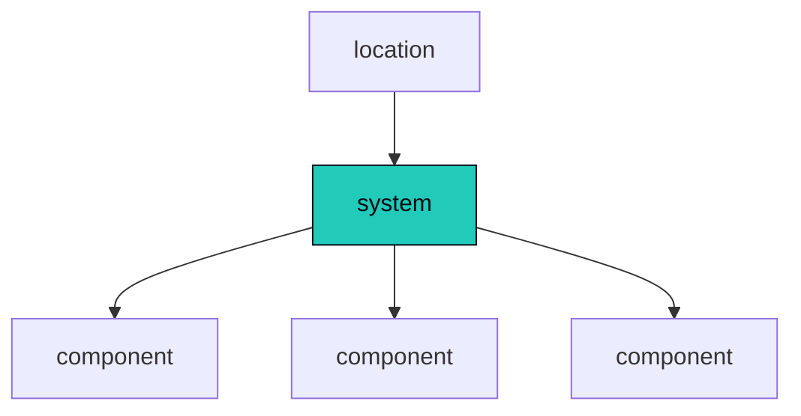
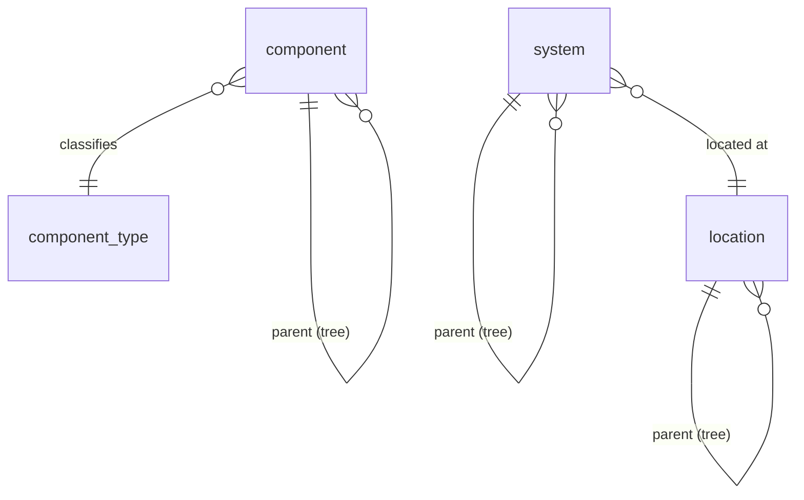

Leaf of the [architecture spine](/architecture/). The structural entities you operate, how they
nest, and how everything else (datapoints, events, alarms, config) names exactly one of them as its
owner. The shapes these entities pin are [templates](/architecture/templates/); the data they own is
[datapoints](/architecture/datapoints/); the physical tables are [storage](/architecture/storage/).

## The estate: four structural entities

Three nouns describe what you operate, plus the edge process that collects for them.

- A **component** is a deployed device, app, or service: a display, a codec, a DSP, a control
  processor, a cloud UCC service. It owns datapoints, pins a `component_template_version`, and is
  classified by `component_type`.
- A **system** is a set of components that work together to do one job. A meeting room is a system.
  So is a classroom, a video wall, a broadcast chain. The word is deliberately universal: a system
  is the unit you actually care about, whatever shape it takes. It pins a `system_template_version`,
  is located at a location, and is classified by `system_type`.
- A **location** ties systems and components to a physical place (campus, building, floor, room).
  It is classified by `location_type` and, unlike component and system, has **no template**: for a
  location the type is the only shape-definer.
- A **node** is the edge process (`omniglass --mode node`) that pulls work, reaches components over
  interfaces, and ships results ([nodes](/architecture/nodes/)). It is structural because it is a
  first-class **owner**: a node owns its own self-health telemetry and can carry a node-owned alarm.

A component belongs to a system; a system sits in a location.

Above the four sits the singleton **`global`** estate root: the top owner above every location where
estate-wide health and KPIs roll up, and the top of the [cascade](/architecture/cascade/). One per
deployment, no FK.

| Entity | What it is | Key columns |
|---|---|---|
| `component` | a deployed instance (`dsp-boardroom-3`) | name (unique), type, **parent_id** (self-ref tree), display_name; pins a `component_template_version`; classified by `component_type` |
| `system` | a composition of components / subsystems (the service tree) | name (unique), type, **parent_id** (self-ref tree), display_name; pins a `system_template_version`; carries `location_id`; classified by `system_type` |
| `location` | a place tree | name (unique), type, **parent_id** (self-ref tree), display_name; no template (the `location_type` is the only shape-definer) |
| `node` | the edge process | name (the identity); carries labels, last_heartbeat_at, and its bound credential ([identity and access](/architecture/identity-access/)) |

## The variable-depth trees

`component`, `system`, and `location` are each a **variable-depth tree**: a `parent_id` self-reference
that nests to arbitrary depth (campus -> building -> floor -> room; parent system -> subsystem; chassis
-> card). The trees are the structural backbone of the [cascade](/architecture/cascade/): resolution
runs over an entity's containment path and the **deepest node wins**, weight-free, pure depth.

A non-leaf node in a tree (a chassis, a floor, a parent system) contributes its **instance**
bindings down the cascade, not its template: a chassis hands a card its chassis-wide credential while
the card keeps its own template ([cascade](/architecture/cascade/)).

### Sub-components and sub-systems

The `parent_id` self-reference is **same-kind nesting**: a component may have a parent component, and a
system may have a parent system. A chassis with line cards is a parent component over child
components; a building-wide AV system composed of room subsystems is a parent system over child
systems. This nesting is what will feed the cascade (deepest wins down the component and system trees)
and the **health rollup** (a child's health composes up into its parent). This page introduces the
concept only; the depth resolution and rollup semantics live in [cascade](/architecture/cascade/) and
[health](/architecture/health/).

## Ownership: the exclusive-arc

Everything observed, asserted, or set in Omniglass attaches to exactly one structural entity, through
the **exclusive-arc**. Every datapoint table, plus `event`, `alarm`, and `variable`, carries:

- an **`owner_kind`** enum, plus
- the **matching typed FK** (`component_id` / `system_id` / `location_id` / `node_id`, or none for the
  singleton `global`), plus
- a **CHECK** that exactly the column matching `owner_kind` is set (or all null for `global`).

This makes **system-, location-, node-, and global-level datapoints first-class** (e.g. `health` is a
`state_datapoint` owned by a system, estate-wide availability is owned by `global`, and a node's
self-health is owned by the node), the fix for a monitoring tool that can only put state on a single
host. The same arc owns the `event` and `alarm` rows a datapoint produces, so a system-owned datapoint
yields a system-owned alarm. The full pattern and the storage DDL are on [storage](/architecture/storage/).

## Structural multi-membership (a component in N systems)

A shared device legitimately belongs to more than one system, which would make the system layer a DAG.
Keep it a **tree with a primary-system pointer** (which system chain feeds the cascade); a truly shared
device **skips the system layer**. The genuine "config differs per system" case is answered by
**per-system effective views** on demand, not by merging chains into the resolution
([cascade](/architecture/cascade/)).
