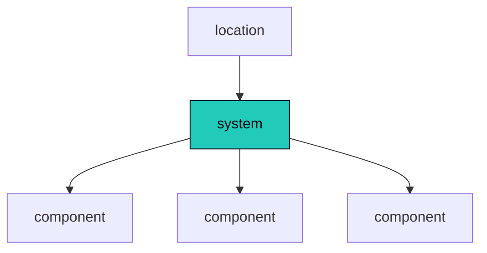
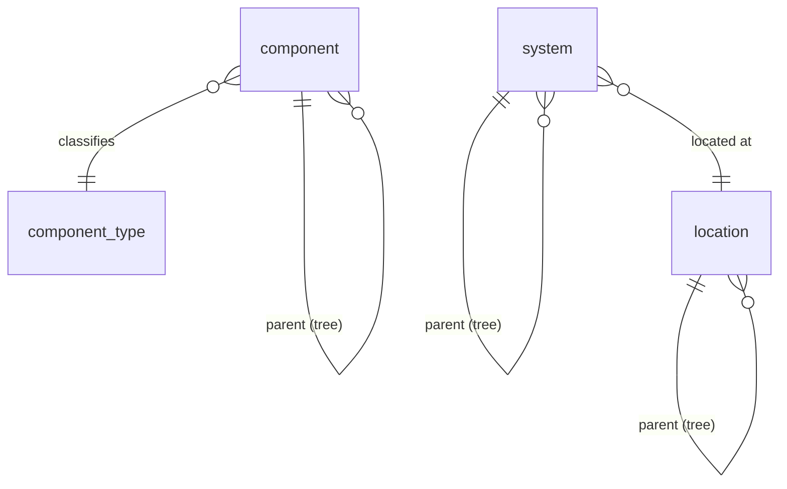

Core entities are the things an operator actually manages, the component, system, location, and node, and giving each its own identity is what lets every datapoint, event, alarm, and config name exactly one of them as its owner. This page covers the structural entities, how they
nest, and how everything else names one of them as owner. The shapes these entities pin are [templates](/architecture/templates/); the data they own is
[datapoints](/architecture/datapoints/); the physical tables are [storage](/architecture/storage/).

## The estate: four structural entities

Three nouns describe what you operate, plus the edge process that collects for them.

- A **component** is a deployed device, app, or service: a display, a codec, a DSP, a control
  processor, a cloud UCC service. It owns datapoints, pins a `component_template_version`, and is
  classified by `component_type`.
- A **system** is a set of components that work together to do one job. A meeting room is a system.
  So is a classroom, a video wall, a broadcast chain. The word is deliberately universal: a system
  is the unit you actually care about, whatever shape it takes. It pins a `system_template_version`,
  is located at a location, and is classified by `system_type`.
- A **location** ties systems and components to a physical place (campus, building, floor, room).
  It is classified by `location_type` and, unlike component and system, has **no template**: for a
  location the type is the only shape-definer.
- A **node** is the edge process (`omniglass --mode node`) that pulls work, reaches components over
  interfaces, and ships results ([nodes](/architecture/nodes/)). It is structural because it is a
  first-class **owner**: a node owns its own self-health telemetry and can carry a node-owned alarm.

A component belongs to a system; a system sits in a location.

Above the four sits the singleton **`global`** estate root: the top owner above every location where
estate-wide health and KPIs roll up, and the top of the [cascade](/architecture/cascade/). One per
deployment, no FK.

| Entity | What it is | Key columns |
|---|---|---|
| `component` | a deployed instance (`dsp-boardroom-3`) | name (unique), type, **parent_id** (self-ref tree), display_name; pins a `component_template_version`; classified by `component_type` |
| `system` | a composition of components / subsystems (the service tree) | name (unique), type, **parent_id** (self-ref tree), display_name; pins a `system_template_version`; carries `location_id`; classified by `system_type` |
| `location` | a place tree | name (unique), type, **parent_id** (self-ref tree), display_name; no template (the `location_type` is the only shape-definer) |
| `node` | the edge process | name (the identity); carries labels, last_heartbeat_at, and its bound credential ([identity and access](/architecture/identity-access/)) |

## The variable-depth trees

`component`, `system`, and `location` are each a **variable-depth tree**: a `parent_id` self-reference
that nests to arbitrary depth (campus -> building -> floor -> room; parent system -> subsystem; chassis
-> card). The trees are the structural backbone of the [cascade](/architecture/cascade/): resolution
runs over an entity's containment path and the **deepest node wins**, weight-free, pure depth.

A non-leaf node in a tree (a chassis, a floor, a parent system) contributes its **instance**
bindings down the cascade, not its template: a chassis hands a card its chassis-wide credential while
the card keeps its own template ([cascade](/architecture/cascade/)).

### Sub-components and sub-systems

The `parent_id` self-reference is **same-kind nesting**: a **system may have a parent system**
(sub-system nesting) and a **component a parent component** (sub-component nesting), both over the same
variable-depth `parent_id` trees. A chassis with line cards is a parent component over child
components; a building-wide AV system composed of room subsystems is a parent system over child
systems.

This nesting feeds two mechanisms. It feeds the **cascade**, where the **deeper node wins** down the
component and system trees (a sub-system's bindings override its parent's, a sub-component's override
the chassis'). And it feeds the **health rollup**: a **sub-system's health rolls into its parent
system**, and a **sub-component's into its parent component**, the same role-aware composition that
runs up the rest of the tree.

The **practical starting depth is 3 levels** (parent / child / grandchild) for both trees, a guidance
default, **not a hard cap**: the `parent_id` trees support arbitrary depth, and we revisit the
guidance if a use case needs more. The depth-resolution and rollup semantics themselves live in
[cascade](/architecture/cascade/) and [health](/architecture/health/).

## Ownership: the exclusive-arc

Everything observed, asserted, or set in Omniglass attaches to exactly one structural entity, through
the **exclusive-arc**. Every datapoint table, plus `event`, `alarm`, and `variable`, carries:

- an **`owner_kind`** enum, plus
- the **matching typed FK** (`component_id` / `system_id` / `location_id` / `node_id`, or none for the
  singleton `global`), plus
- a **CHECK** that exactly the column matching `owner_kind` is set (or all null for `global`).

This makes **system-, location-, node-, and global-level datapoints first-class** (e.g. `health` is a
`state_datapoint` owned by a system, estate-wide availability is owned by `global`, and a node's
self-health is owned by the node), the fix for a monitoring tool that can only put state on a single
host. The same arc owns the `event` and `alarm` rows a datapoint produces, so a system-owned datapoint
yields a system-owned alarm. The full pattern and the storage DDL are on [storage](/architecture/storage/).

## Structural multi-membership (a component in N systems)

A shared device legitimately belongs to more than one system, which would make the system layer a DAG.
Keep it a **tree with a primary-system pointer** (which system chain feeds the cascade); a truly shared
device **skips the system layer**. The genuine "config differs per system" case is answered by
**per-system effective views** on demand, not by merging chains into the resolution
([cascade](/architecture/cascade/)).

The binding itself is the **`system_member`** table: the **instance assignment** that ties a
`component` to a `system` under a specific role, satisfying a `system_template_member` from the frozen
`system_template_version` (key columns: `system_id`, `component_id`, `role`, plus the pin to the
`system_template_member` it satisfies).

A `system_template_member` declares, per role, a **requirement** (the canonical datapoints and commands a
member must provide) plus its `health_role`; any component whose template meets the requirement can fill
the role, validated on assignment. Detailed on [templates](/architecture/templates/).

## Operational mode: active, maintenance, disabled

Every entity has an **operational mode**, a cascade-resolved state that says how much the platform backs
off, set on the entity or inherited from a parent ([cascade](/architecture/cascade/)):

- **active** (default): collect, evaluate, act, enforce drift, count toward SLA. Normal.
- **maintenance**: **keep collecting**, but **suppress the consequences** of what is seen. Planned work:
  watch, but do not act.
- **disabled**: **stop collecting and interacting** with the device entirely (the Zabbix host-disable).
  The entity stays in the model, dormant, until re-enabled.

Maintenance and disabled are the **same suppression**, differing on one knob, **collection**: maintenance
suppresses consequences but keeps watching (so an operator can verify the work); disabled also goes dark
(no polling, no commands). Both suppress the same four consequences:

- **action dispatch is held**: an alarm may still open (you see it), but no `action_rule` pages or opens a
  ticket ([alarms and actions](/architecture/alarms-actions/)).
- **drift is observed, not enforced**: the set function never fires, so a tech mid-swap is not fought
  ([config](/architecture/variables/)). The device-swap case (a brief declared-identity authority,
  [datapoints](/architecture/datapoints/)) is just maintenance suppressing drift.
- **health rolls up no impact**: a member in maintenance or disabled does not sink its parent's
  [health](/architecture/health/); it surfaces as "down (maintenance)", the truth plus the mode, not a
  fifth health value.
- **SLA does not count it**: the window is excluded from availability and the SLO.

Maintenance is **time-bound**: a window (start / end, [time](/architecture/time/)) that **auto-exits**, or
open-ended until cleared, with a recurring window expressed as a schedule. Disabled is held until
re-enabled. Entering or exiting either is an **audited** operator action ([audit](/architecture/audit/)),
so "no page at 2am, it was in the patch window" is always explainable. Because the mode is
cascade-resolved, maintenance on a system covers its components.

## Decommission and delete

"Delete" is **decommission** by default, a **soft delete**: the entity is tombstoned, drops out of
placement, worklists, and default views, but its **history is retained** (datapoints, events, alarms,
audit), attributed to the tombstone and aging out by [retention](/architecture/storage/). An observability
and control plane must not let "remove this projector" erase the incident record, and a decommissioned
entity can be **re-commissioned** if the device returns. **Purge** is the privileged, audited hard erase
for a genuine mistake (a test component); for a high-volume entity it runs as a background job over the
partitions, while the cheap path is decommission plus letting retention age the firehose out.

Decommissioning runs the **in-flight cleanup**, reusing mechanisms that already exist: collection stops
(the worklist drops it, sessions close), **open alarms auto-resolve** (reason "decommissioned"),
**pending commands and running flows cancel** (the durable command queue, and flows are already gated on
their alarm staying open), and config / tag / credential / group bindings drop. The entity leaves its
parent's health rollup.

The cascade is **not** "delete everything below", because containers do not own their members:

- a **component** (leaf) decommissions as above;
- a **system** delete **unbinds its members** (the `system_member` rows) but **does not delete the
  components**; they become standalone, re-homeable;
- a **location** delete is **refused by the API while occupied** (it returns what is placed there); the
  console offers re-homing before the delete (move the systems and components, then delete the empty
  location);
- a **node** delete **re-places its tasks** (to the server or another node, or surfaces the components as
  uncollected) and revokes the node credential ([identity and access](/architecture/identity-access/));
  `node.*` history is retained.
