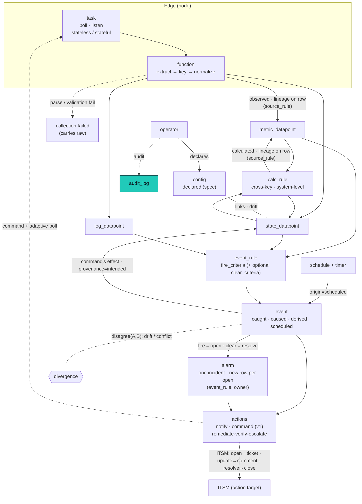

This is the heart of the authoritative data model: what a datapoint is, the two axes that define it, how we know a value (provenance), and how values reconcile, diverge, and read back. The physical layout (tables, partitioning, the lineage CHECK, tiering) lives in storage; the spine is [the architecture overview](/architecture/). Events, calc rules, and the response layer get their own pages: [events](/architecture/events/), [calculations](/architecture/calculations/), and [alarms and actions](/architecture/alarms-actions/).

## Two orthogonal axes

The model has exactly two independent questions, and conflating them is the only thing that makes it feel fuzzy.

- **Kind** answers *what kind of thing is this?* It is fixed per **key**, forever, decided once when the key is defined. `power.state` is always a state.
- **Provenance** answers *how do we know this particular value?* It varies per **row**. The same `power.state` can be observed or intended at different moments. A *declared* desired value lives in [config](/architecture/variables/) (keyed to the signal), not on the datapoint.

Kind is a property of the key. Provenance is a property of the row.

## Datapoints: one family, three kinds

A **datapoint** is an observation: a value of one key, on one owning entity (component, system, or location), at one time. The row shape is the same for all three kinds: `(owner, key, instance, ts, value, provenance, source, lineage)`. They are three physical tables only because they index and retain differently, not because they are different concepts.

- **metric** (`metric_datapoint`): numeric (float). Continuous, aggregatable. Has a current value.
- **state** (`state_datapoint`): categorical, text, or a structured object. Discrete, dwell-measurable. Has a current value (`last()` is meaningful).
- **log** (`log_datapoint`): a component's own words, the value is the log line (text or jsonb), keyed by log type (`log.system`, `log.os`, `log.app.<name>`). A stream, not a current value, but still an observation with a value at a time, so it is a datapoint, not a separate primitive. In practice only components emit logs.

Treating log as a datapoint removes the usual special case: an alarm on a log line is just an event rule whose condition matches a `log_datapoint` value, no different in shape from a metric threshold.

**An event is not a datapoint.** A datapoint is an observation (a value we recorded); an **event** is *our semantic assertion that something happened*, in our vocabulary. Datapoints are what rules read; events are what event rules produce. See [events](/architecture/events/).

### Ownership: the exclusive-arc

A datapoint attaches to a **structural entity**, not only a component. The owner is the **exclusive-arc**: an `owner_kind` enum plus the matching typed FK (`component_id` / `system_id` / `location_id` / `node_id`, or none for the singleton **`global`** estate root) with a CHECK that exactly the column matching `owner_kind` is set. The same arc owns `event` and `alarm` rows. This makes **system-, location-, node-, and global-level datapoints first-class** (e.g. `health` is a `state_datapoint` owned by a system, and estate-wide availability is owned by `global`), the fix for Zabbix's inability to put state on a group of hosts. See Ownership on the spine for the full pattern and the storage DDL.

### The instance dimension: many values of one key on one owner

One owner can hold several distinct values of the *same* canonical key: three fan speeds on a switch, per-port counters, per-channel audio levels. The canonical registry deliberately holds **one** `datapoint_type` per measurement (`fan.speed`, not `fan.speed.intake`), so the discriminator lives outside the key, as an `instance text NOT NULL DEFAULT ''` column on all three datapoint tables. Series identity is therefore **`(owner, datapoint_type, instance, provenance)`**: each instance is its own series, while a singleton (`instance = ''`) is the default. Aggregation stays clean (group by `key`, ignore `instance`); per-instance trends stay distinct.

The instance rides the pipeline as a reserved **`instance` label** on the collected datapoint: the collection extract spec authors it as a `key[instance]` suffix (`fan.speed[intake]=<oid>`, `fan.speed[exhaust]=<oid2>`), the parser strips the bracket into the label so `registryAllows` / `kindFor` still match the bare canonical key, and the derive step reads `instance` into the column. Calc folds **every** instance of an input key into the reduce: a rule reading `fan.speed` from a component gets one candidate per fan, so `worst` / `average` / `count` / Expr aggregate across all of them (a singleton key yields one candidate). An input filter can select one instance (`instance == "intake"`). The worklist needs no instance granularity: `calc_work` collapses on `(owner, key)` and recompute re-reads current state of every instance, so two fan changes in one event coalesce to one correct recompute. Calc **outputs** stay aggregate (`instance = ''`); per-instance outputs (one health per fan, a group-by) are a separate future capability, not a silent gap, output owners default to the singleton.

### The has-a-value-now razor (datapoint vs event)

A datapoint records a value; an event records an occurrence.

- `"input is 1"` is a value, so it is a **datapoint** (state).
- `"call started"` is an occurrence, "what is call-started now?" is meaningless, so it is an **event**. See [events](/architecture/events/).

A raw occurrence we have not normalized (a syslog line, a raw webhook frame) lands as a **`log_datapoint`** (observed, value = the line). An event rule can then **promote** it into a normalized event. So the log table is also the holding pen for un-normalized occurrences until a rule recognizes them.

## The datapoint_type registry

A datapoint and an event are different shapes (a datapoint has a value; an event is an occurrence), so each gets a registry named for what it holds. The event half is [`event_type`](/architecture/events/); the datapoint half is `datapoint_type`. We do **not** force them into one universal registry, that would be the false unification the rest of this model avoids.

**`datapoint_type`** describes every datapoint key: `(name, scope, template_id?, kind, value_type, unit, fusion_policy, validation)`, with the **`scope`** (`template` / `org` / `official`) deciding where the name is unique (see [Key scope](#key-scope-template-org-official)). One registry across all three datapoint kinds (metric/state/log). The kind is decided by the key, not at runtime: the compiler bakes each key's kind into the edge unit, so a value routes to the right table with no runtime lookup, the same way at every scope. `fusion_policy` is the key's read-time **default** for reducing multiple perspectives, a hint rather than a mandate (see [Fusion](#fusion)). A key names a **measurement, never its owner** (`temperature`, not `room.temperature`), with snake_case segments in a dot hierarchy and the unit in the `unit` field (`fan.speed` + `unit: rpm`, not `fan_rpm`); the ship-with official set lives in `internal/registry/defaults.yaml`. Adding or naming one: the `canonical-datapoint` skill.

The naming convention is consistent: a `_type` registry defines what a thing *is*, named for the thing (`datapoint_type`, `event_type`, like `component_type`, `interface_type`). `datapoint_type` spans the three datapoint kinds, and events get their own registry because an event is a different shape.

**Datapoint key naming is owner-agnostic.** A key names a *measurement*, never its owner: `temperature` is a Celsius reading whether a codec's thermals or a room's ambient sensor produced it, and the owner (component / system / location / node / global) plus a template's labels and the function that collected it give it context. So there is no `system.` / `device.` / `room.` prefix; keys group by measurement domain (`cpu.utilization`, `power.state`, `video.input`, `audio.level`, `network.icmp.rtt`). This is the normalization the product hinges on: one canonical path means one comparable signal across every vendor, which is what makes cross-fleet dashboards and AI useful. The official set is seeded from `internal/registry/defaults.yaml` following OpenTelemetry semantic conventions for the IT leaves (`cpu.utilization`, `memory.usage`; semconv's own `system.` prefix is dropped to avoid colliding with the `system` entity type) and the [OpenAV minimum-device-functionality guidelines](https://github.com/OpenAVCloud/specifications/blob/main/min-device-functionality/OAVC-AV-Device-Minimum-Functionality-Guidelines.md) for AV signals. A template declares its datapoints at **template** scope, or references an **org** or **official** key: the distro mints **official** keys, the deployment mints **org** keys, and a template mints its own **template**-scoped keys (the Zabbix model, where two templates can both declare an `input` with no collision).

**Validation on insert, under a policy.** Every datapoint is typed by a `datapoint_type` row (the FK is **non-null**: a template-scoped key is a real `datapoint_type` row at `scope=template`, not an inline-only shape), so insert checks two things, plus an optional third. **(1) The key resolves** to a `datapoint_type` at a reachable scope: a template-scoped key self-resolves; a referenced org or official key must exist, checked at template compile time. An unresolved key is **reject-not-project**: kept out of the typed series, a `datapoint.validation_failed` event raised, the raw carried on a `collection.failed` event so nothing is lost (backfillable once the registry or template is corrected). **(2) The value conforms** to the type's kind and domain: the type's `validation` (`{min,max}` for a metric, `{values:[...]}` for a state). Optionally **(3) the owner kind** must be one the type allows. All three are governed by the `validation_policy` config mode: **bypass** (skip), **audit** (the default: write the value but emit the event), or **enforce** (hold the value back from the typed series, emit the event). The point is visibility: an out-of-range or unmapped value means a template author declared a type the device disagrees with, so the violation surfaces as an owner-attributed event operators and admins see. The mode is a single global setting today; resolving it per-entity down the cascade (global, location, system, component) is the follow-on, gated on the cascade resolver.

## Key scope: template, org, official

A datapoint key carries a **`scope`**, the axis that decides where its name is unique and where its trust comes from. Three layers:

| scope | identity (uniqueness) | trust | who defines it |
|---|---|---|---|
| **template** | `(template_id, name)` | local | the template author |
| **org** | `name`, unique within the deployment | local custom canonical | the org / operator |
| **official** | `name`, globally | shipped with the distro | the distro |

`official` is just `scope == official` (the prior pass's `official` boolean folds into this enum as its top value). **Conflicts are impossible** at template scope because a template-scoped key is identified by `(template_id, name)`: two templates can both declare an `input` datapoint with no collision (the Zabbix model). Trust still comes from **distribution**, not a label: an official key is trusted because it is **in the release**, the same `video.input` across every vendor, not spoofable. An org key is a deployment's own custom canonical, authoritative within that one database (per-database isolation makes it unambiguous, one database is one tenant). A template key is local to the template that minted it.

**Every datapoint is typed by a registry row, just at some scope.** The datapoint -> `datapoint_type` FK is **non-null**: template-scoped keys ARE `datapoint_type` rows (`scope=template`, with a `template_id`), not inline-only shapes, so there is no nullable type FK and no dual identity. Kind, unit, and validation live on the type row at **every** scope, so the edge compiler bakes the kind and routes to the right table (metric / state / log) the same way for all three layers. Series identity is `(owner, datapoint_type, instance, provenance)`.

**The promotion ladder is template -> org -> official.** Each step is a cheap **re-scope or re-point**, not a migration: lift a template's `input` to an org-canonical `video.input` and re-point the template's datapoint at it; later it gets blessed **official** by being shipped in the distribution (the one real way trust is earned, not a flag an operator sets). Datapoints already collected keep resolving. This is the "shift to normalized over time" path.

**Normalization is therefore optional but encouraged.** A template ships using template-scoped keys with zero registry friction; aligning a key to org or official is what buys cross-fleet comparability, dashboards, and AI. The shipped official set covers the common AV/IT signals, so most templates align by just **referencing** one. Sharing happens at the **template level** (a repo or marketplace of templates): an imported template is **linked** (tracks upstream) or **copied** (forked, diverged), and the keys it introduces land at **template** or **org** scope, not as a federated signal trust tier.

**Governance is curation, not runtime enforcement.** Omniglass is a Postgres database an operator runs, so nothing stops a self-hoster inserting an org-scoped row or editing an official one in their own database. We vouch only for what we **ship**; you vet what you import, and you own the risk. Commands sit at **template** scope the same way (functions live on the template); a canonical command type is the same promotion ladder, deferred (see [templates](/architecture/templates/)).

## Provenance: how we know a value

Provenance is the second axis, stamped per datapoint row. The same key, with the same value, can be known three ways. Each provenance points at the immutable ground-truth record that produced it (its **lineage**), and the lineage column populated is mutually exclusive per provenance, enforced by a CHECK constraint.

| Provenance | How we know it | Lineage points at |
|---|---|---|
| **observed** | measured from a component | on-row: `source_rule` (+ version), the edge function that parsed it |
| **calculated** | derived from other datapoints | on-row: `source_rule` (+ version), the calc_rule |
| **intended** | the declared effect of a command we issued, pending reconciliation | `event_id` (the command event) |

A value of any provenance is still a metric/state/log (the kind is fixed by the key); provenance only records *how it got there*. All three land in the same datapoint tables, side by side for the same key, which is what makes divergence detection free. Declared intent is the fourth value an operator can assert, but it lives in [config](/architecture/variables/), not in the datapoint tables, and can be compared against an observed datapoint for drift.

A separate **`source`** column records *which sensor or path* produced an observed value (`codec.cec` vs `display.lan` vs `control.system`). Source is distinct from provenance: provenance is *how we know* (observed), source is *which sensor told us*. Three sensors reporting one display's power are three observed rows on one key, differing only in source. This is what makes multi-source corroboration and [fusion](#fusion) possible.

### observed: from a component, via an edge parse

"Measured from a component," not "from a device", every device is a component, but not every component is a device. The observed datapoint carries its own lineage on the row: `source_rule` + `source_rule_version` (which function and template version made it, the backtest hinge). The verbatim payload it parsed is **not** kept (no telemetry table); raw surfaces only on a `collection.failed` event or a dev raw-mode tap. There is no separate execution table, a derived datapoint is itself the evidence of the function's run, exactly as an event/alarm/action row self-describes.

### calculated: derived by a calc rule

A calculated value (a 5-minute average, a system rollup, a fused consensus) is parallel to observed: both are machine-derived. The difference is the input: an edge function parses a device payload, a calc rule reads **other datapoints**. Both carry `source_rule` + `source_rule_version` on the row, so they are distinguished by the **`provenance` column** (an edge function versus a calc_rule), not by a pointer. The exact inputs a calc read are reconstructable from the rule version (that is what backtest does); if an immutable input snapshot is ever needed it is a nullable `inputs jsonb` column, not a table. The rule itself lives on [calculations](/architecture/calculations/).

### intended: the declared effect of a command

When the action layer issues a command, it records the command as an **event** and writes the **intended** state it expects, in one step. The intended datapoint's lineage is that command event. The name is deliberate: **intended vs observed** is the central razor, intent-in-progress versus measured reality.

```text
1. command issued:  "power on display-5"  -> recorded as an event
2. intended write:  display-5 power = on, provenance=intended, lineage=<the command event>
                    a bet: intended, not measured
3. adaptive poll:   the command triggers a poll sooner than the normal interval
4. observed arrives:
     observed = on  -> reconciled (the bet paid off)
     observed = off -> divergence (the command did not land)
```

There is no separate "mapping" primitive. Which state a command intends lives on the command definition. **Only commands set intended state** (intended's lineage is always a command event). The external-event-implies-state case ("meeting started, so the room is occupied") is deferred.

Not every log-to-state path goes through a command. The split is measured fact vs pending intent:

| The source says | Means | Path |
|---|---|---|
| "eth0 **is** down" | a component reporting measured reality | edge parse, then **observed** state, directly |
| we sent "**power on**" | intent in progress, not yet confirmed | command, event, then **intended** state |

### declared values are config

mac, ip, serial, locked-input, anything an operator *sets* is declared intent, and declared intent is **not** a datapoint provenance. It lives in [config](/architecture/variables/): keyed to the same canonical signal as its observed side, resolved through the scope cascade, never in the datapoint tables. There is no separate property store: config is the declared side of a signal plus the cascade. Ownership resolution reads the resolved identity (a declared identity config value, or the observed identity datapoint that shares its key) to bind observed data to components.

### Precedence: spec versus status lives in config

When declared intent and observed reality disagree, which one wins is a **per-config-item `reconcile` policy** ([config](/architecture/variables/#drift-and-reconcile)), not a per-key datapoint attribute:

- **observed wins** is `reconcile: observe` (or `warn`): the declaration was a hint or stale guess, reality is truth. A device reporting a different MAC than the declared one is a divergence to surface (silently under `observe`, as an alarm under `warn`); adopting the observed value as declared is a separate one-shot import action.
- **declared wins** is `reconcile: enforce`: the declaration is the spec, reality should conform. Observed input HDMI2 against a declared HDMI1 means the world is wrong, converge via the set function (self-healing, the Kubernetes spec-and-status pattern), and alarm if the set fails.

Among datapoint provenances there is no precedence contest: intended is a pending bet that observed confirms or refutes (reconciliation, see [intended](#intended-the-declared-effect-of-a-command)), and observed supersedes it on arrival. The spec-versus-status decision is config's reconcile policy, not a per-key datapoint attribute. Device-swap (where a declared MAC is briefly authoritative before the device reports it) is handled by a future component "maintenance mode" that suppresses drift.

## Ground truth versus derived

Distinguished by a property of the table, not a naming suffix.

- **Raw payload: not stored.** Datapoints are emitted at the edge, so the verbatim wire payload is **not persisted** (no `telemetry` table). Raw surfaces only on a **`collection.failed`** event when a parse or validation rejects (diagnosis, and the one backfill-after-fix case) and via a **dev raw-mode** tap; the datapoint is authoritative, its lineage is `source_rule` + version.
- **Ground truth, logs** (immutable, append-only, the actor's own record): **`log_datapoint`** (a component's words, a datapoint kind), **`audit_log`** (an operator), **`session_log`** (connection lifecycle, node-reported), **`internal_log`** (platform self-narration), and the deferred **`collection_log`** / **`node_log`** companions. Each named for what it is. There is no separate rule-execution table: a derived row *is* the evidence of its rule's run, carrying `source_rule` + `source_rule_version` on the row itself.
- **Derived** (produced by rules, reconstructable in principle from ground truth): **`metric_datapoint`**, **`state_datapoint`**, **event**, **alarm**, **action**.

A datapoint's lineage is `source_rule` + version (the function that made it). The deferred companions extend it: `collection_log` is the cheap per-run execution record (every run, including failures), `node_log` the node's operational narration. A failed parse rides a `collection.failed` event carrying the raw; there is no telemetry table in the chain. See the architecture overview on the spine.

## The DAG invariant

The pipeline must stay acyclic.

> A rule may **read** observed and calculated values as truth. It may **compare** an intended value, or config's declared value, against observed (drift). It may **not** treat an intended value *as truth* to infer a new fact.

This is what makes drift safe: a drift rule reads the *pair* (intended, observed) and emits when they disagree; the intended value is tested, not trusted. The one forward edge command-to-intended-state is terminal (nothing reads back from an intended value to produce more state). Event rules reading only observed/calculated keeps the graph acyclic with no runtime cycle guard required in v1.

## disagree and divergence

Drift is a condition operator, **`disagree(A, B)`**, usable inside event rule conditions, comparing two provenances (or two sources) of one key:

- `disagree(intended, observed)`: the command did not land (reconciliation)
- `disagree(declared, observed)`: the world drifted from intent (config drift, device swap); the declared side is read from [config](/architecture/variables/)
- `disagree(observed, observed)` across `source`: sensors conflict (a failing sensor)

> Any two provenances of the same key that disagree = an anomaly. One detector.

Command reconciliation, configuration drift, sensor conflict, and hardware-swap detection are not separate features; they are one comparison applied to a key that can hold more than one provenance.

## Fusion

When multiple sources report one signal, they land as **perspectives**: source-tagged observed rows differing only by `source`, **all preserved** (seeing multiple perspectives on one value is itself instructive). A reduce-on-read **policy** produces the effective value. Fusion splits by whether the inputs describe the same key:

- **same-key, many sources** keeps every perspective and reduces on read. The key's **`fusion_policy`** on `datapoint_type` is a **default/hint, not a mandate**: the right reduce often is not knowable a priori at the `datapoint_type` level (for `display-5.power` from codec CEC, display LAN, and the control system, you cannot know how to fuse the value before considering the actual sources). So a policy may **default from the type**, but can be source-weighted, per-instance, or **deferred**: keep all perspectives and decide at read time, by an operator, or by AI. When a policy reduces (`mode`: priority / weighted / majority / worst / average / latest, plus tie-break and optional per-source weights), the reduced value is what `current_value` and event_rule evaluation read; the source-tagged perspectives stay, so "which source is wrong" remains queryable. This improves *confidence in a reading*. A `source` registry carries default trust weights, so the simplest case needs no config. Materialize a fused series only if a profile earns it.
- **cross-key / system-level** is a **`calc_rule`** (the only fusion that authors a rule): `room.in_use` derived from display power + codec call-state + occupancy. This *derives a higher-order fact*, a new key, not a same-key consensus. See [calculations](/architecture/calculations/).

Conflict detection (`disagree(observed, observed)` across sources) is the complementary operation: even when an effective value is usable, a perspective disagreeing beyond tolerance is itself a signal.

## Reads: current value is a view

Current value (latest per owner / key / **instance** / **provenance**, reduced across the source perspectives per the effective `fusion_policy`) is a **view**, correct and zero-maintenance. It is keyed per-provenance because "current observed power" and "current intended power" are different values for the same key, and the divergence model depends on seeing both. A materialized `current_value` table is a deferred optimization, earned only when a fleet-dashboard read profile proves the view too slow (the same view-by-default discipline as storage). Ownership resolution reads resolved identity config (the declared value, else the observed datapoint) by targeted indexed lookup, not a full scan, so it does not by itself justify the materialized table.

## The datapoint tables

The three kinds are three physical tables only because they index and retain differently; the [physical layout, partitioning, and the lineage CHECK](/architecture/storage/) live on storage.

| Table | Key columns | Notes |
|---|---|---|
| `metric_datapoint` | id, ts, **owner_kind, component_id/system_id/location_id/node_id**, key, **instance**, **value float8**, provenance, source, **source_rule, source_rule_version, event_id** | the firehose; BRIN on ts; numeric aggregation. `instance` (`''` default) discriminates many values of one canonical key on one owner |
| `state_datapoint` | id, ts, owner arc, key, instance, **value text/jsonb**, provenance, source, + same lineage cols | sparse, transition-only; time-in-state and dwell. [Config](/architecture/variables/) is keyed to one as its observed side |
| `log_datapoint` | id, ts, owner arc, key, instance, **value text/jsonb (the line)**, level, provenance, source, + same lineage cols | GIN / tsvector full-text; also the holding pen for un-normalized occurrences |

Common datapoint columns (all three kind-tables): `ts`, the **owner arc** (`owner_kind` plus `component_id` / `system_id` / `location_id` / `node_id`), `key, provenance, source`, plus the on-row lineage `source_rule, source_rule_version, event_id`; only the value column differs (float8 / text-jsonb / line). A `datapoint` view UNIONs the common columns for "all datapoints for owner X".

The key registry that types these tables is `datapoint_type` (one registry across all three kinds), detailed at [the datapoint_type registry](#the-datapoint_type-registry):

| Table | Key columns | Notes |
|---|---|---|
| `datapoint_type` | name, **scope** (template/org/official), **template_id?**, kind (metric/state/log), value_type, unit, **fusion_policy**, validation (jsonb) | the one key registry across all datapoint kinds; `scope` decides where the name is unique (`(template_id, name)` at template scope, `name` at org/official); referenced by templates, which also mint their own template-scoped rows |

## The pipeline, end to end



The teal node is `audit_log`, the ground-truth record of operator writes (including config changes); observed and calculated carry `source_rule` on the row, intended points at the command `event` (via `event_id`). The raw payload is not stored: a parse or validation failure rides a `collection.failed` event. The three datapoint tables (`metric_datapoint`, `state_datapoint`, `log_datapoint`) are emitted at the edge or derived; [config](/architecture/variables/) holds declared intent, keyed to a state datapoint as its observed side.

Related: [events](/architecture/events/) (the event family and `event_type`), [calculations](/architecture/calculations/) (calc rules and the rule families), [config and credentials](/architecture/variables/) (declared config, drift, reconcile), [collection](/architecture/collection/) (how telemetry arrives), [alarms and actions](/architecture/alarms-actions/) (alarm lifecycle, actions), and [the glossary](/architecture/glossary/) (every term defined once).
