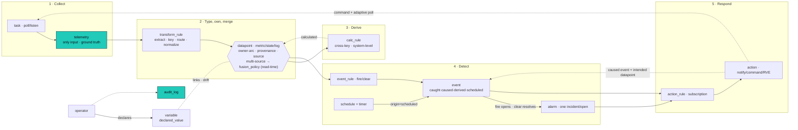
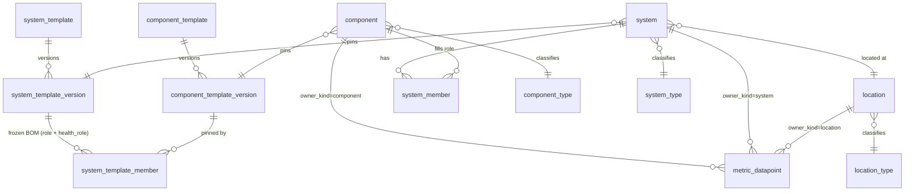

This is the north star, the spine of the architecture. It holds the whole-system overview, the canonical glossary, the patterns and decisions, and the index of leaf documents. Each leaf goes deep on one functional component and points back here; terms are defined here once and not redefined in the leaves. Physical schema is in storage; build order in migration-plan.

## Leaf documents

| Leaf | Owns the depth on |
|---|---|
| [taxonomy](/architecture/taxonomy/) | data-model semantics: provenance/lineage, multi-source + fusion, disagree/divergence, the DAG invariant, the razors |
| storage | physical schema, exclusive-arc DDL, the lineage CHECK, partitioning, tiering |
| [components](/architecture/components/) | device shape: types, templates + immutable versions, interfaces, extractors, commands |
| [nodes](/architecture/nodes/) | node runtime, job queue, sessions |
| time | schedules, timers, no-data |
| health | health, SLI, SLA |
| workers | the rule engine, stages, Expr policy |
| api | the HTTP API surface |
| [alarms-actions](/architecture/alarms-actions/) | alarm lifecycle, actions, ITSM |
| [cascade](/architecture/cascade/) | the type to template to placement to group cascade in detail |
| [identity-access](/architecture/identity-access/), credentials, files, ui, audit | their components |
| development | the development + contribution model: test-first, functional core / imperative shell, the workflow |
| migration-plan | the from-scratch initial migration + the TDD build sequence |

## The model in two sentences

Collectors load raw **telemetry**; **transform_rules** parse it into typed
**datapoints** (metric, state, log) owned by a structural entity; **calc_rules** derive
more datapoints, and **event_rules** evaluate datapoints into **events** (and the
**alarms** they open and close); **actions** respond. Every datapoint carries a
**provenance** (observed, calculated, intended) and a **source**, and any two
provenances (or sources) of one key disagreeing is the single universal divergence
signal. Declared config (operator intent) lives in [variables](/architecture/variables/), not as a datapoint provenance.



The pipeline is a **DAG**: rules read observed and calculated values as truth, only
*compare* intended values (and a variable's declared value) against observed, and never
infer a new fact from an intended value treated as truth (see [The DAG invariant](#the-dag-invariant)).

## Two orthogonal axes

Two independent questions; conflating them is the only thing that makes the model feel
fuzzy.

- **Kind** answers *what kind of thing is this?* Fixed per **key**, forever, decided
  when the key is defined. `power.state` is always a state.
- **Provenance** answers *how do we know this particular value?* It varies per **row**.
  The same `power.state` can be observed or intended at different moments. A *declared*
  desired value lives in a [variable](/architecture/variables/).

Kind is a property of the key. Provenance is a property of the row.

## Datapoints: one family, three kinds

A **datapoint** is an observation: a value of one key, on one owning entity, at one
time. The three kinds are three physical tables only because they store and index
differently, not because they are different concepts.

- **`metric_datapoint`**: numeric (float8). Continuous, aggregatable. Has a current
  value. The firehose.
- **`state_datapoint`**: categorical, text, or a structured object. Discrete,
  dwell-measurable. Has a current value (`last()` is meaningful).
- **`log_datapoint`**: a component's own words; value = the log line (`ts` parsed from
  the line, device clock), keyed by log type (`log.system`, `log.app.<name>`). A
  stream, not a current value, but still a value-at-a-time, so a datapoint, not a
  separate primitive. In practice only components emit logs.

### The has-a-value-now razor (datapoint vs event)

A datapoint records a value; an event records an occurrence.

- `"input is 1"` is a value, so a **datapoint** (state).
- `"call started"` is an occurrence, "what is call-started now?" is meaningless, so an
  **event**.

A raw occurrence we have not normalized (a syslog line, a raw webhook frame) lands as a
**`log_datapoint`** (observed, value = the line); an event_rule can then **promote** it
into a normalized event. So the log kind is also the holding pen for un-normalized
occurrences. **An event is not a datapoint.**

## Ownership: the exclusive-arc

A datapoint attaches to a **structural entity**, not only a component. The owner is the
**exclusive-arc** pattern: an `owner_kind` enum plus the matching typed FK column
(`component_id` / `system_id` / `location_id`), with a CHECK that exactly the column
matching `owner_kind` is set. This is the integrity-preserving polymorphism: real
per-kind foreign keys keep the cascade joins and `ON DELETE` behavior.

This makes **system-level and location-level datapoints first-class** (e.g.
`health` is a `state_datapoint` owned by a system). It is the fix for Zabbix's
inability to put state on a group of hosts. The same exclusive-arc owns **`event`** and
**`alarm`** rows, so an event_rule on a system datapoint produces a system-owned alarm.

## The registries: datapoint_type and event_type

Two registries, each named for what it holds (a datapoint has a value; an event is an
occurrence), each with the official/private shadow (namespace shadow pattern).

- **`datapoint_type`** describes every datapoint key: `(namespace, name, kind,
  value_type, unit, fusion_policy)`. One registry across all
  three kinds. The transform never decides a kind at runtime; the key already knows it,
  so a key lookup routes the value to the right table.
- **`event_type`** describes every event key: `(namespace, name, display_name,
  payload_schema)`. Declaring event types (`call.started`, `cable.unplugged`,
  `command.sent`) gives events a known schema and is what lets an event_rule promote a
  raw log line into a *registered* event.

## Types, templates, and the cascade

Three layers describe what an entity *is* and how it behaves, from broad to specific.

- **`*_type`** (`component_type`, `system_type`, `location_type`), classification +
  a **field schema** (the [variable](/architecture/variables/) keys instances carry) + **type-level
  defaults**. Official/private. For **location** the type is the *only* shape-definer
  (locations have no template).
- **`*_template`** (`component_template`, `system_template`), the richer shape:
  collection (interfaces + tasks), commands, datapoint_type declarations, default
  alarms/health, and (systems) the role composition. Templates may also declare keys
  (fields) and defaults. **Versioned and immutable** (below). Components and systems
  have templates; locations do not.
- **The instance** (`component`, `system`, `location`), pins a template version
  (component/system) and carries its own [variable](/architecture/variables/) values.

**Properties are variables.** A "field" (prop) on a type/template is a
[variable](/architecture/variables/) key with a default; the instance value is the
variable's `declared_value`, resolved through the scope cascade and optionally linked to
an observed datapoint for drift. There is no separate property/attribute store: inventory
like `model` or `asset_tag` is a variable with only a declared value (no observed
counterpart, so drift never fires on it), and it gets audited change history for free.

### The current-state cascade

The effective value of a [variable](/architecture/variables/) (its declared value or template default) is resolved by walking from broadest to
most specific; **the most specific set value wins**:

```text
global → type → template → location → system → component (instance)   ·   group (weighted, cross-cutting)
```

Both **type and template declare defaults**; **template overrides type** on conflict
(type is higher up the tree). Placement scopes (`location → system → component`)
override the class defaults, and a value declared directly on the component instance is
the most specific. **Groups** are a weighted cross-cutting overlay. The exclusive-arc's
real FKs are what keep these cascade joins sound.

### Immutable template versions

Instances pin an **immutable `*_template_version`** (a frozen snapshot), not the mutable
template. Because the version is frozen, the keys/roles an instance depends on never
change or vanish under it. Editing a template mints a **new version**; existing
instances stay on theirs until an **explicit re-point** (the migration). No fragile
reconcile.

- `component_template` to **`component_template_version`** (frozen `spec`); a `component`
  pins a version.
- `system_template` to **`system_template_version`** (frozen); a `system` pins a version.
- **`system_template_member`** is the system_template_version's frozen **bill of
  materials**: `(role, component_template_version, health_role)`. A system template
  authors against a *specific* `component_template_version` per role; cutting the system
  template version freezes those pins, so a published system shape is fully reproducible
  and a new component-template version never silently alters it.
- **`system_member`** is the *instance* assignment: `(system, role, component)`; the
  role validates against the system's frozen version, so it never expires.
- A **`system` links to a `location`** at instantiation (`system.location_id`); this
  anchors placement (nodes are assigned by location) and the cascade
  (`location → system → component`). Quick-adding a location clones an existing one.

## Collection: how telemetry arrives

A **task** is a node's unit of collection work. Two orthogonal axes:

- **Task mode** (a property of the task): **poll** (we ask for each datum) or **listen**
  (we wait for it to arrive). Stated from *our* perspective on purpose.
- **Transport** (a property of the interface): **stateless** (a throwaway connection per
  shot) or **stateful** (a held-open connection, which becomes a `session` and emits
  `session_log` rows for connect/auth/drop/reconnect).

|                  | **poll** (we ask)              | **listen** (we wait)        |
|------------------|--------------------------------|-----------------------------|
| **stateless**    | SNMP get, HTTP GET             | webhook, SNMP trap, syslog  |
| **stateful**     | SSH-exec / xAPI `xStatus`      | MQTT subscribe, xAPI feedback |

**One ingest path.** Everything lands in `telemetry` first, including first-class data
pushed by smart senders (a near-identity transform, `shape=native`). Nothing bypasses
telemetry: it is the system of record and the replay source.

## Provenance: how we know a value

Provenance is stamped per datapoint row. The same key, same value, can be known three
ways; each carries its **lineage on the row** (no separate execution table).

| Provenance | How we know it | On-row lineage |
|---|---|---|
| **observed** | measured from a component | `source_rule` (+ version) + `telemetry_id` |
| **calculated** | derived from other datapoints by a calc_rule | `source_rule` (+ version); `telemetry_id` null |
| **intended** | the declared effect of a command we issued, pending reconciliation | `event_id` (the command event) |

A value of any provenance is still a metric/state/log (the kind is fixed by the key);
provenance records *how it got there*. All three land in the same datapoint tables, side
by side for one key, which is what makes divergence detection free. Declared intent is the
fourth value an operator asserts, but it lives on a [variable](/architecture/variables/), not
in the datapoint tables. The lineage CHECK
distinguishes observed (`telemetry_id` set) from calculated (`telemetry_id` null).

A separate **`source`** column records *which sensor or path* produced an observed value
(`codec.cec` vs `display.lan` vs a platform API). Source is distinct from provenance:
three sensors reporting one display's power are three observed rows on one key, differing
only in `source`. This is what enables multi-source corroboration and fusion.

### intended: the intent-vs-reality razor

When the action layer issues a command, it records the command as an **event** and writes
the **intended** state it expects, in one step (the intended datapoint's lineage is that
command event). **Only commands set intended.** `intended` vs `observed` is the central
razor: a bet in progress versus measured reality. An adaptive poll then reconciles
(`observed == intended` is landed; `disagree` means the command did not take).

### declared values live in variables

mac, ip, serial, locked-input, model, capacity, anything an operator sets is a
[variable](/architecture/variables/)'s `declared_value`, audited on change, not a datapoint
provenance. This dissolves the old `prop_type` / `prop_binding` / `util_routing_props`
machinery into the variable table plus the cascade. Ownership resolution (the transform
`route` step) reads the resolved **identity** variable (its declared value, or the observed
datapoint it links) to bind incoming telemetry to entities.

### spec versus status: the variable reconcile policy

When declared intent and observed reality disagree, which wins is the
[variable](/architecture/variables/)'s **`reconcile`** policy, not a per-key datapoint
attribute: **observed wins** (`accept`, or just `alert`) when reality is truth,
**declared wins** (`enforce`) when the declaration is the spec and reality should conform
(the self-healing pattern). The old per-key `authoritative_provenance` is superseded by
this per-variable policy.

## Multi-source merge and fusion

When several sources report the same key, they land as multiple **observed rows
differing only by `source`**. Reconciliation is **built into the key**, not an authored
rule:

- **`datapoint_type.fusion_policy`** declares the reconciliation: `mode`
  (priority / weighted / majority / worst / average / latest) + tie-break + optional
  per-source weights. A **`source` registry** carries default trust weights (e.g.
  `webex=100, zoom=50`), overridable per key. A sane default per kind means the simplest
  case needs no config.
- Fusion is applied **on read** (consistent with views-by-default): `current_value` and
  event_rule evaluation read the policy-reduced value; the raw per-source observed rows
  stay (for history and `disagree`). Materialize a fused series only if a profile earns
  it.
- A **`calc_rule`** is reserved for what fusion-on-the-key can't do: **cross-key** or
  **system-level** derivation (a *new* key from many keys/components), and custom logic.

**Worked example (merging 3 systems of record).** Three APIs poll the same 100
components every 60s; each reports reachability, error, serial, mac, often
disagreeing. **Linkage** is the transform `route` step matching each source's incoming
id against the component's **declared identity** variable (the stable anchor), not against another
source's observed serial (which dodges the serial-is-also-conflicting trap); a source's
observed serial is then validated against the declared variable via `disagree`. **Reconciliation** is
each key's `fusion_policy` (e.g. reachability `worst` or weighted by trusted source);
the normalize step maps each vendor's vocabulary to ours first. **Conflict** is itself a
signal (`disagree(observed, observed)` across source flags a broken integration). When
**discovery** lands, one source is **authoritative** (creates components + declared
identity, including shared join keys); the others are match-only and latch on
(orphan-on-miss).

## Rules: three pipeline families + a subscription

A rule is named for its function; `rule` is the genus.

- **`transform_rule`**: telemetry to datapoint: **match** (by task) then **extract**
  (jsonpath / regex / oid-map; the fan-out) then **key** (assign; datapoint_type routes by
  kind) then **route** (resolve the owning entity from indexed identity variables) then
  **normalize** (optional Expr). Named for its transformation: it is the one of two
  datapoint-producers that reads telemetry.
- **`calc_rule`**: datapoint(s) to datapoint (calculated): inputs / reduce / output key /
  scope. For cross-key and system-level derivation (same-key multi-source reconcile is
  the key's `fusion_policy`, not a calc).
- **`event_rule`**: datapoint change to event: `fire_criteria` (required) +
  `clear_criteria` (optional; a clear criterion makes the events alarm-paired). Absorbs
  the old `alarm_rule`.
- **`action_rule`**: a *subscription* (an Expr predicate over events; alarms via their
  edge events) wiring occurrences to actions. Not a fourth pipeline family.
- **`discovery_rule`** *(deferred, tracked)*, observed data **creates**
  components/systems/locations + their identity variables. Active/inactive;
  official/private namespace; pairs with the discovery-**authoritative** source. Spec
  pending.

## Events: caught, caused, derived, scheduled

An **event** is a discrete semantic occurrence the action/rule layer reacts to; keyed
(`event_type`), point-in-time, owned via the exclusive-arc, carrying `alarm_id`
(nullable). Its **origin**:

1. **caught**: a structured occurrence arrives (xAPI Event, webhook, trap), or an
   event_rule promotes a `log_datapoint` line.
2. **caused**: we issued a command, recorded as an event; this opens an intended
   datapoint.
3. **derived**: an event_rule fuses signals into an operator-meaningful fact.
4. **scheduled**: the clock fired a schedule.

**Schedule, event, action.** A schedule fire *is* an event (`origin=scheduled`),
manufactured by the clock; there is no separate schedule log table. So `action_rule`
subscribes to events uniformly (digests, synthetic checks, SLA resets are all schedule
fires an action subscribes to).

## Alarms: stateful incidents, one row per open

An **alarm** is the stateful row an event_rule's paired events drive. It is **not** a
rule and **not** event-sourced, the row holds current state directly (`status`,
`severity`, `opened_at`, `resolved_at`, `acked_by`), owned via the exclusive-arc.

- **One row per open.** Each open-to-close cycle is a new alarm row, a distinct incident; a
  reopen is a new alarm. This is the ITSM correlation anchor (a ticket binds to one
  alarm id). A partial unique index `WHERE resolved_at IS NULL` is the one-open backstop.
- The alarm is keyed `(event_rule, owner)`. "Active alarms" is `WHERE resolved_at IS
  NULL`; the condition's history is `WHERE event_rule = R AND owner = X ORDER BY
  opened_at`.
- The open/close **events** carry the `alarm_id` (the edge log); operator **ack/snooze**
  go to `audit_log` carrying `alarm_id`. The timeline assembles by `alarm_id`; the alarm
  row is the live state.

This matches the Zabbix mental model: a long-lived condition (event_rule) generates a
stream of per-occurrence incidents (alarm).

## Actions: ordered steps

An **action** is an ordered sequence of **steps**; most are length 1. `notify` and
`command` are step types. A multi-step action is a "workflow", one action model, not a
separate engine. v1 builds `notify`, `command`, and the canned
**remediate-verify-escalate** (`command → wait → recheck → notify if unchanged`), which
is also the ITSM lifecycle driver. `wait` / `branch` are deferred.

A **command** is a `run`-action **declaration** in a `component_template` version (the
interface `commands:` block), carrying `intends:{key,value}`. It is **not a table**; a
command *instance* is an `action` with `kind=command`. When it runs it records a caused
`event` and writes the `intended` datapoint whose lineage points at that event.

## The DAG invariant

> A rule may **read** observed and calculated values as truth. It may **compare**
> an intended value, or a variable's declared value, against observed (drift). It may **not** treat an intended
> value *as truth* to infer a new fact.

This keeps drift safe (a drift rule reads the *pair* and emits when they disagree; the
intended value is tested, not trusted) and the graph acyclic. The one forward edge,
command to intended-state, is terminal.

### disagree and divergence

**`disagree(A, B)`** is a condition operator comparing two provenances (or two sources)
of one key:

- `disagree(intended, observed)` means the command did not land (reconciliation)
- `disagree(declared, observed)` means the world drifted from intent (config drift, swap); the declared side is a [variable](/architecture/variables/)
- `disagree(observed, observed)` across `source` means sensors/feeds conflict

> Any two provenances (or sources) of one key that disagree = an anomaly. One detector.

Command reconciliation, configuration drift, sensor conflict, and hardware-swap
detection are one comparison applied to a key that holds more than one provenance/source.

## Time: schedules and timers

- **`schedule`** (config), a recurring definition (cron/rrule + IANA tz + what it
  triggers).
- **`timer`** (mechanism), the clock worker's pending-fire working set (kinds:
  schedule-tick, for-sustain, runbook-wait, watchdog); drained `SKIP LOCKED`; mutable,
  not history. A schedule-tick fire writes an `event` (`origin=scheduled`); other kinds
  record on the entity they produce (an alarm edge `event`, the `action` row, a stale
  `datapoint`).

## Ground truth versus derived

- **Ground truth, data**: **telemetry** is the clean collected data primitive (not a
  log): schema defined by its payload, one row per *successful* collection emission, the
  only input and system of record. Like `event`, it carries a payload plus a source
  (`collection_id`), not a fixed `_log` shape.
- **Ground truth, logs** (immutable, append-only, the actor's own record): **`log_datapoint`**
  (a component's words), **`audit_log`** (an operator), **`session_log`** (connection
  lifecycle, node-reported), **`internal_log`** (platform self-narration), and the
  deferred **`collection_log`** / **`node_log`** companions (below). Each named for what
  it is; there is no `_log` suffix-*pattern* and no rule-execution table, derived rows
  carry their own lineage.
- **Derived** (produced by rules, reconstructable from ground truth + versioned rules):
  `metric_datapoint`, `state_datapoint` (calculated rows), `event`, `alarm`, `action`.

The collection provenance chain (when the companions land):
**datapoint → `telemetry_id` → telemetry → `collection_id` → collection_log → `node` → node_log.**
`telemetry` stays clean (only passing tasks); `collection_log` records every run
(timing, status, stderr, including failures); `node_log` is the node's operational
narration.

The model is **not event-sourced**: stateful entities hold current state directly.
Re-running a versioned rule over retained ground truth (**backtest**) is a bounded
capability, not the basis for current state.

## Reads: current value is a view

Current value (latest per owner / key / **provenance**, fused across sources per the
key's `fusion_policy`) is a **view**, correct and zero-maintenance. It is per-provenance
because "current observed" and "current intended" are different values for one key, and
divergence needs both. A materialized `current_value` table is a deferred optimization,
earned only when a fleet-dashboard read profile proves the view too slow.

## Structural and ownership model



## Glossary

The authoritative reference. These nouns do not get redefined.

| Term | Definition |
|---|---|
| **node** | Edge process (`--mode node`); pulls and runs tasks/commands over interfaces; carries placement, heartbeat, bound credential. |
| **task** | A node's unit of collection: **poll** (we ask) or **listen** (we wait), over a stateless or stateful (session) interface. Content-addressed. |
| **interface** | A connection to a component, declared per protocol; transport stateless or stateful (to session). |
| **interface_type** | Protocol+style registry (ssh, ssh-exec, https, snmp, mqtt, webhook...); built-flag + param schema. |
| **session** | A stateful interface's live held-open connection; a current-state view over `session_log`. |
| **telemetry** | The clean collected-data primitive (not a log): schema by payload, one row per *successful* collection emission, the only input + system of record, owns nothing; carries `collection_id` as its source. Ground truth. |
| **collection_log** | *(deferred companion)* The execution record: one row per collection run across all nodes, including failures, with timing/status/stderr. `telemetry.collection_id` points at it. |
| **node_log** | *(deferred companion)* A node's operational log (collection events firing, errors, restarts), linked to `collection_log`. |
| **datapoint** | An observation: a key's value on one owning entity at one time, with provenance + source + on-row lineage. Kinds: metric, state, log. |
| **metric_datapoint** | Numeric (float8) datapoint. Continuous, aggregatable. The firehose. |
| **state_datapoint** | Categorical/text/object datapoint. Discrete, dwell-measurable. A [variable](/architecture/variables/) can link one as its observed side. |
| **log_datapoint** | A component's own log lines; value = the line (`ts` from the line). A stream; also the holding pen for un-normalized occurrences. |
| **kind** | What a key is: metric, state, or log. Fixed per key at definition. |
| **key** | The identity of what's measured/asserted; registered in `datapoint_type`. |
| **owner / owner_kind** | A datapoint/event/alarm's subject, the exclusive-arc: `owner_kind` + the matching typed FK (`component_id`/`system_id`/`location_id`) + CHECK. |
| **datapoint_type** | Registry for datapoint keys: namespace, name, kind, value_type, unit, fusion_policy. Official/private shadow. |
| **event_type** | Registry for event keys: namespace, name, display_name, payload_schema. Official/private shadow. |
| **fusion_policy** | Per-key, built-in multi-source reconciliation (mode + tie-break + source weights), applied on read. |
| **source** | Which sensor/path produced an observed value; distinct from provenance; enables multi-source rows + fusion. A `source` registry carries default weights. |
| **provenance** | How we know a value: observed, calculated, intended. Per row. Declared intent is a [variable](/architecture/variables/). |
| **observed** | Measured from a component. On-row lineage: `source_rule` (+ version) + `telemetry_id`. |
| **calculated** | Derived from other datapoints by a calc_rule. On-row lineage: `source_rule`; `telemetry_id` null. |
| **intended** | A command's declared effect, pending reconciliation. Lineage: the command `event_id`. Only commands set it. |
| **variable** | A scoped, shaped config cell holding operator-**declared** intent (`declared_value`), optionally linked to an observed datapoint for drift/reconcile. Replaces the prop tables. See [variables](/architecture/variables/). |
| **lineage (on-row)** | A derived row carries its own lineage; no execution table. The rule version is the backtest hinge. |
| **reconcile** | Per-[variable](/architecture/variables/): spec-vs-status when declared and observed disagree (`alert` / `enforce` / `accept`). Replaces the old per-key authoritative_provenance. |
| **transform_rule** | telemetry to datapoint: match / extract / key / route / normalize. The `route` step is ownership resolution. |
| **calc_rule** | datapoint(s) to datapoint (calculated): cross-key / system-level derivation. (Same-key multi-source reconcile is the key's fusion_policy.) |
| **event_rule** | datapoint change to event: fire_criteria + optional clear_criteria (clear makes events alarm-paired). Absorbs alarm_rule. |
| **action_rule** | A subscription (Expr over events; alarms via edge events) wiring occurrences to actions. |
| **discovery_rule** | *(deferred)* observed data creates components/systems/locations + their identity variables; active/inactive; official/private; pairs with the authoritative source. |
| **event** | A discrete semantic occurrence the action layer reacts to. Keyed, point-in-time, owned via the arc. Not a datapoint. |
| **origin** | How an event arose: caught, caused, derived, scheduled. |
| **alarm** | One open-to-close incident: a stateful row driven by an event_rule's paired events; new row per open; keyed (event_rule, owner). Not event-sourced. ITSM anchor. |
| **action** | An ordered sequence of steps (notify, command in v1; wait/branch deferred). The canned remediate-verify-escalate ships v1. |
| **command** | A `run`-action declaration in a component_template version (not a table); an instance is an `action` with `kind=command`. |
| **disagree(A,B)** | A condition operator comparing two provenances/sources of one key. Drift, config drift, conflict. Keeps the DAG. |
| **divergence** | Any two provenances/sources of one key that disagree. The universal anomaly signal. |
| **fusion** | Reconciling multiple observations: same-key multi-source = the key's fusion_policy (built-in, read-time); cross-key/system-level = a calc_rule. |
| **schedule** | Config: a recurring definition (cron/rrule + IANA tz + what it triggers). |
| **timer** | The clock worker's pending-fire working set (schedule-tick / for-sustain / runbook-wait / watchdog); drained SKIP-LOCKED; not history. |
| **component** | A deployed instance (device/app/service); owns datapoints; a variable-depth tree; pins a component_template_version; classified by component_type. |
| **component_type** | Classification + field schema + type-level defaults. Official/private. |
| **component_template / _version** | The device shape (collection, commands, datapoint_types, defaults, alarms); the **immutable version** instances pin. |
| **system** | A composition of components/subsystems (the service tree); pins a system_template_version; located at a location; classified by system_type. |
| **system_type** | Classification + field schema + defaults. Official/private. |
| **system_template / _version** | The system shape; the immutable version is the snapshot instances pin. |
| **system_template_member** | The system_template_version's frozen BOM: role to pinned component_template_version + health_role. |
| **system_member** | Instance assignment: (system, role, component); role validates against the system's frozen version. |
| **location** | A place tree; classified by location_type; no template (clone to quick-add). |
| **location_type** | Classification + field schema + defaults. Official/private. The only shape-definer for locations. |
| **cascade** | Resolves the effective variable value (declared or template default): global → type → template → location → system → component → group (weighted); most specific wins. |
| **tag** | Operator label (registry + bindings); union + override. |
| **group** | A named set (component/system/location/user), static or dynamic, weighted; a cascade overlay + access scope. |
| **audit_log** | Who-did-what ground truth; one row per operator write, same-tx; the lineage target for operator writes, including variable changes. |
| **session_log** | Connection-lifecycle transitions (node-reported, diagnostic). Alertable connection state is a state_datapoint. |
| **internal_log** | Platform self-narration (startup, reconcile, migration, node-reg, config-sync). |
| **ground truth** | Immutable append-only records: telemetry, log_datapoint, audit_log, session_log, internal_log. |
| **health** | An ordinary *calculated* state_datapoint owned by a system (up/degraded/down/unknown), reduced over members. |
| **principal / role / grant** | IAM subject; RBAC capability set x scope. |
| **credential** | A referenced secret (vault path), encrypted via the SecretProvider; decrypts audited. |
| **file / blob** | Searchable metadata over content-addressed bytes (pgblobs/S3/disk); dedup. |
| **configuration** | The platform-wide key-to-JSON settings store (e.g. `severity_levels`). |

## Locked patterns

- **Exclusive-arc ownership**: `owner_kind` enum + typed FK columns + CHECK; on
  datapoint tables, `event`, `alarm`. Integrity-preserving polymorphism that keeps
  cascade joins.
- **Immutable template versions**: instances pin a frozen `*_template_version`; edits
  mint new versions; role/field keys never expire; re-templating is an explicit re-point.
- **Built-in fusion on the key**: same-key multi-source reconcile is the key's
  `fusion_policy`, read-time; calc_rule only for cross-key/system-level.
- **On-row lineage**: derived rows carry their own lineage; no execution table.
- **Official/private namespace shadow**: every registry/rule ships an official set;
  private shadows by id; the URL never exposes namespace.
- **Head-noun-last naming**: `<qualifier>_<genus>`; bare names are standalone
  genera/entities.
- **Views by default**: current-state reads are views; materialize only when profiled.
- **Not event-sourced**: stateful entities hold state directly.
- **Keys & indexing**: append-only tables range-partition by `ts`; PK `(id, ts)`;
  workhorse `btree(owner, key, ts DESC)` + `BRIN(ts)`; nothing FKs into a datapoint row.
- **No `tenant_id`**: isolation is per-database (CNPG-per-tenant).

## Deferred but tracked

- **`discovery_rule`**: create entities from observed data; active/inactive;
  official/private; the discovery-authoritative source vs match-only/orphan-on-miss.
  Needs a spec pass.
- **`collection_log` + `node_log`**: the collection-execution record (every run, timing,
  status, stderr, including failures) and the node's operational log, completing the
  provenance chain `datapoint → telemetry → collection_log → node → node_log`.
  `telemetry` stays the clean data primitive; these are the companion logs.
- **System-level fusion/derivation**: the calc rolling components into a system
  datapoint (now that system owners exist).
- **`current_value` shape**: one view vs per-kind vs materialized; profiled later.
- **`priority`/`weighted` reducers**: confirm in the calc + fusion_policy reducer set.
- **Location depth**: type only for now; revisit if locations ever need templates.
- **Action layer, calc, intended/command execution**: created-empty this PR, wired in
  follow-ons.

## Implementation status

The shipped schema predates this model (the observed pipeline now dispatches metric,
state, and log datapoints by kind). The
build order, the one forward migration, the convert-vs-net-new line, and the blast
radius are in migration-plan. Physical tables, the lineage
CHECK, partitioning, and tiering are in storage.
