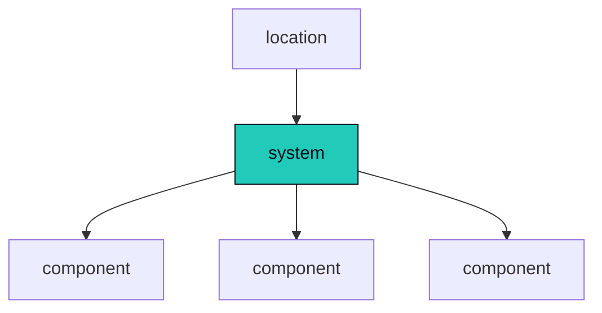
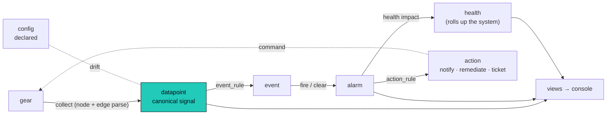

Monitoring, stripped down, is one shape: **collect the data, evaluate it, see it, act on it.** The
whole reason to do it is to **know your systems**, and the one question that matters most is
deceptively simple:

> Is this system working right now?

Omniglass is built around that question. This page follows a **single reading through its whole
life**, top to bottom, from the gear to the answer and the action on it. Each **bold word** is an
official term; the linked ones open their deep dive, and every one is defined in the
[glossary](/architecture/glossary/).

:::note[A proposed architecture]
This is a **proposed, forward-looking architecture**: where we intend to take Omniglass, written in
present tense as the target design, not a promise that every detail ships unchanged. Expect it to adjust
as we build. Each page carries a status badge, **Design** (specified, little or none built), **Partial**
(some capabilities shipped), **Built** (all shipped and tested), or **Diverged** (built, but the
implementation differs from this design, see the page's note); the badge is the page's floor. The
per-capability breakdown and what is actually shipped live on
[implementation status](/architecture/status/); undecided design points are flagged inline as
`Open question` asides.
:::

## The estate

Three nouns describe what you operate.

- A **[component](/architecture/core-entities/)** is a deployed device, app, or service: a display, a
  codec, a DSP, a control processor, a cloud UCC service.
- A **system** is a set of components that work together to do one job. A meeting room is a system.
  So is a classroom, a video wall, a broadcast chain. The word is deliberately universal: a system
  is the unit you actually care about, whatever shape it takes.
- A **location** ties systems and components to a physical place (campus, building, floor, room).

A component belongs to a system; a system sits in a location.

## Something happens

A display drops off the network. A codec changes input. A meeting starts, or a fan stalls. The gear
changes state, and that change is what the rest of the architecture exists to catch and make sense
of.

## Collect

AV gear is **agentless**: you cannot install something inside it, so the reading has to come from
the outside. Sometimes the component **pushes** it to Omniglass; usually Omniglass **polls** for it
on an interval. Either way, a **[node](/architecture/nodes/)** running close to the gear reaches a
component over an **interface** (whatever the device speaks: SNMP, HTTP, SSH, a control processor's
own command language) and reads.

How to reach a class of device, and what to read from it, is declared once in the component's
**template**, the reusable device shape. The node runs that and, crucially, **parses the answer
right there at the edge**, turning a vendor's raw response into a normalized reading on the spot.

That normalized reading is a **datapoint**.

## The datapoint

A **[datapoint](/architecture/datapoints/)** is one value of one **canonical signal** (`power.state`,
`audio.level`), owned by exactly one entity through the **exclusive arc**: one owner, a component or
a system or a location, never more than one. It carries a **provenance** (how we know it: **observed**
from the device, **calculated** by Omniglass, or **intended** by a command we sent) and a **source**
(which sensor or path told us).

The meaning of each signal (its kind, unit, and validation) lives in a governed **registry**, and
a template *references* a registered signal rather than inventing one. That is the whole trick: two
displays from different manufacturers answer the same question the same way, because the
**measurement** is named, not the device. One canonical name, one comparable signal across the whole
fleet.

## What it should be

Not every value is measured. Some are **declared**, set by an operator rather than read from a
device: a setting that should hold (this input should be HDMI1), or a value that rides down the tree
(this system polls every 30 seconds). A declared value is **[config](/architecture/variables/)** when
it is bound to a signal, or a plain **variable** when it just rides down the tree, both resolved down
a **[cascade](/architecture/cascade/)**: set once high, overridden exactly where it matters. Config
has an observed side, so the gap between intent and reality is **drift**, a signal you can alarm on or
a fix you can push back.

## Detect

An **[event_rule](/architecture/alarms-actions/)** watches a datapoint and fires when its condition
is met, recording an **event**: our assertion, in our own words, that something happened. Pair a fire
with a clear and the two events open and resolve an **alarm**, the stateful incident, one row per
occurrence, the thing an operator works and a ticket binds to. An alarm can carry a **health impact**,
which is what turns a detection into a verdict on the system.

## Model health

A single alarm is rarely the point. The headline is **[health](/architecture/health/)**: a
first-class state carried as a calculated datapoint and owned by the **system**. A component goes
unhealthy when a health-impacting **alarm** opens on it, and the system **rolls its members up,
role-aware**. A *required* component down takes the system down; a *redundant* one only degrades it;
an *informational* one does not touch it. That is the answer to "is the system working?", and a
target on it over time is a real uptime **SLA**.

The rollup ships **opinionated by default**, a first-class model rather than a byproduct of the rules
engine, with an escape hatch for the systems the defaults get wrong. The health model always runs;
the only question is whether it runs *as a system* against real signal, or in the operator's head
against half of it.

## Act

An **action_rule** subscribes to events and alarms and runs an **[action](/architecture/alarms-actions/)**.
An action can be one step (notify the right person) or many (remediate, wait, re-check the real
datapoint, escalate if it did not take; or open and close a ticket as the alarm opens and clears).
The loop closes where it started, at the gear.

## See it

The operator never queries raw tables. Reads go through **views** (a named query returning a uniform
`{columns, rows}`), rendered in the **[console](/architecture/ui/)**: the fleet-health grid, the
alarm drill-down, the "why did this value win" cascade explainer. The whole journey is visible the
entire time.

## The journey, end to end

## Underneath

The journey rides on a few foundations, named once:

- the **[Storage Gateway](/architecture/storage/)** is the one door to the database; every read and
  write goes through it, which is where **scope** ([identity and access](/architecture/identity-access/))
  is enforced: a permission on every route, a visibility filter on every query.
- the **[workers](/architecture/workers/)** are one machinery draining a few worklists (the rule
  engine, the outbox, the clock, reconcile); no bespoke loops.
- the **[audit](/architecture/audit/)** trail and the operational logs are immutable, append-only
  ground truth: the record of who changed what and what the platform did.
- **[time](/architecture/time/)** is the one primitive that turns the passage of time into events, so
  the rest of the pipeline stays purely event-driven.
- **[scaling and deployment](/architecture/scaling/)**: the single binary is a modular monolith with run
  modes, deployed as one container for a small estate or scaled out on Kubernetes with a distributed
  edge. One binary is the packaging, not a scale ceiling.

Datapoints are parsed and emitted at the edge, so they are not re-derived from a raw store. Raw
payloads are a debugging aid (a raw mode you turn on while developing, plus failure logging on
collection); how much of that to persist, and for how long, is still being settled.

## The invariants

A handful of patterns hold everywhere, and they are why the model stays coherent:

- **Exclusive-arc ownership**: every datapoint, event, and alarm names exactly one owner (component,
  system, location, node, or global), so system- and location-level signals are first-class.
- **Immutable template versions**: an instance pins a frozen template version (or tracks `latest`);
  editing mints a new version; re-pointing is explicit.
- **On-row lineage**: a derived row carries its own evidence; there is no separate execution table.
- **Scope and the `official` boolean**: the key registries (`datapoint_type`, `event_type`) carry a
  `scope` (template / org / official) deciding where a name is unique; the other registries and rule
  rows carry an `official` boolean (the same axis minus the template layer). `official` is the curated
  ship-with set, the rest is operator-authored and local to a deployment.
- **Views by default**: current-state reads are plain views, materialized only when a profile proves
  it necessary.
- **Not event-sourced**: stateful entities (alarm, action) hold their state directly.
- **Per-database isolation**: there is no tenant column; a tenant is a database.

## Look up any term

Every official term is defined once in the **[glossary](/architecture/glossary/)**. The deep
pages in the sidebar follow this same journey: collection, the device shape, the data model,
config and credentials, the cascade, health, alarms and actions, then the foundations underneath.

Omniglass is built greenfield, one vertical slice per PR; the physical schema lives in
[storage](/architecture/storage/).
