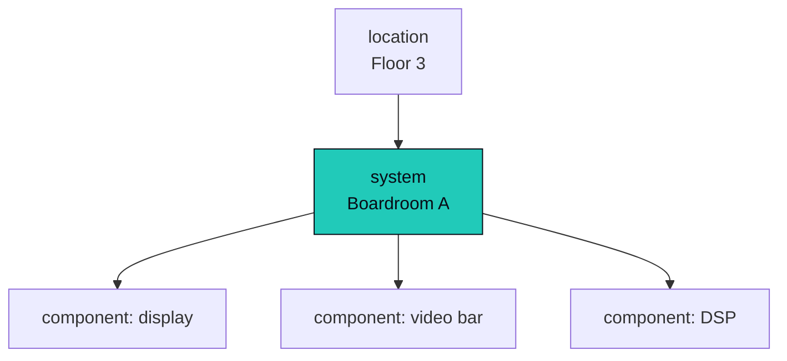
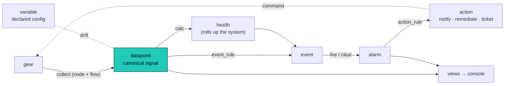

Omniglass has one job: take what comes off your gear and turn it into the answer to "is the room
working?", then act on it. This page follows a **single reading through its whole life**, top to
bottom. Each **bold term** is an official concept; the bold-and-linked ones open their deep dive,
and every term is defined once in the [glossary](/architecture/taxonomy/#glossary).

## The estate

An AV estate is a tree. A **[component](/architecture/components/)** is a deployed device, app, or
service. A **system** is a composition of components that does one job (the meeting room, the video
wall, the broadcast chain): the service tree. A **location** places systems in the world (campus,
building, floor, room). A component belongs to a system; a system sits in a location; and **health,
alarms, and config attach at any level**, not just the device.

## Something happens

A display drops off the network. A codec switches input. A meeting starts, or a fan stalls. The gear
changes state, and that change is what the rest of the architecture exists to catch and make sense
of.

## Collect

The gear will not volunteer its state, so Omniglass goes and gets it. A **[node](/architecture/nodes/)**,
the edge runtime placed near the gear, runs a **[flow](/architecture/collection/)** declared in the
component's **template**: it reaches the device over an **interface** (SNMP, HTTP, SSH, a control
processor's raw command dialect), reads, and parses the answer right there at the edge. What comes
back is no longer a vendor's string.

## Type it

The parsed reading is a **[datapoint](/architecture/taxonomy/)**: one value of one **canonical
signal** (`power.state`, `audio.level`), owned by the component through an exclusive arc, stamped
with a **provenance** (how we know it: **observed** from the device, **calculated** by a rule, or
**intended** by a command we issued) and a **source** (which sensor or path told us). The meaning of
each signal, its kind and unit and validation, lives in the **datapoint_type** registry; a template
*references* a signal, it never invents one. That single canonical path is what lets a Sony display
and a Samsung display answer the same question the same way.

## What it should be

Not every value is measured. Some are declared: this codec *should* be on HDMI1; this room's poll
interval is 30s. A declared value is a **[variable](/architecture/variables/)**, resolved down a
**[cascade](/architecture/cascade/)** (set once high, overridden where it matters). Link a variable
to its observed datapoint and the gap between intent and reality is **drift**: a signal you can alarm
on, or a fix you can push back.

## Model health

A single signal is rarely the point. **calc rules** combine and roll signals up the tree, and the
headline rollup is **[health](/architecture/health/)**: an ordinary calculated datapoint owned by
the **system**, reduced from its members and **role-aware**. A *required* display down takes the room
down; a *redundant* mic only degrades it; an *informational* sensor does not touch it. That is the
answer to "is the room working?", and a target on it over time is a real uptime **SLA**.

## Detect

An **[event_rule](/architecture/alarms-actions/)** watches a datapoint and fires when its condition
is met, recording an **event**: our assertion, in our own vocabulary, that something happened. Pair a
fire with a clear and the two events open and resolve an **alarm**, the stateful incident, one row
per occurrence, the thing an operator works and a ticket binds to.

## Act

An **action_rule** subscribes to events and alarms and runs an **[action](/architecture/alarms-actions/)**:
notify the right person; or remediate-verify-escalate (send the command, wait, re-check the real
datapoint, escalate if it did not take); or open and close a ticket as the alarm opens and clears.
The loop closes where it started, at the gear.

## See it

The operator never queries raw tables. Reads go through **views** (a named query returning a uniform
`{columns, rows}`), rendered in the **[console](/architecture/ui/)**: the fleet-health grid, the
alarm drill-down, the "why did this value win" cascade explainer. The whole journey is visible the
entire time.

## The journey, end to end

## Underneath

The journey rides on a few foundations, named once:

- the **[Storage Gateway](/architecture/storage/)** is the one door to the database; every read and
  write goes through it, which is where **scope** ([identity and access](/architecture/identity-access/))
  is enforced: a permission on every route, a visibility filter on every query.
- the **[workers](/architecture/workers/)** are one machinery draining a few worklists (the rule
  engine, the outbox, the clock, reconcile); no bespoke loops.
- the ground-truth records, **telemetry** (the raw debug sidecar), the logs, and the
  **[audit](/architecture/audit/)** trail, are immutable and append-only; everything else is derived
  and rebuildable.
- **[time](/architecture/time/)** is the one primitive that turns the passage of time into events, so
  the rest of the pipeline stays purely event-driven.

## The invariants

A handful of patterns hold everywhere, and they are why the model stays coherent:

- **Exclusive-arc ownership**: every datapoint, event, and alarm names exactly one owner (component,
  system, or location), so system- and location-level signals are first-class.
- **Immutable template versions**: an instance pins a frozen template version; edits mint a new
  version; re-templating is an explicit re-point.
- **On-row lineage**: a derived row carries its own evidence; there is no separate execution table.
- **Official and private namespaces**: every registry and rule ships a curated official set, shadowed
  by private operator rows; the URL never exposes the namespace.
- **Views by default**: current-state reads are plain views, materialized only when a profile proves
  it necessary.
- **Not event-sourced**: stateful entities (alarm, action) hold their state directly.
- **Per-database isolation**: there is no tenant column; a tenant is a database.

## Look up any term

Every official term is defined once in the **[glossary](/architecture/taxonomy/#glossary)**. The deep
pages in the sidebar follow this same journey: collection, taxonomy, variables, cascade, components,
health, alarms and actions, then the foundations underneath.

Omniglass is built greenfield, one vertical slice per PR; the physical schema, the lineage CHECK,
partitioning, and tiering live in [storage](/architecture/storage/).
