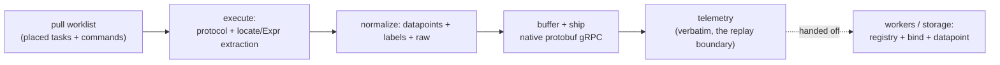

Component document of
[the architecture overview](/architecture/). How the edge runtime gets
its instructions and runs them: worklist pull, placement, executing tasks and
commands, sessions, inbound demux, the job queue, reachability, and shipping
telemetry. The declarative shape it executes lives in [components](/architecture/components/).

## The node

The node is the edge process (`omniglass --mode node`), one per site, or the
**server itself** for work with no site-local edge (see *Placement*). Its identity
is **bound to `node.name`**; a compromised node cannot impersonate another (see
[identity-access](/architecture/identity-access/) for the node auth path). It holds no
config of its own: it pulls what to do, runs it, and ships results.

## Getting its instructions

The node pulls a **worklist**: the tasks and commands resolved for the
components **placed on it**, over a gRPC config pull, and **heartbeats** so the
server tracks liveness. The server, not the template, decides placement (next), and
resolves the cascade (`${component.state.*}`, effective `interval`, credentials)
before handing the node concrete work. The node never sees a template; it sees
materialized, resolved task and command instances.

### Config propagation (declared change to running node)

An interface's connection config (endpoint, snmp community, http auth header) is a
**projection** of the component's declared state through its template. The node
re-pulls the worklist (tasks) every tick, but **caches interface config for its
process lifetime**, so a changed connection input must be propagated, not just
written:

- **Reconcile on the server.** Changing a declared input (via `:apply`, or a
  direct write to `/components/{name}/datapoints/state`) re-renders the affected
  interfaces from the component's *current* declared state and upserts them,
  preserving placement. So the materialized interface always reflects the latest
  declared config, regardless of which path changed it.
- **Invalidate on the node.** The worklist response carries a per-node **config
  generation** (`X-Og-Config-Generation`): the max `updated_at` across the
  interfaces the node polls. When it advances, an interface's rendered config
  changed, so the node drops its interface cache and re-fetches this tick. A
  steady generation serves from cache; a real change forces a refresh within one
  tick, no restart.

The generation moves at **operator-config pace, not telemetry pace**: it is a
read-side aggregate over interface config, and the high-volume datapoint-write
path never touches `interface.updated_at`. A no-op re-apply (identical rendered
config) does not advance it, so nodes are never woken for nothing.

## Placement (ELT, cascaded)

Collection follows **ELT**: extract and load-shaping (including the extractor's Expr
transform) default to the **edge**; resolve / bind / calc / evaluate default to
**central**. Placement is a **cascaded property** ([cascade](/architecture/cascade/)), not a
special mode: `placement: central` makes the **server itself the node target**, for
cloud APIs, SaaS pollers, and inbound webhooks from external sources. A listener
endpoint lives where placement puts it: the on-site node for LAN devices (lower
latency, survives a WAN outage), the server for cloud sources, which is why a
registered callback URL resolves to the placed listener's address, not a hardcode.

## Running tasks

For each task the node runs the protocol over the interface's connection,
then **normalizes at the edge**: it applies the locate + Expr extraction
([components](/architecture/components/)) to produce datapoints, stamps labels (cascading
union + override), and keeps the original wire bytes as `raw`. The three types
differ only in trigger:

- **poller**: on the resolved `interval`, send the command/request, read the
  response;
- **stream**: connect, subscribe, receive a stream of events;
- **listener**: receive data pushed to the endpoint it exposes.

All three assemble the same telemetry payload (below).

### Built poll protocols and their config

The node translates each stored task + interface into a poller the collection
engine runs. The built poll types (`interface_type.built = true`) and the
operator config they read:

| interface type | shape | host/target | per-task params | datapoints |
|---|---|---|---|---|
| `icmp` | inline probe | `task.params.target` | `count`, `timeout` | `icmp.reachable`, `icmp.rtt_avg` (fixed) |
| `tcp` | inline probe | `task.params.target` (`host:port`) | `timeout` | `tcp.open`, `tcp.connect_time` (fixed) |
| `snmp` | held connection | `interface.endpoint` (`host[:port]`, port defaults 161) | `task.params.oids` (comma-separated `name=oid`); `interface.params.version` (default `2c`), `interface.params.community` | one datapoint per OID, `name` = the datapoint key |
| `http` | held connection | `interface.endpoint` (base URL) | `task.params.path` (joined onto the base URL), `method` (default `GET`), `timeout` (default `5s`), `body`, `extract` (comma-separated `name=json:<dot.path>`); `interface.params.header_*` (request headers, prefix stripped) | `http.reachable`, `http.status_code`, `http.response_time` (fixed) + one per `extract` entry |
| `raw-tcp` | held connection | `interface.endpoint` (`host:port`) | `task.params.command` (sent verbatim + line ending), `timeout`, `extract` (comma-separated `name=re:<pattern>`); `interface.params.line_ending` (default `\r\n`), `read_delim` (default `\n`), `connect_timeout`, `read_timeout` | `rawtcp.reachable`, `rawtcp.response_time` (fixed) + one per `extract` entry |
| `telnet` | held connection | `interface.endpoint` (`host:port`) | as `raw-tcp`, plus `interface.params.username`/`password` (drive the default `login:` / `Password:` chain; `login_expect`/`password_expect` override the prompts) | `telnet.reachable`, `telnet.response_time` (fixed) + one per `extract` entry |
| `ssh` | held connection | `interface.endpoint` (`host:port`) | as `raw-tcp` (the command runs as a one-shot `exec`), plus `interface.params.username` and `password` and/or `private_key` (inline PEM) | `ssh.reachable`, `ssh.response_time` (fixed) + one per `extract` entry |

`icmp`/`tcp` are inline probes (the target rides the task); `snmp`, `http`, and
the text transports (`raw-tcp`/`telnet`/`ssh`) are held connections, so the
connection (host/port/version/community for snmp, base URL + headers for http,
address + framing + auth for the text family) lives on the interface and the task
names what to read.

Every fixed built-in name (`icmp.reachable`/`icmp.rtt_avg`, `tcp.open`/
`tcp.connect_time`, `udp.open`, `snmp.reachable`, `http.reachable`/
`http.status_code`/`http.response_time`, and `<proto>.reachable`/`<proto>.response_time`
for the text family) is a **registered canonical `datapoint_type`** in the ship-with registry,
so probe/liveness results persist as datapoints, not only on the telemetry row's
`raw`. They are owner-agnostic measurements like any other: unregistered,
reject-not-project would drop them at ingest. `registry.seed_validation_test`'s
`liveness_builtins_present` locks the registry to exactly the names the node
emits, so a rename on either side fails the build instead of silently going
un-derived.

For `snmp`, each OID is carried in its **native SNMP type**: numeric OIDs as
numbers, string OIDs (OctetString / IPAddress / OID) as text, so a string-valued
OID (an enum or label) lands as a `state` datapoint and a numeric one as
`metric`. The owning table is decided at ingest from the key's `datapoint_type`
kind. Per-OID declared typing and richer collection specs move to the component
template with authorship (the template declares the OID set, demoting
`task.params.oids` to an override).
v2c plaintext community only this slice; SNMPv3 and credential-backed
(`auth_secret`) community resolution are deferred.

Every extract spec (`oids`, the http/text `extract`) shares one name grammar: a
name may carry a trailing **`key[instance]`** suffix to distinguish several values
of the *same* canonical key on one owner (`fan.speed[intake]=<oid>`,
`fan.speed[exhaust]=<oid2>`). The bracket is stripped into the datapoint's
reserved `instance` label, so the canonical registry still matches the bare key
and the value lands in the `instance` column ([the instance dimension](/architecture/taxonomy/#the-instance-dimension-many-values-of-one-key-on-one-owner)). A name without a bracket is a singleton (`instance = ''`).

For `http`, `http.reachable` is `1` whenever the request completes a round trip
(`0` on a transport failure: DNS, refused, timeout, TLS), and `http.status_code`
carries the HTTP status separately, so reachability and a `>= 500` status are
distinct alarm signals (a non-2xx response is still reachable). `extract` pulls
values from a JSON body by dot-path (`name=json:data.0.temp`): a number or bool
leaf becomes a `metric`, a string leaf a `state`; a missing path, a
container/`null` leaf, or an unreachable endpoint yields no datapoint. Auth rides
as plaintext `header_*` interface params this slice (e.g.
`header_authorization: Bearer ...`); `auth_secret`-backed credential resolution
is deferred, the same posture as snmp's plaintext community. Carry auth in
`header_*`, never in the URL or body: the request `body` param is **not** stamped
as a datapoint label, and the `target` label is the request URL with its query
string (and any userinfo) stripped, so a token placed in the path query does not
leak into attributes (but is still a bad idea). `method`/`body` support POST/PUT;
richer extraction (response headers, regex, JSONPath wildcards), object keys that
contain a literal dot (the extract path separator), and an http liveness probe
are deferred.

For the **text family** (`raw-tcp`/`telnet`/`ssh`), the poll is one ephemeral
round trip: connect, optionally authenticate, send `task.params.command` followed
by the line ending, read the reply (to the `read_delim` for raw-tcp/telnet, to
EOF for ssh's `exec`, bounded by `read_timeout`), extract, close. `<proto>.reachable`
is `1` once the transport opened and the command round-tripped (`0` on a transport
failure: refused, timeout, or rejected credentials, which are connection health, not
errors), and `<proto>.response_time` is absent when unreachable. `extract` pulls
values by **regex named capture** (`name=re:<pattern>`, parallel to http's
`json:`): each named group routes to the datapoint of the same name, or to the lone
datapoint when the pattern has exactly one group; a captured value that parses as a
number becomes a `metric`, otherwise a `state`; a non-matching pattern (or an
unreachable endpoint) yields no datapoint, while a pattern that fails to compile is
a configuration error. Auth rides plaintext this slice (telnet/ssh `password`,
ssh inline `private_key`), the same posture as snmp's community and http's
`header_*`; `auth_secret`-backed credential resolution and ssh host-key pinning are
deferred. Credentials live on the interface and are never labelled; the `target`
label is the command. The transport is swappable behind one boundary, so a future
`raw-udp` request/response poll (datagram in, reply out) slots in as a fourth kind
without new machinery; UDP **listen** (unsolicited inbound: syslog, snmp-trap) is a
different shape and belongs to the deferred listener runtime. Deferred for the text
family: persistent held sessions, multi-line prompt-expect beyond the first
delimiter, command echo handling, Q-SYS-style frame/checksum framing, and ssh shell
/ pty (`exec` only).

### Built listeners and their config

A **listener** is inbound: an external system POSTs to an endpoint we expose,
rather than us polling it (`mode: listen`, the stateless-listen cell of the
collection matrix). `webhook` is the first built listener and is
**server-hosted**: `placement: central` makes the server the endpoint for
inbound external webhooks, so a webhook listen-task is **server-executed and
unassigned** (`node_name IS NULL`); the server's `POST /webhooks/{path}` route is
its runtime, not a node tick.

| field | where | meaning |
|---|---|---|
| `path` | `interface.params.path` | the opaque, unguessable token in the inbound URL (`/webhooks/{path}`); a bearer locator, not the interface name |
| `secret` | `interface.params.secret` | shared secret the sender presents in the `X-Omniglass-Token` header (or `?token=`), constant-time compared |
| `component` | `interface.component` | when set, datapoints pre-bind to that component (trivial owner); when empty, shared-interface ingress is owner-bound server-side by labels |
| `extract` | `task.params.extract` | comma-separated `name=json:dot.path`; number/bool -> metric, string -> state (same extractor as the http poller) |
| `raw_log` | `task.params.raw_log` | optional key to store the whole raw frame under (as JSON when the body parses, else text), the holding-pen an event_rule can later promote |

One or more `mode: listen` tasks bind to a webhook interface; each inbound POST
runs every enabled one, ingesting its points under that task's id through the
server-side ingress path (so owner attribution, parsing, event rules, and calc
rollups all apply).

**Response contract** (webhook senders retry on non-2xx): **202** = durably
accepted; **401** bad/absent secret, **404** unknown path, **413** body over the
1 MiB cap (4xx = sender fault, don't retry); **5xx** = our fault, please retry. A
`GET`/`HEAD` to the path answers the endpoint-verification ping some providers
send, echoing a `?challenge=` value. The body cap, JSON-only parsing, and
"non-JSON body makes declared extractions absent (not an error)" mirror the http
poller.

**Auth and spoofing**: the secret is plaintext in `interface.params` this slice
(same posture as snmp's plaintext community); `auth_secret`-backed resolution and
HMAC-signature verification are deferred behind the auth seam. The route stamps a
trusted, server-set `interface` label on every datapoint and copies body fields
into attributes **only** via the declared `extract` set, so a body field cannot
impersonate another interface; shared-interface ingress should scope on
`event.labels.interface`, and per-component interfaces (server-assigned owner)
are preferred for high-trust sources. Node-hosted listeners (LAN-local sources),
idempotency/dedup, and form-encoded bodies are deferred.

## Sessions

> Status: the built `ssh`/`telnet`/`raw-tcp` poll adapters are **ephemeral** today,
> a fresh connect-auth-command-close per poll (above). The persistent held-session
> model in this section, where the handshake and auth are paid once and reused, is
> the deferred stateful-collection slice (session pool + listener runtime +
> reconnect/backoff/keepalive + `session_log`). It is described here as the target,
> not what slice 1 ships.

A stateful interface (`ssh`, `mqtt`, anything held open) becomes a **session** at
runtime: one connection keyed by `(node, interface)`, shared by every task and
command under it, so the handshake and auth are paid once. The live socket is
ephemeral and lives on the node; the node **reports lifecycle transitions as
`session_log` rows** to the server, where the `session` entity projects current state
(a current-state view over `session_log`, ground-truth side; see the storage spoke).

Generic lifecycle (exact enum deferred to the ssh slice):

- **establish**: connect, authenticate, **subscribe** if a stream rides this
  session;
- **operate**: run pollers and receive stream events over the held connection,
  demuxed (next);
- **recover**: graceful retry on connect, **especially auth failures** (backoff,
  surface as a `session_log` error, never hammer, since hammering a rejected
  credential risks lockout; ties to credentials); a
  subscription is session-scoped, so a reconnect **re-subscribes**;
- **teardown**: on error or when told, exit cleanly and set up again.

**Where failures land.** `session_log` owns **connection health** (cannot connect,
auth rejected, dropped, timeout). The **data event owns parse health**: a parse
failure (connected, got bytes, the extraction did not match) lands on the record
being produced (`telemetry` for polls and listener frames, the caused `event` + the
`action` row for commands), with `raw` for replay, and surfaces as a collection-health
datapoint so it is alertable. A command timeout can touch both.

## Inbound handling on a shared connection

When one connection carries heterogeneous inbound frames (a session with pollers + a
stream, or one webhook taking many payload types), an arriving frame is **not**
self-evidently the response to the last command. Frames route through an **ordered
matcher set**:

- every task contributes a matcher (a poller's awaited-response shape, a
  listener/stream's `match:` predicate); each inbound frame is tested **in
  order**, first match routes it to that task's extraction;
- while a poll is **outstanding**, its response matcher is tried **first**, then the
  standing matchers in declared order, so an event arriving mid-poll falls through to
  its stream instead of being mis-eaten as the response;
- where the protocol **frames** responses vs events (xAPI tags `*r` vs `*e`, a
  request id correlates), framing drives routing and the regex only extracts within
  the matched frame; otherwise ordered content-matching is the fallback;
- an **unmatched** frame lands as `raw` (orphan, logged, replay-recoverable), so a
  missing matcher is a fixable gap, not lost data.

## The component job queue

The node's work is the **component job queue** (distinct from the central
**rule engine's work queue** that processes derivation; see workers). It
holds **poll jobs** (produce `telemetry`) and **command jobs** (from `run`
actions, produce a caused `event` + `action`-row status), and splits work by shape:

- **discrete jobs** (pollers, commands): scheduled or triggered, request/response,
  **serialized into per-component lanes**. Component, not host, is the contention
  key: a server with two IPs is one component, and a reboot takes out both
  interfaces, so a per-host lane would run parallel work against the box you just
  rebooted. A shared poller that fans to many components runs once on its parent and
  fans out at binding.
- **standing receivers** (listeners, streams): always-on, event-driven, **not
  lane-serialized**; they normalize as events arrive, sharing a held session with
  pollers (demuxed) or owning their connection.

**Smart-wait gate.** After a disruptive command, the lane blocks until reachability
reports the host back up, then releases the next job. The gate is a condition over
live reachability read from the node's **local** copy, not a round-trip to the
datapoint store; a fixed timeout is only the backstop.

## Implicit reachability

Any interface with a host address gets reachability for free: the node pings the
host and checks the declared port(s) are listening, continuously and out of band.
Smart default, **bypassable per interface** (endpoints that drop ICMP or have no port
to check opt out or override the probe). The results come back as `reachable` /
`port_open` **datapoints** usable in rules and dashboards, and they feed the
smart-wait gate from the node's local copy, so the connection detector and the
dashboard signal are the same always-on probe.

**Built today (the layered availability gate).** The gate is an **OSI-layered**
set of cheap checks run as a **concurrent pre-pass** (its own high concurrency,
short timeouts) before a connection-interface's poll tasks. All applicable checks
run (they are cheap), each ships a built-in datapoint, instanced (the ping by
host, the rest by interface) and owned by the queried component, and the
interface's **`interface.reachable`** verdict is their AND. The pre-pass is
separate from the bounded poll phase, so a node pinned to `--workers 1` (to
trickle telemetry past the queue) still gates a large fleet in ~one wave.

| Layer | Check | Datapoint | Notes |
|---|---|---|---|
| L3 network | ICMP ping, **batched once per host** per tick | `icmp.reachable` / `icmp.rtt_avg` | **informational** (see verdict below); shared by every interface on the host |
| L4 transport | TCP connect (tcp-family) **or** UDP presence (snmp/UDP) | `tcp.open`/`tcp.connect_time` · `udp.open` | a closed UDP port answers ICMP port-unreachable, so absence of that is "present"; this is why SNMP's transport check is L4, not its auth-dependent get |
| L7 app | protocol handshake: SNMP `sysUpTime` get (**`snmp.reachable`**, default-on) · SSH handshake+auth · telnet login chain | (verdict) | the SNMP get is the **primary, default** SNMP liveness (ICMP-independent); SSH/telnet are **opt-in** (`ssh_check`/`telnet_check="on"`) because their liveness credential can differ from the device's |

**The verdict respects each layer's definitiveness.** A TCP connect and any L7
handshake (SSH/telnet auth, the SNMP get) are **definitive** proof of
reachability, so they stand on their own and the **ping is informational**: an
ICMP-filtered host (a hardened device or a cloud API that drops echo) still reads
up from its port/protocol check, instead of the whole interface going dark. A UDP
"present" is a **read timeout** (open|filtered) and so is **ambiguous**; the only
thing that disambiguates it is the ping. So a failed ping fails the verdict ONLY
for an SNMP interface that has *opted out* of the L7 get (`snmp_check=off`),
leaving the ambiguous UDP probe as its only signal (`pingGates`); by default the
SNMP get is the signal and the ping is informational. A definitively *down* layer
(TCP refused, UDP ICMP-unreachable, an L7 auth/no-answer) fails the verdict
regardless; an inconclusive probe (a setup/resolve error, a missing credential)
does not gate.

**Off gates (the enable/disable convention).** Every check is toggled by
`params.<name>_check = "on" | "off"`, overriding its default; `params.liveness =
"off"` disables the whole gate. The default split is by **auth dependence**:

- **auth-independent layers default ON (opt-out):** `ping_check`, `port_check`
  (and `tls_check` when TLS lands). Cheap and credential-free, so safe to gate on.
- **`snmp_check` defaults ON** (opt-out), the one auth-dependent exception: the
  get reuses the *same* community the poll already needs, so a get failure means
  the device is genuinely unpollable, the right verdict, and it's the only
  ICMP-independent SNMP signal. Opt out to fall back to ping+UDP.
- **`ssh_check` / `telnet_check` default OFF** (opt-in): a service whose *liveness*
  credential differs from the device's must not read as down, so the operator
  opts in per interface.

The honest limit on SNMP status: a v2c wrong community is a **silent drop** (the
agent answers the *manager*, not us), so a get failure alone can't separate down
from wrong-community. Cross-referencing the layers does: host pings + UDP not
refused + get silent ⇒ "reachable, SNMP not answering this community" (auth/ACL/
wedged), distinct from "host down"; with ICMP fully blocked that inference is lost
and it's honestly reported as "host down or fully filtered." SSH verifies auth (a
rejected handshake is down); telnet completes the `login:`/`Password:` chain
(service-up, not a verified shell). Override the SNMP probe OID with
`params.liveness_oid` when a community view excludes the system group.

**Poller** tasks run only if the verdict is up; **listener** (`mode=listen`) tasks
are inbound and run ungated (and are never pinged); **inline probes** (`icmp`/`tcp`
with the host on the task, no interface endpoint) *are* the check and run ungated.
A down interface's gate datapoints all ship in **one** batched call. L5 (socket),
L6 (TLS), and further L7 handshakes slot in by extending the check stack: one
`append` in `ifaceChecks`, gated by its own `_check` param.

## Shipping telemetry

The node ships a native `Event`: `{ datapoints, raw, labels }` plus an envelope
(`task`, batch `ts`), as **native protobuf over gRPC**, buffered with
retry/backoff. `raw` is the original wire bytes, kept so a wrong extraction is
**replay-recoverable**. An **OTLP adapter** at the edge accepts OTLP from
third-party tools and translates to the native shape.

The server appends the payload **verbatim** as a `telemetry` (the replay
boundary: ground truth, immutable); everything after, registry lookup and binding to
`datapoint`s, is derived and owned by workers and the storage
spoke. The node's job ends at the ship.

## Tick scheduling, concurrency, and self-observability

A tick groups the worklist **by interface** and runs in three phases: the L3 ping
pre-pass (batched per host), then the per-interface gate-verdict pre-pass, then
the poll phase. The two gate pre-passes run at a **high fixed concurrency**
(`gateConcurrency`, the checks are cheap short-timeout socket probes), while the
poll phase fans out across the **bounded poll pool** (default 16, `--workers`).
Splitting them is the point: the cheap gate is never throttled by a small
`--workers` (a node pinned to one poll worker still gates a large fleet in ~one
wave), and a node facing many dead or slow targets is bounded by concurrency, not
the serial sum of every probe timeout (a dead SNMP get costs `timeout *
(retries+1)`, configurable via `--snmp-timeout` / `--snmp-retries`; default 3s x2).
Each poll task additionally runs under a per-task deadline (`--task-deadline`,
default 30s).

The loop is **overrun-aware**: instead of a fixed ticker that silently drops
ticks when one runs long, it reschedules relative to each tick's finish. A tick
that exceeds its interval is flagged and the next fires immediately, so a node
falling behind **surfaces** the overrun rather than stalling its cadence
silently.

Each tick the node reports its own execution via `POST /nodes/{name}:report`:
tick duration, task attempted/ran/skipped/failed counts, interface probed/up/down
counts, and the `node.overrun` state. **Telemetry is telemetry**: the report is
not special-cased: the handler appends it as a telemetry envelope through the
same ingester every source uses (tagged the reserved `node.self` shape) and
returns, and the queue worker derives it like any other event. A node carries no
operator-authored template; its telemetry shape is **built into the binary** (the
seeded `node.*` datapoint types and node-health rules), and the `node.self` shape
is what selects that built-in template at derive time. The one node-specific
piece is owner resolution: `ProcessTelemetry` **pre-binds** a `node.self` envelope to
the reporting node (`owner_kind = node`, the fourth exclusive-arc alongside
component/system/location), the node-arc analogue of a per-component interface
pre-binding its telemetry to its component. So node datapoints land node-owned
with no server-side parse, no inline derivation, and the worker's batching +
concurrency + amortized rule refresh apply for free. This is the operator-visible
health of the collection layer itself. Self-telemetry is best-effort (a failed
report is logged, never fatal; it must not break collection).

A node that goes dark, though, reports nothing, so a degraded-but-alive signal
is not enough. The server's queue worker runs a **node-liveness sweep**: a node
whose last heartbeat (or its registration, if it has never checked in) predates
the staleness window (`OMNIGLASS_NODE_DOWN_AFTER`, default 90s) gets a node-owned
**`node.down` alarm**, auto-resolved the moment it heartbeats again. The alarm is
raised directly by the sweep (no event_rule: a dead node emits no datapoint to
evaluate), keyed by `(node.down, node owner)` so it is idempotent across sweeps.
This is why the node owner arc reaches `event` and `alarm`, not just datapoints:
"the node isn't working" is a first-class node-owned incident.

A degraded-but-alive node, by contrast, *does* report, so it alarms through the
ordinary **event_rule** path the worker runs over every derived datapoint, no
node-specific evaluation: a rule on a `node.*` key opens a node-owned alarm. Two
are seeded by default: `node-overrun` (fires while `node.overrun` is true) and
`node-tasks-failing` (fires while `node.tasks.failed > 0`), both resolving
implicitly on the next clean tick. This works because the trigger engine is
owner-general: `Evaluate` opens and resolves alarms for the datapoint's actual
owner (component, system, location, or node), which also unlocks system- and
location-owned alarms.

## Open items

- The exact `session` lifecycle state enum and pooling parameters (idle timeout, max
  lifetime, pool size per interface, shared vs dedicated session for a stream).
- Per-task schedule dispatch (the resolved `interval` exists; honoring distinct
  per-task cadences within one node tick).
- Tasks within a single interface still run serially (one probe, then its
  tasks in order); only distinct interfaces run concurrently. Intra-interface
  concurrency is deferred (connection/order semantics per protocol).
- A durable node-side queue (today the worklist is server-pulled per tick;
  backpressure is concurrency + deadlines, not persistence).
- The node-server config-pull and heartbeat protocol detail (co-design with
  the API spoke and the node auth path in [identity-access](/architecture/identity-access/)).
