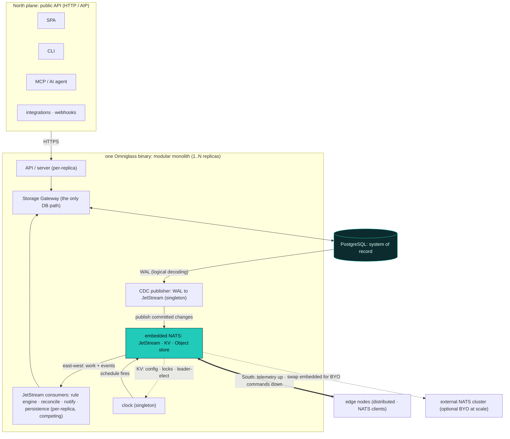

Omniglass is **one Go binary**, and that is a packaging decision, not a scale ceiling. The same artifact
runs an all-in-one container on a laptop and a horizontally-scaled fleet on Kubernetes; you scale by
**topology**, not by swapping products. This page is the deployment and scale model: the two run modes,
the embedded services, what replicates, the coordination substrate, platform configuration, high
availability, and multi-tenancy.

## Two run modes, one binary

The binary is a **modular monolith**: one codebase, one artifact, modules behind clean seams (the Storage
Gateway is the only path to the database, coordination rides NATS, collection runs at the edge). It runs
two ways, the **same binary**, no fork:

- **All-in-one (the modular monolith).** One process runs every role, with **Postgres and NATS embedded**
  (below), against nothing external. The desktop, single-binary, small-estate case: download, run, done.
- **Split by run mode (Kubernetes).** The same binary launched **per mode** as separate Deployments,
  against an **external** Postgres and an external NATS cluster. A Helm chart wires it up, and each role
  scales independently.

Splitting a mode onto its own pods is a **deployment choice, not a rewrite**, because the modules already
talk over NATS and the gateway rather than in-process calls that would need untangling. The roles:

- **server**: the public HTTP API ([API](/architecture/api/)) and the views read path; it serves the
  **SPA embedded in the binary** (`go:embed`), so the web UI is not a separate service. Stateless.
- **worker**: the **JetStream consumers** (rule engine, reconcile, notify, [workers](/architecture/workers/)).
  Stateless competing consumers; add replicas for throughput.
- **controller**: the leader-elected **singletons** (the clock and the CDC publisher, below). A role, not
  necessarily its own pod.
- **node**: collection; at the edge it runs **at the sites** (outside the cluster) and connects back, with
  a central `node` for cloud-API and SaaS sources (`placement: central`, [nodes](/architecture/nodes/)).

## Embedded services (single-binary mode)

In all-in-one mode the binary brings its dependencies up in-process, so an operator runs **one container,
zero external setup**:

- **NATS + JetStream, embedded as a library** (`nats-server` in-process, file-backed). The app is always a
  NATS client; embedded versus external is a config flag, not a code path.
- **PostgreSQL, embedded as a managed subprocess** ([embedded-postgres](https://github.com/fergusstrange/embedded-postgres)):
  a **real** Postgres, so logical decoding (the CDC bridge below), JSONB, partitioning, and the
  exclusive-arc CHECK constraints behave identically to at-scale. Pinned to **Postgres 18.3.0 or newer**
  for ARM and x86. **Not SQLite**, which has no logical replication and would fork the data layer into a
  second, lesser architecture.

So "single binary" is the binary orchestrating a real Postgres and NATS for you, not a different
datastore. The data and coordination architecture is identical at any size.

## Coordination: NATS moves, Postgres remembers

The split is firm. **Postgres is the relational system of record** (entities, datapoints, events and
alarms, audit, and the queries the cascade, fusion, views, and scope need). **NATS (JetStream) is the
nervous system**: work distribution, the durable command queue, the telemetry buffer, and fan-out, plus
**KV** (config, locks, leader-election) and an object store for internal artifacts.

The two meet through **change data capture**: Postgres tells us *what changed* (logical decoding of the
WAL), and NATS carries the queue. A single **leader-elected CDC publisher** reads committed changes from a
replication slot and publishes them to JetStream (an idempotency key per change yields exactly-once
outcomes downstream). **Postgres is never a message bus**; it only emits its changes. The replication
**slot and publication are ensured idempotently in the boot phase, not a migration**, since dbmate
migrations run exactly once.

### Inter-service communication

Service-to-service traffic rides **two lanes on the one JetStream bus**, by what is moving:

- **Data lane (NATS-native).** Observed and calculated **datapoints** live on NATS. The edge and central
  nodes publish observed datapoints to a JetStream datapoints stream, calc consumers publish derived
  datapoints back onto the same stream, and the rule engine consumes them **directly from NATS**. A
  **persistence consumer** batch-writes datapoints to the Postgres metric, state, and log tables as an async
  **sink**. Datapoints do not pass through CDC: they are already on NATS, idempotent on `(series, ts)`, and
  the firehose, so rules never wait on Postgres. Postgres is the durable record, NATS is the live signal.
- **Record and state lane (Postgres-first, CDC-out).** **Events, alarms, actions, and operator mutations**
  (config, ack, snooze, settings, manual commands) are **born in a Postgres transaction**: when an
  `event_rule` fires, the consumer writes the event record and the alarm transition (serialized per
  `(event_rule, owner)`) in one transaction, and the API writes config, ack, and settings the same way. The
  leader-elected CDC publisher then fans those committed changes out to JetStream, where `action_rule`,
  reconcile, and projection consumers react. **No dual-write**: born in the commit, CDC fans out.

## Horizontal scale: what replicates

- **server** is **stateless**: replicate it behind a load balancer; state lives in Postgres.
- **workers** are **JetStream consumers**: a work-queue stream delivers each message to exactly one
  consumer, so adding replicas adds throughput with no leader and no cross-worker chatter (NATS is the
  coordinator, [workers](/architecture/workers/)).
- **edge nodes**: distribution is the design, one or many per site, connecting back; adding sites adds
  nodes ([nodes](/architecture/nodes/)).
- **singletons** (the clock and the CDC publisher) are **leader-elected via a NATS KV lock**: exactly one
  active, the rest stand by and take over on failure. One mechanism, no separate election service.

## Platform configuration

Configuration is **two tiers**, and platform settings are deliberately **centralized**, not scattered
across dozens of tables and APIs:

- **Bootstrap (env, optional).** The irreducible minimum needed before the database exists: the Postgres
  DSN, the NATS embed-or-external choice and address, the `SecretProvider` key, the run mode, and the
  listen address. In all-in-one mode these have working defaults, so a desktop run needs **no configuration
  at all**; env vars override when you need them.
- **The platform settings store (one place).** Everything else lives in a single, audited **settings
  store**: feature flags, the buffer and retention defaults, CDC routing, integration settings, UI
  defaults, official-registry overrides. It is materialized in Postgres (the runtime authoritative copy,
  changeable through the API and audited), and **seeded declaratively from a settings file**
  (`settings.json` or YAML) reconciled on every boot (the idempotent boot-seed phase, `ON CONFLICT DO
  UPDATE`). The file is GitOps-friendly and mounts cleanly as a **Kubernetes ConfigMap** (and a future
  operator), so the same declarative source drives a laptop and a fleet.

This is distinct from estate [config and variables](/architecture/variables/), which describe the
*estate* and resolve down the cascade. The settings store describes the **platform itself**, and there is
exactly one home for it, the single source of truth core settings deserve.

## Vertical scale and high availability

Replicas are the **HA** story: the server and worker tiers have no single point of failure (any replica
can serve or consume), the singletons fail over by re-electing on the NATS KV lock, Postgres HA is the
database's concern (CNPG, a managed cluster), NATS HA is the JetStream cluster's, and the **edge survives a
WAN outage on its own** (the bounded buffer plus the durable command queue, [nodes](/architecture/nodes/)).
Vertical scale is the simple first lever (a bigger Postgres, more worker CPU); horizontal removes the
ceiling.

## Multi-tenancy: per database, per account, per deployment

Tenant isolation is **physical, not a row predicate**: a tenant is **one database, one NATS account, and
one deployment**. There is no `tenant_id` column anywhere, no shared row store, and no shared subjects, so
per-database isolation (storage) and per-account isolation (messaging) are the **same boundary**. The data
model stays single-tenant-shaped; multi-tenancy lives at the orchestration layer (CNPG-per-tenant). One
noisy or compromised tenant cannot reach another because there is nothing shared to reach across
([identity and access](/architecture/identity-access/)).

## The one-binary promise

The same binary and the same code paths run the demo and the fleet. You do not adopt a different product
to scale: you run more roles, on more pods, against an external Postgres and NATS, with more edge nodes.
Simplicity at the small end, a real horizontal ceiling at the large end, one artifact across the range.
