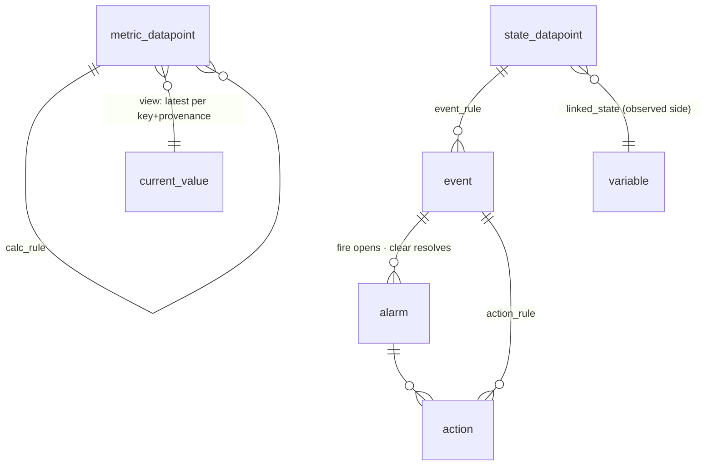
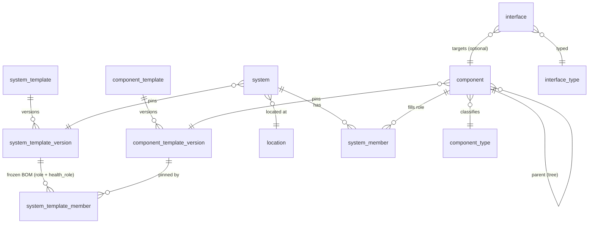

Leaf of the [architecture spine](/architecture/). Every other leaf defines entities that land
here. This page shows the tables and how they relate, but points back to each owning leaf (and to
[datapoints](/architecture/datapoints/) for the data-model semantics) rather than re-explaining them.

## Conventions

- **No `tenant_id`.** Isolation is per-database (a database per tenant); there is no tenant column
  anywhere. The ship-with **official registries** (`interface_type`, `component_type`, `event_type`,
  `variable_type`, and the official namespace of `datapoint_type`) are the namespace-null shared
  layer, shadowed by private rows (the namespace shadow pattern).
- **Three storage shapes.** **Ground-truth records** are append-only and immutable, each named for
  what it is: `log_datapoint` (a datapoint kind), `audit_log` (operator actions), and the standing
  `*_log` ground-truth logs (`session_log`, `internal_log`, plus the deferred `collection_log` /
  `node_log`). There is **no `telemetry` table**: datapoints are emitted at the edge, so the raw
  payload is not persisted in steady state; raw appears only on a `collection.failed` event or a
  dev raw-mode tap ([datapoints](/architecture/datapoints/)). A schedule fire is not a record here: it is an `event` with `origin=scheduled`.
  There is no separate rule-execution table: derived rows carry their lineage on the row.
  **Datapoints** (`metric_datapoint` / `state_datapoint` / `log_datapoint`) are the typed
  observation firehose. **Stateful entities and projections** (`alarm`, `action`, current-value)
  hold state directly or are rebuildable read models, **views by default**. The model is **not
  event-sourced**.
- **Provenance and lineage on every datapoint**: `provenance` (observed / calculated / intended),
  `source` (which sensor or path, for observed), and a lineage pointer. observed and calculated both
  carry `source_rule` (+ version), the function or calc_rule that produced the row; intended carries
  `event_id` (the command). A CHECK enforces the pointer per provenance; **observed vs calculated is
  the `provenance` value itself**, not a column-presence trick. Declared config is not a datapoint
  provenance; it lives in [config](/architecture/variables/), keyed to the same signal.
- **Ownership is the exclusive-arc** on every datapoint table, `event`, `alarm`, and `variable`:
  `owner_kind` enum plus the matching typed FK (`component_id` / `system_id` / `location_id` /
  `node_id`, or none for the singleton `global`) plus a CHECK that exactly the matching column is set
  (or all null for `global`). System-, location-, node-, and global-level datapoints are first-class.
- **Keys**: datapoints and events use a surrogate id plus `ts`; the key registry `datapoint_type`
  uses the composite natural key `(namespace, name)`; structural entities are name-keyed; a `task`
  is **content-addressed** (`hash(interface, kind, schedule, params)`); a `node` by name.

## The records



| Table | Key columns | Notes |
|---|---|---|
| `metric_datapoint` | id, ts, **owner_kind, component_id/system_id/location_id/node_id**, key, **instance**, **value float8**, provenance, source, **source_rule, source_rule_version, event_id** | the firehose; BRIN on ts; numeric aggregation. `instance` (`''` default) discriminates many values of one canonical key on one owner ([datapoints](/architecture/datapoints/)) |
| `state_datapoint` | id, ts, owner arc, key, instance, **value text/jsonb**, provenance, source, + same lineage cols | sparse, transition-only; time-in-state and dwell. [Config](/architecture/variables/) is keyed to one as its observed side |
| `log_datapoint` | id, ts, owner arc, key, instance, **value text/jsonb (the line)**, level, provenance, source, + same lineage cols | GIN / tsvector full-text; also the holding pen for un-normalized occurrences |
| `event` | id, ts, key, **origin** (caught/caused/derived/scheduled), owner arc, payload (jsonb), correlation_id, **alarm_id** (nullable), + lineage | the semantic-occurrence log; a momentary event has null `alarm_id`, an alarm edge carries it. A schedule fire is an event with `origin=scheduled` (no separate schedule table) |
| `alarm` | **id**, event_rule, owner arc, **status, severity, opened_at, resolved_at, acked_by** | a stateful entity, **one incident, new row per open** ([datapoints](/architecture/datapoints/)); holds current state directly (not event-sourced); the ITSM anchor. History = events + audit by `id` |
| `action` | id, **steps (ordered: notify/command/wait/branch)**, status, current_step | a stateful entity; delivery and step state; driven by events/alarms ([alarms and actions](/architecture/alarms-actions/)) |
| `audit_log` | id, ts, actor, verb, resource_kind, resource_id, old, new (jsonb) | ground truth; the lineage target for operator writes (including config changes); secret decrypts always recorded |
| `session_log` | id, ts, session_id, node, interface, transition (connect/auth/drop/close/reconnect/error), detail | ground truth, node-reported; the connection log |
| `internal_log` | id, ts, kind (startup/reconcile/migration/node-reg/config-sync), detail | ground truth; the platform narrating itself |

Common datapoint columns (all three kind-tables): `ts`, the **owner arc** (`owner_kind` plus
`component_id` / `system_id` / `location_id` / `node_id`), `key, provenance, source`, plus the on-row lineage
`source_rule, source_rule_version, event_id`; only the value column differs (float8 /
text-jsonb / line). A `datapoint` view UNIONs the common columns for "all datapoints for owner X".

### The lineage CHECK

Lineage lives on the datapoint row, no separate execution table. `source_rule` (+ version) is set
for observed and calculated (the function or calc_rule that produced the row); intended carries the
command `event_id`. The pointer per provenance is enforced so e.g. "intended with no command event"
is impossible at the storage layer:

```sql
CHECK (
     (provenance IN ('observed','calculated') AND source_rule IS NOT NULL AND event_id IS NULL)
  OR (provenance = 'intended'                 AND event_id IS NOT NULL AND source_rule IS NULL)
)
```

Observed and calculated both carry `source_rule`; they are distinguished by the **`provenance`
column**, not a pointer-presence trick (an edge function versus a calc_rule). The intended split is
the one the CHECK enforces. This is one of three layers: the CHECK enforces *which pointers are populated*, foreign keys enforce
*the ids are real*, and the app enforces *the value type matches the key's kind*.

## Current value and projections: views by default

`alarm` and `action` are **stateful entities** that hold their own current state in a real table
(not event-sourced). Everything else that is "current state" is a **read model**, and the default is
a **plain SQL view** (always-correct, never stale, zero maintenance). A worker-maintained table is a
**deferred, measured optimization**, earned only when a read profile shows a view too slow.

| Read model | Of | Day-one shape | Notes |
|---|---|---|---|
| `current_value` | latest datapoint per (owner, key, **instance**, **provenance**), fused across sources per the key's `fusion_policy` | **view** | the dashboard read; per-provenance so observed and intended are both visible (the divergence model needs both), per-instance so siblings of one key stay distinct, fusion applied on read. The only later table candidate, metric kind only |
| `session` | `session_log` | **view** | low-volume; node, interface, status, opened_at, last_activity_at, command/error counts |

**When the view stops scaling.** A latest-per-key view's cost scales with the number of **distinct
keys** (a loose index scan), not total rows. Point and scoped reads ("current value of X on Y") are
a covering-index probe, fast at any size. A full-fleet "every current value" is O(distinct keys):
comfortable to hundreds of thousands, painful past a few million. A naive `DISTINCT ON` scans the
whole log and dies on the firehose; never that plan.

So only `current_value` for the **metric** firehose is even a table candidate, and only when
frequent full-fleet reads meet low-millions-plus distinct keys. The sparse kinds (`state` / `log`)
stay views indefinitely. A worker-maintained table costs **one upsert per datapoint write** (write
amplification, hot-key contention) and reintroduces a staleness window; that cost must be earned by
a read profile, not assumed. **Never a materialized view**: a PG MV is stale between refreshes and
has no incremental refresh, so a refresh is a full firehose recompute. The choice is plain view
(default) versus inline table (profiled).

## Inventory and structural



| Table | Key columns | Notes |
|---|---|---|
| `component` / `location` / `system` | name (unique), type, **parent_id** (self-ref tree), display_name; `component`/`system` pin a `*_template_version`; `system` carries `location_id` | three variable-depth trees; deepest wins in the cascade ([cascade](/architecture/cascade/)) |
| `*_type` | (namespace, name), display_name, **field schema + defaults** | classification registries; official namespace null. For **location** the type is the *only* shape-definer (no template) |
| `component_template` / `system_template` | name, type, **spec (jsonb)** | the mutable device/system shape ([components](/architecture/components/)); editing mints a new version. Locations have no template |
| `component_template_version` / `system_template_version` | (template, **version**), frozen **spec** | the **immutable** snapshot an instance pins; keys and roles never change under it |
| `system_template_member` | (system_template_version, **role**, component_template_version, **health_role**) | the frozen **bill of materials**: role -> pinned `component_template_version` + health role (required / redundant / informational, [health](/architecture/health/)) |
| `system_member` | (system_id, **role**, component_id) | the *instance* assignment; the role validates against the system's frozen version so it never expires |

## Collection

| Table | Key columns | Notes |
|---|---|---|
| `interface_type` | name, **built**, direction (in/out), param_schema (jsonb) | the protocol-and-style registry (`ssh`, `https`, `snmp`, `mqtt`, `webhook`, ...); generates the template config schema |
| `interface` | name (per component), interface_type, **component** (nullable: set = pre-bound, null = shared/match-key), params (jsonb), **node** (server-assigned placement) | the connection, declared once ([collection](/architecture/collection/), [nodes](/architecture/nodes/)) |
| `task` | **id = content hash**, interface, **mode (poll/listen)**, spec (jsonb), enabled | a node's unit of collection work; dedupes identical work. Parsing to datapoints is the **edge function** ([collection](/architecture/collection/)), not the task's job |
| `datapoint_type` | (namespace, name), kind (metric/state/log), value_type, unit, **fusion_policy**, validation (jsonb) | the one key registry across all datapoint kinds; official namespace null, private shadow on assignment; referenced by templates ([datapoints](/architecture/datapoints/#the-datapoint_type-registry)) |
| `event_type` | (namespace, name), display_name, **payload_schema (jsonb)** | the event-key registry; lets an event_rule promote a raw log line into a registered event. Official namespace null, private shadow |

A command is **not a table**: it is a `component_template_version.spec` declaration (the interface
`commands` block); a command instance is an `action` row with `kind=command`.

## Config, credentials, and variables

Operator-set values are **not** datapoints and not a separate prop-table family; they resolve through
the cascade ([config and credentials](/architecture/variables/)). Three kinds share that home:
**config** keyed to a signal (declared + observed, drift, reconcile), **credentials** (secret-bearing
shapes, encrypted at rest by the pluggable **`SecretProvider`** with every decrypt audited), and free
**variables** (macros). Whether they share one table or split is open.

| Table | Key columns | Notes |
|---|---|---|
| `variable_type` | (namespace, name), schema (fields + **per-field secret**), refresh, validation | the **shape** registry (a scalar, or structured like `oauth2` / `ssh_credential` / `snmp_community`); official namespace null, private shadow |
| `variable` | (name, **owner arc**), type, **declared_value** (secret fields encrypted), **linked_state** (-> state_datapoint, nullable), **observed_value**, reconcile | the config cell and the `$var:` cascade key; scope is the exclusive arc (template/component/system/location/global). Holds declared intent, optionally mirrors an observed datapoint for drift ([variables](/architecture/variables/)) |
| `tag` | name, applies_to, propagates | operator-label registry (no `_type`, no namespace) |
| `tag_binding` | (scope_kind, scope_id, tag), value | union + override combinator |
| `group` | id, kind (component/system/location/user), membership (static list or dynamic filter), **weight** | cascade band and access scope ([cascade](/architecture/cascade/), [identity and access](/architecture/identity-access/)) |
| `calc_rule` / `event_rule` / `action_rule` | **(id, version)**, scope, spec (jsonb: Expr + params) | config, named for function ([calculations](/architecture/calculations/)); versioned so a backtest can pin the rule version. `calc_rule` = cross-key/system-level derivation; `event_rule` = fire_criteria + optional clear_criteria; `action_rule` = a subscription (an Expr predicate over events). Parsing is the edge function, not a rule; a deferred `discovery_rule` is not yet in schema |

## Files and blobs

| Table | Key columns | Notes |
|---|---|---|
| `file` | id, name, content_type, size, **sha256**, tags | searchable metadata handle; points at a blob by hash ([files](/architecture/files/)) |
| `blob` | **sha256**, bytes / storage_ref, size, content_type | content-addressed bytes; dedup; backend pgblobs / S3 / disk behind the gateway; reference-counted GC |

## Time

| Table | Key columns | Notes |
|---|---|---|
| `schedule` | id, rrule/cron, **tz (IANA)**, target, enabled | config: a recurring trigger ([time](/architecture/time/)) |
| `timer` | id, **fire_at (timestamptz)**, kind (schedule-tick / for-sustain / runbook-wait / watchdog), ref, payload, claimed_at | the clock worker's pending-fire **working-set** (mutable, drained `SKIP LOCKED`), not a history log; fires are logged on the entity they produce |

## IAM

| Table | Key columns | Notes |
|---|---|---|
| `principal` (+ per-kind `human` / `service` / `node`) | id, kind, ... | subjects ([identity and access](/architecture/identity-access/)); a `node` carries labels, last_heartbeat_at, and its bound credential |
| `role` | (namespace, name), permissions (jsonb: `<resource>:<action>`) | RBAC capability set; ship viewer/operator/admin/owner + custom |
| `principal_grant` | (principal_id, role, **scope**) | role x scope; scope = a structural node, an entity-group, or `all`; additive |

## Partitioning and retention

- **Append-only tables are range-partitioned by `ts`** (native declarative partitioning;
  `pg_partman` where the provider permits, else a documented manual roll). The firehose
  (`metric_datapoint`) is the partitioning-critical one.
- **Retention is per table**, set by policy, not one global TTL: `metric_datapoint` short,
  `state_datapoint` / `log_datapoint` longer, `audit_log` longest (compliance), `internal_log`
  short. On-row lineage ages out with its datapoint.
- **Views are not partitioned** (bounded by fleet size, not time) and are computed from the
  underlying tables, never the source of truth.

## The storage gateway and tiering

The **Storage Gateway is the single path to the database** (no direct access, no PostgREST); it is
also where IAM scope is injected ([identity and access](/architecture/identity-access/)). Isolation
is per-database, so there is no tenant context to set. Because every read and write goes through it,
the physical backend is swappable beneath it:

- **default**: Postgres for everything (datapoints, ground-truth records, views, registries), the
  single-binary BYO-Postgres story.
- **tiering (direction, details TBD)**: the firehose does not stay in hot Postgres forever. Aged
  `metric_datapoint` / `log_datapoint` partitions tier out to a **columnar or object
  store** (Parquet on S3-compatible, or an embedded columnar engine) behind the same gateway, so
  historical queries fan across hot and cold with no model change. The cold tier is partitioned by
  `ts`.
  - **TBD**: the specific cold engine, the tier-out trigger (age versus partition-detach hook), the
    query-federation mechanism, and whether projections ever tier. Captured here so the gateway
    abstraction is designed for it from day one even though the cold engine is not chosen.

## Open items

- The tiering specifics above (cold engine, tier-out trigger, federation).
- Whether `current_value` (if materialized) is one wide table or per-kind, keyed per (owner, key,
  instance, provenance).
- Index strategy per datapoint table beyond the obvious (BRIN on metric ts, GIN on log body), tuned
  against real volume.
- The append-only id type (bigint identity versus uuid v7) under partitioning.
