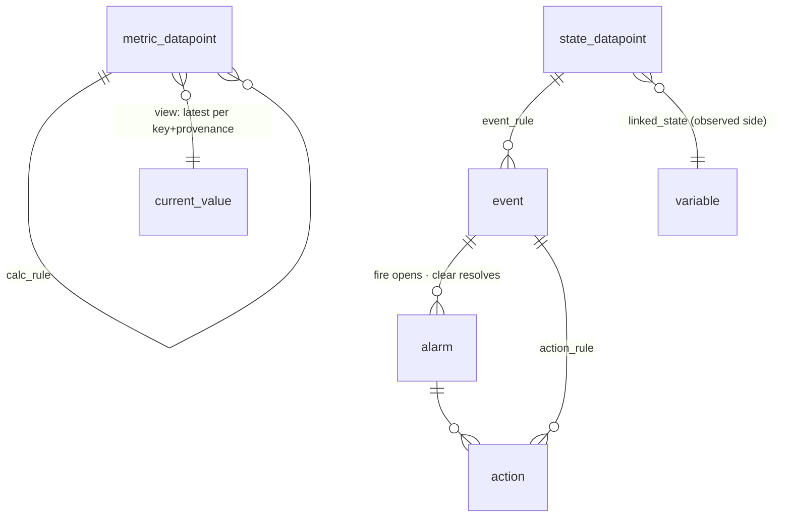

Storage is the set of patterns every entity in Omniglass lands on, so an operator can trust that scope, audit, retention, and lineage behave the same way no matter which table the data lives in. This page describes **how storage works**, the
patterns every other leaf's entities land on, not a per-table column dump. The column schemas live
with each owning feature: [datapoints](/architecture/datapoints/#the-datapoint-tables) (the three
kind-tables), [events](/architecture/events/#storage) (the `event` row), [alarms and
actions](/architecture/alarms-actions/#storage) (`alarm` / `action`), [config and
credentials](/architecture/variables/#storage) (`variable` / config / tags), [core
entities](/architecture/core-entities/) and [templates](/architecture/templates/) (the structural and
template tables), [collection](/architecture/collection/#storage) (interfaces and tasks),
[calculations](/architecture/calculations/#storage) (the rule families), [files](/architecture/files/),
[time](/architecture/time/#storage), and [identity and access](/architecture/identity-access/#storage).

## Conventions

- **No `tenant_id`.** Isolation is per-database (a database per tenant); there is no tenant column
  anywhere. The key registries `datapoint_type` and `event_type` carry a **`scope`** (template / org /
  official) deciding where the name is unique ([key scope](/architecture/datapoints/#key-scope-template-org-official)),
  and the non-template registries (`interface_type`, `component_type`, `variable_type`) carry an
  **`official` boolean**, the same axis minus the template layer: `official: true` rows are the
  ship-with canonical set distributed with the binary, and `official: false` rows are operator- or
  org-authored, local to this deployment.
- **Three storage shapes.** **Ground-truth records** are append-only and immutable, each named for
  what it is: `log_datapoint` (a datapoint kind), `audit_log` (operator actions), and the standing
  `*_log` ground-truth logs (`session_log`, `internal_log`, plus the `collection_log` /
  `node_log` companions). There is **no `telemetry` table**: datapoints are emitted at the edge, so the raw
  payload is not persisted in steady state; raw appears only on a `collection.failed` event or a
  dev raw-mode tap ([datapoints](/architecture/datapoints/)). A schedule fire is not a record here: it is an `event` with `origin=scheduled`.
  There is no separate rule-execution table: derived rows carry their lineage on the row.
  **Datapoints** (`metric_datapoint` / `state_datapoint` / `log_datapoint`) are the typed
  observation firehose. **Stateful entities and projections** (`alarm`, `action`, current-value)
  hold state directly or are rebuildable read models, **views by default**. The model is **not
  event-sourced**.
- **Provenance and lineage on every datapoint**: `provenance` (observed / calculated / intended),
  `source` (which sensor or path, for observed), and a lineage pointer. observed and calculated both
  carry `source_rule` (+ version), the function or calc_rule that produced the row; intended carries
  `event_id` (the command). A CHECK enforces the pointer per provenance; **observed vs calculated is
  the `provenance` value itself**, not a column-presence trick. Declared config is not a datapoint
  provenance; it lives in [config](/architecture/variables/), keyed to the same signal.
- **Ownership is the exclusive-arc** on every datapoint table, `event`, `alarm`, and `variable`:
  `owner_kind` enum plus the matching typed FK (`component_id` / `system_id` / `location_id` /
  `node_id`, or none for the singleton `global`) plus a CHECK that exactly the matching column is set
  (or all null for `global`). System-, location-, node-, and global-level datapoints are first-class.
  The full pattern is on [core entities](/architecture/core-entities/#ownership-the-exclusive-arc).
- **Keys**: datapoints and events use a surrogate id plus `ts`; the key registry `datapoint_type`
  carries a **`scope`** (template / org / official) deciding where the name is unique (`(template_id, name)`
  at template scope, `name` at org/official); structural entities are name-keyed; a `task` is **content-addressed**
  (`hash(interface, kind, schedule, params)`); a `node` by name.

## How the records relate

The relationships, not the columns. The columns of each table live on its owning leaf (linked above).



The structural and template entities (`component` / `system` / `location` and the `*_template` /
`*_template_version` / `system_template_member` / `system_member` families) relate as shown on
[core entities](/architecture/core-entities/) and [templates](/architecture/templates/); the
collection entities (`interface_type` / `interface` / `task`) on
[collection](/architecture/collection/#storage).

## Ground-truth records

The immutable, append-only records, each named for what it is. They are the lineage targets and what
a backtest reads; none is derived. The detailed columns of `audit_log` live on
[audit](/architecture/audit/), `session_log` on [nodes](/architecture/nodes/#sessions); the rest is a
compact list here because storage is their natural architectural home:

- **`log_datapoint`** (a component's own words, a datapoint kind, [datapoints](/architecture/datapoints/));
- **`audit_log`** (operator actions: actor, verb, resource, `old -> new`; the lineage target for
  operator writes; secret decrypts always recorded, [audit](/architecture/audit/));
- **`session_log`** (connection-lifecycle transitions, node-reported; the connection log,
  [nodes](/architecture/nodes/#sessions));
- **`internal_log`** (platform self-narration: startup / reconcile / migration / node-reg /
  config-sync, [workers](/architecture/workers/));
- the **`collection_log`** / **`node_log`** companions (the cheap per-run execution record
  and the node's operational narration).

There is **no separate rule-execution table**: a derived row *is* the evidence of its rule's run,
carrying its lineage on the row (below).

## The lineage CHECK (the pattern)

Lineage lives on the derived row, no separate execution table. This is the **pattern** every derived
row follows: `source_rule` (+ version) is set for observed and calculated (the function or calc_rule
that produced the row); intended carries the command `event_id`. The pointer per provenance is enforced
so e.g. "intended with no command event" is impossible at the storage layer. One example, the datapoint
tables:

```sql
CHECK (
     (provenance IN ('observed','calculated') AND source_rule IS NOT NULL AND event_id IS NULL)
  OR (provenance = 'intended'                 AND event_id IS NOT NULL AND source_rule IS NULL)
)
```

Observed and calculated both carry `source_rule`; they are distinguished by the **`provenance`
column**, not a pointer-presence trick (an edge function versus a calc_rule). The intended split is
the one the CHECK enforces. This is one of three layers: the CHECK enforces *which pointers are populated*, foreign keys enforce
*the ids are real*, and the app enforces *the value type matches the key's kind*.

The datapoint tables also carry nullable **`correlation_id`** and **`caused_by_event_id`** trace
columns. These are orthogonal to the lineage pointers above: they are not lineage pointers, so they
do not participate in the exclusive-lineage CHECK. They carry causation across the command -> device
-> observed-datapoint round trip so the cycle guard walks a real id ([datapoints](/architecture/datapoints/),
[alarms and actions](/architecture/alarms-actions/)).

## Current value and projections: views by default

`alarm` and `action` are **stateful entities** that hold their own current state in a real table
(not event-sourced). Everything else that is "current state" is a **read model**, and the default is
a **plain SQL view** (always-correct, never stale, zero maintenance). A worker-maintained table is a
**measured optimization**, earned only when a read profile shows a view too slow.

| Read model | Of | Shape | Notes |
|---|---|---|---|
| `current_value` | latest datapoint per (owner, key, **instance**, **provenance**), fused across sources per the key's `fusion_policy` | **view** | the dashboard read; per-provenance so observed and intended are both visible (the divergence model needs both), per-instance so siblings of one key stay distinct, fusion applied on read. The one table candidate if a profile earns it, metric kind only |
| `session` | `session_log` | **view** | low-volume; node, interface, status, opened_at, last_activity_at, command/error counts |

**When the view stops scaling.** A latest-per-key view's cost scales with the number of **distinct
keys** (a loose index scan), not total rows. Point and scoped reads ("current value of X on Y") are
a covering-index probe, fast at any size. A full-fleet "every current value" is O(distinct keys):
comfortable to hundreds of thousands, painful past a few million. A naive `DISTINCT ON` scans the
whole log and dies on the firehose; never that plan.

So only `current_value` for the **metric** firehose is even a table candidate, and only when
frequent full-fleet reads meet low-millions-plus distinct keys. The sparse kinds (`state` / `log`)
stay views indefinitely. A worker-maintained table costs **one upsert per datapoint write** (write
amplification, hot-key contention) and reintroduces a staleness window; that cost must be earned by
a read profile, not assumed. **Never a materialized view**: a PG MV is stale between refreshes and
has no incremental refresh, so a refresh is a full firehose recompute. The choice is plain view
(default) versus inline table (profiled).

:::caution[Open question]
If `current_value` is ever materialized, is it one wide table or a table per kind, keyed per (owner,
key, instance, provenance)?
:::

## Partitioning and retention

- **Append-only tables are range-partitioned by `ts`** (native declarative partitioning;
  `pg_partman` where the provider permits, else a documented manual roll). The firehose
  (`metric_datapoint`) is the partitioning-critical one.
- **Retention is per table**, set by policy, not one global TTL: `metric_datapoint` short,
  `state_datapoint` / `log_datapoint` longer, `audit_log` longest (compliance), `internal_log`
  short. On-row lineage ages out with its datapoint. The per-table defaults are **cascade-resolved**
  ([cascade](/architecture/cascade/)) with global defaults, so a class or entity can hold longer or
  shorter without a global change.
- **The `raw_sample` buffer** (the opt-in raw-retention policy, [collection](/architecture/collection/))
  is range-partitioned by `ts` and cold-tierable like the metric partitions, on a short retention. It
  is bounded, sampled, and short-lived; it is not a telemetry table.
- **Views are not partitioned** (bounded by fleet size, not time) and are computed from the
  underlying tables, never the source of truth.

:::caution[Open question]
The index strategy per datapoint table beyond the obvious (BRIN on metric `ts`, GIN on log body),
tuned against real volume.
:::

:::caution[Open question]
The append-only id type under partitioning: bigint identity versus uuid v7.
:::

## The Storage Gateway and tiering

The **Storage Gateway is the single path to the database** (no direct access, no PostgREST); it is
also where IAM scope is injected ([identity and access](/architecture/identity-access/)). Isolation
is per-database, so there is no tenant context to set. Because every read and write goes through it,
the physical backend is swappable beneath it:

- **default**: Postgres for everything (datapoints, ground-truth records, views, registries), the
  single-binary BYO-Postgres story.
- **tiering**: the firehose does not stay in hot Postgres forever. Aged
  `metric_datapoint` / `log_datapoint` partitions tier out to a **columnar or object
  store** (Parquet on S3-compatible, or an embedded columnar engine) behind the same gateway, so
  historical queries fan across hot and cold with no model change. The cold tier is partitioned by
  `ts`.

:::caution[Open question]
Which cold engine backs the tier, what triggers tier-out (age versus a partition-detach hook), how
queries federate across hot and cold, and whether projections ever tier.
:::
