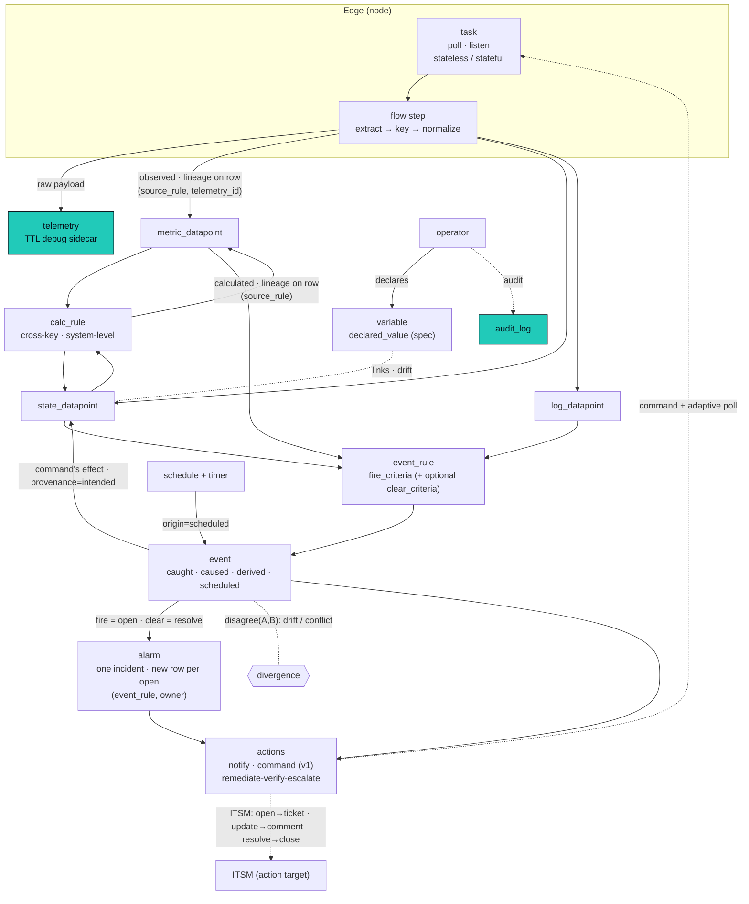

This is the authoritative data model: the meaning of the data. The physical layout (tables, partitioning, the lineage CHECK, tiering) lives in storage; the spine is [the architecture overview](/architecture/).

## The model in two sentences

Flows collect from devices and **parse at the edge** into typed **datapoints** (metric, state, log) owned by a structural entity, keeping the raw payload in **telemetry** as a debug sidecar; **calc_rules** derive more datapoints, and **event_rules** evaluate datapoints into **events** (and the **alarms** they open and close); **actions** respond. Every datapoint carries a **provenance** (how we know it: observed, calculated, intended) and a **source**, and any two provenances (or sources) of one key disagreeing is the single universal divergence signal. Declared config (operator intent) lives in [variables](/architecture/variables/), not as a datapoint provenance.

```text
flow step (edge) --parse--> datapoint (metric / state / log)
                                  |  |   (raw payload --> telemetry, a debug sidecar)
                                  |  +--- calc_rule --> datapoint        (calculated)
                                  +----- event_rule --> event --> alarm
                                                          |
                                                       actions (notify / command / ...)
```

The pipeline is a **DAG**: rules read observed and calculated values as truth, only *compare* intended values (and a variable's declared value) against observed, and never infer a new fact from an intended value treated as truth. See [The DAG invariant](#the-dag-invariant).

## Two orthogonal axes

The model has exactly two independent questions, and conflating them is the only thing that makes it feel fuzzy.

- **Kind** answers *what kind of thing is this?* It is fixed per **key**, forever, decided once when the key is defined. `power.state` is always a state.
- **Provenance** answers *how do we know this particular value?* It varies per **row**. The same `power.state` can be observed or intended at different moments. A *declared* desired value lives in a [variable](/architecture/variables/), not on the datapoint.

Kind is a property of the key. Provenance is a property of the row.

## Datapoints: one family, three kinds

A **datapoint** is an observation: a value of one key, on one owning entity (component, system, or location), at one time. The row shape is the same for all three kinds: `(owner, key, instance, ts, value, provenance, source, lineage)`. They are three physical tables only because they index and retain differently, not because they are different concepts.

- **metric** (`metric_datapoint`): numeric (float). Continuous, aggregatable. Has a current value.
- **state** (`state_datapoint`): categorical, text, or a structured object. Discrete, dwell-measurable. Has a current value (`last()` is meaningful).
- **log** (`log_datapoint`): a component's own words, the value is the log line (text or jsonb), keyed by log type (`log.system`, `log.os`, `log.app.<name>`). A stream, not a current value, but still an observation with a value at a time, so it is a datapoint, not a separate primitive. In practice only components emit logs.

Treating log as a datapoint removes the usual special case: an alarm on a log line is just an event rule whose condition matches a `log_datapoint` value, no different in shape from a metric threshold.

**An event is not a datapoint.** A datapoint is an observation (a value we recorded); an **event** is *our semantic assertion that something happened*, in our vocabulary. Datapoints are what rules read; events are what event rules produce.

### Ownership: the exclusive-arc

A datapoint attaches to a **structural entity**, not only a component. The owner is the **exclusive-arc**: an `owner_kind` enum plus the matching typed FK (`component_id` / `system_id` / `location_id`) with a CHECK that exactly the column matching `owner_kind` is set. The same arc owns `event` and `alarm` rows. This makes **system-level and location-level datapoints first-class** (e.g. `health` is a `state_datapoint` owned by a system), the fix for Zabbix's inability to put state on a group of hosts. See Ownership on the spine for the full pattern and the storage DDL.

### The instance dimension: many values of one key on one owner

One owner can hold several distinct values of the *same* canonical key: three fan speeds on a switch, per-port counters, per-channel audio levels. The canonical registry deliberately holds **one** `datapoint_type` per measurement (`fan.speed`, not `fan.speed.intake`), so the discriminator lives outside the key, as an `instance text NOT NULL DEFAULT ''` column on all three datapoint tables. Series identity is therefore **`(owner, key, instance, provenance)`**: each instance is its own series, while a singleton (`instance = ''`) is the default. Aggregation stays clean (group by `key`, ignore `instance`); per-instance trends stay distinct.

The instance rides the pipeline as a reserved **`instance` label** on the collected datapoint: the collection extract spec authors it as a `key[instance]` suffix (`fan.speed[intake]=<oid>`, `fan.speed[exhaust]=<oid2>`), the parser strips the bracket into the label so `registryAllows` / `kindFor` still match the bare canonical key, and the derive step reads `instance` into the column. Calc folds **every** instance of an input key into the reduce: a rule reading `fan.speed` from a component gets one candidate per fan, so `worst` / `average` / `count` / Expr aggregate across all of them (a singleton key yields one candidate). An input filter can select one instance (`instance == "intake"`). The worklist needs no instance granularity: `calc_work` collapses on `(owner, key)` and recompute re-reads current state of every instance, so two fan changes in one event coalesce to one correct recompute. Calc **outputs** stay aggregate (`instance = ''`); per-instance outputs (one health per fan, a group-by) are a separate future capability, not a silent gap, output owners default to the singleton.

### The has-a-value-now razor (datapoint vs event)

A datapoint records a value; an event records an occurrence.

- `"input is 1"` is a value, so it is a **datapoint** (state).
- `"call started"` is an occurrence, "what is call-started now?" is meaningless, so it is an **event**.

A raw occurrence we have not normalized (a syslog line, a raw webhook frame) lands as a **`log_datapoint`** (observed, value = the line). An event rule can then **promote** it into a normalized event. So the log table is also the holding pen for un-normalized occurrences until a rule recognizes them.

## The registries: datapoint_type and event_type

Two registries, each named for what it holds, because a datapoint and an event are different shapes (a datapoint has a value; an event is an occurrence). We do **not** force them into one universal registry, that would be the false unification the rest of this model avoids.

- **`datapoint_type`** describes every datapoint key: `(namespace, name, kind, value_type, unit, fusion_policy)`, with the official/private shadow (namespace shadow pattern). One registry across all three datapoint kinds (metric/state/log). The kind is decided by the key, not at runtime: the compiler bakes each key's kind into the edge unit, so a value routes to the right table with no runtime lookup. `fusion_policy` is the built-in, read-time multi-source reconcile carried on the key (see [Fusion](#fusion)). A key names a **measurement, never its owner** (`temperature`, not `room.temperature`), with snake_case segments in a dot hierarchy and the unit in the `unit` field (`fan.speed` + `unit: rpm`, not `fan_rpm`); the ship-with official set lives in `internal/registry/defaults.yaml`. Adding or naming one: the `canonical-datapoint` skill.
- **`event_type`** describes every event key: `(namespace, name, display_name, payload_schema, ...)`, same official/private shadow. Declaring event types (`call.started`, `cable.unplugged`, `command.sent`) is first-class and valuable: it gives events a known schema, makes them inspectable, and is what lets an event rule promote a raw log line into a *registered* event. An event key is registered here; an unregistered occurrence stays a `log_datapoint` line until a rule promotes it.

The naming convention is consistent: a `_type` registry defines what a thing *is*, named for the thing (`datapoint_type`, `event_type`, like `component_type`, `interface_type`). `datapoint_type` spans the three datapoint kinds, and events get their own registry because an event is a different shape.

**Datapoint key naming is owner-agnostic.** A key names a *measurement*, never its owner: `temperature` is a Celsius reading whether a codec's thermals or a room's ambient sensor produced it, and the owner (component / system / location / node) plus a template's labels and the flow that collected it give it context. So there is no `system.` / `device.` / `room.` prefix; keys group by measurement domain (`cpu.utilization`, `power.state`, `video.input`, `audio.level`, `network.icmp.rtt`). This is the normalization the product hinges on: one canonical path means one comparable signal across every vendor, which is what makes cross-fleet dashboards and AI useful. The official set is seeded from `internal/registry/defaults.yaml` following OpenTelemetry semantic conventions for the IT leaves (`cpu.utilization`, `memory.usage`; semconv's own `system.` prefix is dropped to avoid colliding with the `system` entity type) and the [OpenAV minimum-device-functionality guidelines](https://github.com/OpenAVCloud/specifications/blob/main/min-device-functionality/OAVC-AV-Device-Minimum-Functionality-Guidelines.md) for AV signals. Templates *reference* these registered keys; a template can never mint one.

**Validation is enforced on ingest, under a policy.** A datapoint_type's `validation` (`{min,max}` for a metric, `{values:[...]}` for a state) is checked when an observed value lands, governed by a `validation_policy` config mode: **bypass** (skip), **audit** (the default: write the value but emit a `datapoint.validation_failed` event), or **enforce** (hold the value back from the typed series, emit the event). The raw telemetry row always persists, so an enforced-out value is never lost, it stays backfillable once the registry or the template is corrected. The point is visibility: an out-of-range or unmapped value means a template author declared a type the device disagrees with, so the violation surfaces as an owner-attributed event operators and admins see. The mode is a single global setting today; resolving it per-entity down the cascade (global, location, system, component) is the follow-on, gated on the cascade resolver.

## Collection: how telemetry arrives

A **task** is a node's unit of collection work. Two independent axes describe it, and keeping them separate is what keeps the model clean.

- **Task mode** (a property of the task): **poll** (we ask for each datum) or **listen** (we wait for it to arrive). Stated from *our* perspective on purpose: "pull/push" inverts depending on whose frame you take, because the component pushes exactly when we pull. `poll` and `listen` are verbs *we* perform.
- **Transport** (a property of the interface): **stateless** (a throwaway connection per shot) or **stateful** (a held-open connection, which becomes a `session` and emits `session_log` rows for connect/auth/drop/reconnect).

These are orthogonal. All four cells are real:

| | **poll** (we ask) | **listen** (we wait) |
|---|---|---|
| **stateless** | SNMP get, HTTP GET | webhook, SNMP trap, syslog |
| **stateful** | SSH-exec or xAPI `xStatus` on a held session | MQTT subscribe, xAPI feedback |

Waiting for a frame is a single mode (**listen**) regardless of transport; a held-open connection is a property of the interface, not a separate mode. So there are two task modes, and statefulness lives on the interface.

**Native push.** First-class data pushed by smart senders (control-system programmers instrumenting directly) is self-describing (it carries its key), so its edge parse is a near-identity pass-through, marked `shape=native`. As with any flow, the raw payload is kept in `telemetry` as a debug sidecar.

## Provenance: how we know a value

Provenance is the second axis, stamped per datapoint row. The same key, with the same value, can be known three ways. Each provenance points at the immutable ground-truth record that produced it (its **lineage**), and the lineage column populated is mutually exclusive per provenance, enforced by a CHECK constraint.

| Provenance | How we know it | Lineage points at |
|---|---|---|
| **observed** | measured from a component | on-row: `source_rule` (+ version) and `telemetry_id` (the source telemetry) |
| **calculated** | derived from other datapoints | on-row: `source_rule` (+ version), `telemetry_id` null |
| **intended** | the declared effect of a command we issued, pending reconciliation | `event_id` (the command event) |

A value of any provenance is still a metric/state/log (the kind is fixed by the key); provenance only records *how it got there*. All three land in the same datapoint tables, side by side for the same key, which is what makes divergence detection free. Declared intent is the fourth value an operator can assert, but it lives on a [variable](/architecture/variables/), not in the datapoint tables, and can be compared against an observed datapoint for drift.

A separate **`source`** column records *which sensor or path* produced an observed value (`codec.cec` vs `display.lan` vs `control.system`). Source is distinct from provenance: provenance is *how we know* (observed), source is *which sensor told us*. Three sensors reporting one display's power are three observed rows on one key, differing only in source. This is what makes multi-source corroboration and [fusion](#fusion) possible.

### observed: from a component, via a transform

"Measured from a component," not "from a device", every device is a component, but not every component is a device. The observed datapoint carries its own lineage on the row: `source_rule` + `source_rule_version` (which flow and template version made it, the backtest hinge) and `telemetry_id` (the raw payload it parsed, kept as a debug sidecar). There is no separate execution table, a derived datapoint is itself the evidence of the flow's run, exactly as an event/alarm/action row self-describes.

### calculated: derived by a calc rule

A calculated value (a 5-minute average, a system rollup, a fused consensus) is parallel to observed: both are machine-derived. The difference is the input. An edge flow parses a raw payload (so the observed row's `telemetry_id` points at the debug sidecar); a calc rule reads **other datapoints** (so `telemetry_id` is null). Both carry `source_rule` + `source_rule_version` on the row. So observed and calculated differ on the row by `telemetry_id` set-or-null, which is also how the lineage CHECK tells them apart, and the exact inputs a calc read are reconstructable from the rule version (that is what backtest does); if an immutable input snapshot is ever needed it is a nullable `inputs jsonb` column, not a table.

### intended: the declared effect of a command

When the action layer issues a command, it records the command as an **event** and writes the **intended** state it expects, in one step. The intended datapoint's lineage is that command event. The name is deliberate: **intended vs observed** is the central razor, intent-in-progress versus measured reality.

```text
1. command issued:  "power on display-5"  -> recorded as an event
2. intended write:  display-5 power = on, provenance=intended, lineage=<the command event>
                    a bet: intended, not measured
3. adaptive poll:   the command triggers a poll sooner than the normal interval
4. observed arrives:
     observed = on  -> reconciled (the bet paid off)
     observed = off -> divergence (the command did not land)
```

There is no separate "mapping" primitive. Which state a command intends lives on the command definition. **Only commands set intended state** (intended's lineage is always a command event). The external-event-implies-state case ("meeting started, so the room is occupied") is deferred.

Not every log-to-state path goes through a command. The split is measured fact vs pending intent:

| The source says | Means | Path |
|---|---|---|
| "eth0 **is** down" | a component reporting measured reality | telemetry, transform, then **observed** state, directly |
| we sent "**power on**" | intent in progress, not yet confirmed | command, event, then **intended** state |

### declared values are variables

mac, ip, serial, locked-input, anything an operator *sets* is declared intent, and declared intent is **not** a datapoint provenance. It lives in a [variable](/architecture/variables/)'s `declared_value`, resolved through the scope cascade and optionally linked to an observed `state_datapoint` for drift. There is no separate property or config store: config is the variable table plus the cascade, not a datapoint provenance. Ownership resolution reads the resolved identity (a declared identity variable, or the observed identity datapoint it links) to bind telemetry to components.

### Precedence: spec versus status lives in variables

When declared intent and observed reality disagree, which one wins is a **per-variable `reconcile` policy** ([variables](/architecture/variables/#drift-and-reconcile)), not a per-key datapoint attribute:

- **observed wins** is `reconcile: accept` (or just `alert`): the declaration was a hint or stale guess, reality is truth. A device reporting a different MAC than the declared one is a divergence to investigate.
- **declared wins** is `reconcile: enforce`: the declaration is the spec, reality should conform. Observed input HDMI2 against a declared HDMI1 means the world is wrong, alarm or remediate (self-healing, the Kubernetes spec-and-status pattern).

Among datapoint provenances there is no precedence contest: intended is a pending bet that observed confirms or refutes (reconciliation, see [intended](#intended-the-declared-effect-of-a-command)), and observed supersedes it on arrival. The spec-versus-status decision is the variable's reconcile policy, not a per-key datapoint attribute. Device-swap (where a declared MAC is briefly authoritative before the device reports it) is handled by a future component "maintenance mode" that suppresses drift.

## Ground truth versus derived

Distinguished by a property of the table, not a naming suffix.

- **Raw debug sidecar**: **telemetry** is the raw collected payload, *not* a log: schema defined by its payload, one row per collection emission, TTL'd, bound to no owner, carrying `collection_id` as its source. Datapoints are emitted at the edge, not re-derived from telemetry, so replay and backfill from it are not guaranteed.
- **Ground truth, logs** (immutable, append-only, the actor's own record): **`log_datapoint`** (a component's words, a datapoint kind), **`audit_log`** (an operator), **`session_log`** (connection lifecycle, node-reported), **`internal_log`** (platform self-narration), and the deferred **`collection_log`** / **`node_log`** companions. Each named for what it is. There is no separate rule-execution table: a derived row *is* the evidence of its rule's run, carrying `source_rule` + `source_rule_version` (and `telemetry_id` for observed) on the row itself.
- **Derived** (produced by rules, reconstructable in principle from ground truth): **`metric_datapoint`**, **`state_datapoint`**, **event**, **alarm**, **action**.

The full collection provenance chain (when the companions land): `datapoint -> telemetry_id -> telemetry -> collection_id -> collection_log -> node -> node_log`. `telemetry` stays clean (only passing collections); `collection_log` records every run including failures; `node_log` is the node's operational narration. See the architecture overview on the spine.

## Rules: calc, event, action

Parsing a raw payload into datapoints is the **edge flow step** ([collection](/architecture/collection/)), not a server-side rule: a flow extracts, keys, and normalizes on the node and emits resolved datapoints. The rules that run server-side over the typed datapoints are two derivation families plus a subscription.

- **calc_rule**: datapoints to datapoint (calculated). Owns inputs, a reduce (worst / majority / average / Expr), an output key, and a scope. For **cross-key** and **system-level** derivation; same-key multi-source reconcile is the key's `fusion_policy`, not a calc (see [Fusion](#fusion)).
- **event_rule**: datapoint change to event. Carries a required **`fire_criteria`** and an optional **`clear_criteria`**. No clear criteria: the rule is **momentary** (one-shot events). With clear criteria: the fire event **opens** an alarm and the clear event **resolves** it (clear defaults to `!fire`).
- **action_rule**: a subscription wiring events and alarms to actions (below).

An alarm is not produced by a different rule; it is an event rule whose events are paired (open, close), so there is no `alarm_rule` and no `condition_rule`. Ownership for a templated flow is stamped at the edge (the component is known); shared-interface ingress is owner-bound server-side. A deferred **`discovery_rule`** (observed data creates entities) rounds out the family; see [Actions](#actions-ordered-steps) and the spine's rules section.

### Alarms: stateful incidents, one row per open

An **alarm** is the stateful row an event rule's paired events drive. It is **not** a rule, and it is **not** event-sourced, the row holds current state directly (`opened_at`, `resolved_at`, `acked_by`, `severity`, `status`).

- **One row per open.** Each open-to-close cycle is a new alarm row, a distinct incident. A reopen three months later is a new alarm, not a reuse of the old one. This is the ITSM correlation anchor: an incident ticket binds to one alarm id and is never muddled by a later reopen. (Not every alarm becomes a ticket, promotion is an action decision.)
- The alarm carries `(event_rule, owner)`, the condition it belongs to, where `owner` is the exclusive-arc subject (component, system, or location). "This condition's history on this owner" is `WHERE event_rule = R AND owner = X ORDER BY opened_at`, the open/resolve/open/resolve timeline over months. "Active alarms" is `WHERE resolved_at IS NULL`.
- The open and close **events** (in the event table) are the edge log, each carries the `alarm_id`. Operator **ack/snooze** go to `audit_log`, also carrying `alarm_id`. The full alarm timeline assembles by `alarm_id` across event + audit; the alarm row is the live state.

This matches the v1 Zabbix mental model: a long-lived condition (trigger / event_rule) generates a stream of per-occurrence incidents (problem / alarm).

### Events: caught, caused, derived, scheduled

An event arrives one of four ways; none is auto-manufactured from a state flip (a transition is already two consecutive datapoint rows, derivable by query).

1. **caught**: a structured occurrence arrives (xAPI Event channel, a webhook, a trap), or an event rule **promotes** a `log_datapoint` line into a normalized event.
2. **caused**: we issued a command, recorded as an event; this is what opens an intended datapoint.
3. **derived**: an event rule fuses signals into an operator-meaningful fact ("codec in-call + traffic spike + room booked, so meeting started"), inferred without instrumenting the control system.
4. **scheduled**: the clock fired a schedule. A schedule fire *is* an event with `origin=scheduled`, manufactured by the clock worker; there is no separate schedule log table. So `action_rule` subscribes to events uniformly (**schedule to event to action**: digests, synthetic checks, SLA resets are all schedule fires an action subscribes to).

Caught/caused/derived/scheduled is the event's **origin**, a small vocabulary on the event table; it is not the same enum as datapoint provenance. The discipline that keeps an event-driven system from rotting is that events are declared (registered event keys) and rules are inspectable (the blast-radius preview in the UI).

### The DAG invariant

The pipeline must stay acyclic.

> A rule may **read** observed and calculated values as truth. It may **compare** an intended value, or a variable's declared value, against observed (drift). It may **not** treat an intended value *as truth* to infer a new fact.

This is what makes drift safe: a drift rule reads the *pair* (intended, observed) and emits when they disagree; the intended value is tested, not trusted. The one forward edge command-to-intended-state is terminal (nothing reads back from an intended value to produce more state). Event rules reading only observed/calculated keeps the graph acyclic with no runtime cycle guard required in v1.

### disagree and divergence

Drift is a condition operator, **`disagree(A, B)`**, usable inside event rule conditions, comparing two provenances (or two sources) of one key:

- `disagree(intended, observed)`: the command did not land (reconciliation)
- `disagree(declared, observed)`: the world drifted from intent (config drift, device swap); the declared side is read from a [variable](/architecture/variables/)
- `disagree(observed, observed)` across `source`: sensors conflict (a failing sensor)

> Any two provenances of the same key that disagree = an anomaly. One detector.

Command reconciliation, configuration drift, sensor conflict, and hardware-swap detection are not separate features; they are one comparison applied to a key that can hold more than one provenance.

### Fusion

When multiple sources report the same thing, they land as multiple **observed rows differing only by `source`**. Reconciliation splits by whether the inputs describe the same key:

- **same-key, many sources** is built into the key, *not* an authored rule. The key's **`fusion_policy`** on `datapoint_type` declares the reconcile (`mode`: priority / weighted / majority / worst / average / latest, plus tie-break and optional per-source weights). Three readings of `display-5.power` (codec CEC, display LAN, control system) reduce to one value **applied on read**: `current_value` and event_rule evaluation read the policy-reduced value; the three raw observed rows stay, so "which source is wrong" remains queryable. This improves *confidence in a reading*. A `source` registry carries default trust weights, so the simplest case needs no config. Materialize a fused series only if a profile earns it.
- **cross-key / system-level** is a **`calc_rule`** (the only fusion that authors a rule): `room.in_use` derived from display power + codec call-state + occupancy. This *derives a higher-order fact*, a new key, not a same-key consensus.

Conflict detection (`disagree(observed, observed)`) is the complementary operation: even when the fused value is usable, a source disagreeing beyond tolerance is itself a signal.

## Actions: ordered steps

An action is an ordered sequence of **steps**; most are length 1. `notify` and `command` are step types, not kinds of action. A "workflow" is an action with more than one step, there is one action model, not a simple-action system plus a separate workflow engine.

Actions are bound to what triggers them by an **`action_rule`**: a decoupled subscription (an Expr predicate over events and alarms, e.g. `on: alarm, when: alarm.severity >= 40`), so one action rule can serve many alarms and an alarm need not name its response. The `action_rule` is a *subscription*, not a datapoint-pipeline rule family; the derivation rules (`calc_rule`, `event_rule`) produce data, the `action_rule` wires the resulting events and alarms to actions. See [Alarms and actions](/architecture/alarms-actions/).

- **v1 builds**: `notify`, `command`, and one canned multi-step shape, **remediate-verify-escalate** (`command, wait wall-clock, recheck the measured datapoint, notify if unchanged`). This is the 99% remediation case and the self-healing reconcile loop. It is also the ITSM lifecycle driver: alarm open, try remediate, else create ticket; alarm update, comment; alarm resolve, resolve ticket.
- **deferred**: general `wait` / `branch` / conditionally-activated rules (the durable resumable state machine). The substrate is the existing outbox + clock-worker plus a persisted cursor. The dangerous step is conditionally activating rules mid-execution (it can re-enter the rule graph and break the DAG); it needs the action-layer acyclic guard and is built last.

## Reads: current value is a view

Current value (latest per owner / key / **instance** / **provenance**, fused across sources per the key's `fusion_policy`) is a **view**, correct and zero-maintenance. It is keyed per-provenance because "current observed power" and "current intended power" are different values for the same key, and the divergence model depends on seeing both. A materialized `current_value` table is a deferred optimization, earned only when a fleet-dashboard read profile proves the view too slow (the same view-by-default discipline as storage). Ownership resolution reads resolved identity variables (the declared value, else the linked observed datapoint) by targeted indexed lookup, not a full scan, so it does not by itself justify the materialized table.

## The pipeline, end to end



Teal nodes are ground-truth records: `telemetry` (the raw debug sidecar an observed row references via `telemetry_id`) and `audit_log` (operator writes, including variable changes); observed and calculated carry `source_rule` on the row, intended points at the command `event` (via `event_id`). The three datapoint tables (`metric_datapoint`, `state_datapoint`, `log_datapoint`) are emitted at the edge or derived; a [variable](/architecture/variables/) holds declared config and can link a state datapoint.

## Glossary

A local quick-reference for the terms this leaf uses most; the **authoritative glossary lives on the spine** (the architecture overview) and is not redefined here.

| Term | Definition |
|---|---|
| **telemetry** | The raw collected payload (not a log): schema by payload, one row per collection emission, a TTL'd debug sidecar, owns nothing; carries `collection_id` as its source. Datapoints are emitted at the edge, not re-derived from it. |
| **task** | A node's unit of collection: **poll** (we ask) or **listen** (we wait), over a stateless or stateful (session) interface. Two orthogonal axes. |
| **datapoint** | An observation: `(owner, key, instance, ts, value, provenance, source, lineage)`. Kinds: metric, state, log. Series identity is `(owner, key, instance, provenance)`. The thing rules read. |
| **metric** | A numeric (float) `metric_datapoint`. Continuous, aggregatable. Has a current value. |
| **state** | A categorical / text / object `state_datapoint`. Discrete, dwell-measurable. Has a current value. A [variable](/architecture/variables/) can link one as its observed side. |
| **log** | A component's own words (`log_datapoint`), value = the line, keyed by log type. A datapoint (a value at a time) but a stream, not a current value. Also the holding pen for un-normalized occurrences. |
| **owner / owner_kind** | A datapoint/event/alarm's subject, the exclusive-arc: `owner_kind` + the matching typed FK (`component_id`/`system_id`/`location_id`) + CHECK. |
| **event** | Our semantic assertion that something happened. Keyed, point-in-time, rule-produced. **Not** a datapoint. Origin: caught, caused, derived, or scheduled. |
| **alarm** | One open-to-close incident: a stateful row driven by an event rule's paired events. New row per open. Keyed by (event_rule, owner). The ITSM correlation anchor. Not a rule; not event-sourced. |
| **datapoint_type** | The registry for datapoint keys across all three kinds: namespace, name, kind (metric/state/log), value_type, unit, fusion_policy. Official/private shadow. |
| **event_type** | The registry for event keys: namespace, name, display_name, payload_schema. Official/private shadow. Separate from datapoint_type because an event is a different shape (an occurrence, not a value). |
| **kind** | What a key is: metric, state, or log. Fixed per key, decided at definition. |
| **provenance** | How we know a datapoint's value: observed, calculated, or intended. Per row, not per key. Declared intent is a [variable](/architecture/variables/), not a datapoint provenance. |
| **observed** | Provenance: measured from a component. On-row lineage: `source_rule` (+ version) and `telemetry_id` (the source telemetry). |
| **calculated** | Provenance: derived from other datapoints by a calc rule. On-row lineage: `source_rule` (+ version); `telemetry_id` null. |
| **intended** | Provenance: the declared effect of a command, pending reconciliation. Lineage points at the command `event_id`. Only commands set intended. |
| **variable** | A scoped, shaped config cell holding operator-**declared** intent (`declared_value`), optionally linked to an observed datapoint for drift and reconcile. The home for declared config. See [variables](/architecture/variables/). |
| **source** | Which sensor/path produced an observed value (codec.cec vs display.lan). Distinct from provenance; enables multi-source rows on one key. A `source` registry carries default trust weights. |
| **reconcile** | A per-[variable](/architecture/variables/) policy deciding spec-versus-status when declared and observed disagree: `alert` (default), `enforce` (declared wins, push to device), `accept` (observed wins). |
| **fusion_policy** | Per-key, built-in multi-source reconcile (mode + tie-break + source weights), applied on read. Same-key fusion lives here, not in a calc. |
| **edge parse** | A flow step parses a raw payload into datapoints on the node (extract / key / normalize), the edge half of the [flow engine](/architecture/collection/). There is no server-side transform rule. |
| **calc_rule** | datapoint(s) to datapoint (calculated): inputs / reduce / output / scope. Cross-key / system-level derivation (same-key multi-source reconcile is the key's fusion_policy). |
| **event_rule** | datapoint change to event: fire_criteria (required) + clear_criteria (optional; clear makes the events alarm-paired). No separate alarm or condition rule. |
| **action_rule** | A subscription (Expr over events; alarms via edge events) wiring occurrences to actions. Not a fourth pipeline family. |
| **lineage (on-row)** | A derived row carries its own lineage, no separate execution table. Datapoints: `source_rule` + `source_rule_version` (+ `telemetry_id` for observed). Events/alarms/actions: their `source_rule` (+ trigger inputs). The rule version is the backtest hinge. |
| **audit_log** | Who-did-what ground truth, one row per operator write, same-transaction as the change. The lineage target for operator writes, including variable changes. |
| **session_log** | Connection-lifecycle transitions (node-reported, diagnostic). Alertable connection state is a state_datapoint. |
| **internal_log** | Platform self-narration (startup, reconcile, migration, node-reg, config-sync). |
| **disagree(A,B)** | A condition operator comparing two provenances (or sources) of one key. Drift, config drift, conflict. Terminal, keeps the DAG. |
| **divergence** | Any two provenances of one key that disagree. The universal anomaly signal. |
| **fusion** | Reconciling multiple observations: same-key multi-source = the key's fusion_policy (built-in, read-time); cross-key/system-level = a calc_rule. |
| **action** | An ordered sequence of steps. Step types: notify, command (v1); wait, branch (deferred). Length-1 common; multi-step is a "workflow" (deferred, except the canned remediate-verify-escalate). |
| **ground truth** | The immutable, append-only records: telemetry (clean data), `log_datapoint`, `audit_log`, `session_log`, `internal_log` (and deferred `collection_log`/`node_log`). Each named for what it is; ground-truth-vs-derived is a table property, not a naming suffix. |

## Build status

Omniglass is built greenfield, one vertical slice per PR: a from-scratch migration defines the schema, and the code and tests are written onto it. Deferred capabilities are tracked as GitHub issues.

Related: [variables](/architecture/variables/) (declared config, drift, reconcile), storage (physical tables, the lineage CHECK, partitioning, tiering), [the cascade](/architecture/cascade/) (the scope cascade), workers (the rule-engine worker), [alarms and actions](/architecture/alarms-actions/) (alarm lifecycle, actions), and [the architecture overview](/architecture/) (the spine).
