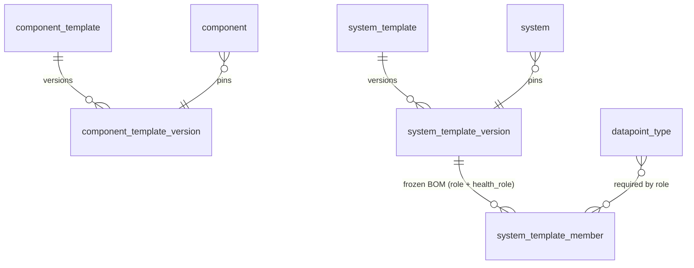

Templates let an operator define a device or system class once and stamp it onto many instances, with each instance pinned to a frozen version so its keys and roles never shift underneath it. Templates are the **immutable, versioned, content-hashable shapes**
that instances pin. A [component](/architecture/core-entities/) pins a `component_template_version`;
a [system](/architecture/core-entities/) pins a `system_template_version`. Editing a template mints a
**new version**; an instance pins one frozen version, or tracks `latest`, or follows a channel
(`stable` / `beta`), and re-pointing is explicit, so the keys and roles never change under a pinned
instance.

## The component_template: the device shape

A **`component_template` is the direct mirror to a Zabbix template**: it bundles, as one versioned
unit, everything needed to monitor and control a class of device. Where a Zabbix template ships items,
triggers, macros, and tags, ours ships:

- **collection** authored as [functions](/architecture/collection/) (inputs, interfaces, functions),
  below;
- **commands** (command-triggered functions the device supports, e.g. `reboot`, `set-input`), detail
  in [collection](/architecture/collection/);
- **`datapoint_type`s** (kind / unit / validation live on the registry, see
  [datapoints](/architecture/datapoints/#the-datapoint_type-registry); a template declares its keys at
  **template** scope, or references an **org** / **official** key, see [Template-scoped keys](#template-scoped-keys-and-optional-alignment));
- required **[config](/architecture/variables/)** and defaults, and the **credential shapes** it needs
  (see [config and credentials](/architecture/variables/));
- default **tags**;
- default **alarms / health** (the trigger mirror; [alarms and actions](/architecture/alarms-actions/)
  owns the detail).

A template is authored once and **assigned to an existing component**; the node then executes the
result.

| Family | What it is | Examples |
|---|---|---|
| `component_type` | classification | device, app, cloud-api |
| `component_template` | the **device shape**: everything about a class of device | Polaris DSP 16, Cisco Room Kit Pro, Q-SYS Core |
| `component` | a deployed instance | `dsp-boardroom-3` |

### Collection is built from functions

A template's collection is authored as [functions](/architecture/collection/): `inputs` (typed
parameters), `interfaces` (connections declared once, possibly persistent), and `functions` (each a
trigger plus a DAG of steps that parse at the edge and emit datapoints). A command is a
command-triggered function in the same model. See [collection](/architecture/collection/) for the full
schema; this page covers the rest of the device shape.

### Template-scoped keys and optional alignment

A template declares its datapoints **and** commands at **template scope** by default: auto-discoverable,
no registry friction, identified by `(template_id, name)` so two templates can both declare an `input`
with no collision ([key scope](/architecture/datapoints/#key-scope-template-org-official)). It may
**optionally align** each datapoint to an org or official canonical key. Alignment is just
**referencing** a canonical `datapoint_type` (plus an optional value transform), which is what buys
cross-fleet comparability, dashboards, and AI; the shipped official set covers the common signals, so
most templates align by referencing one. That value transform is also where the device's **native
unit** is normalized to the key's **canonical unit** before the datapoint is emitted (a Fahrenheit
display's template emits celsius), so storage stays single-unit ([datapoints](/architecture/datapoints/)). Commands are template-scoped (the functions live on
the template); a canonical **command type** (the abstract `reboot` to per-model layer) follows the same
promotion ladder.

:::caution[Open question]
The `args` typing vocabulary for commands (which scalar and structured arg types it admits) and how
command results beyond `success-when` map to the `action` row fields.
:::

### The rest of the shape

- **Config.** The template declares the [config](/architecture/variables/) a component *requires*
  (connection and inventory facts, e.g. `ip-addr`, `serial`) and their defaults. Effective values
  resolve through the cascade ([cascade](/architecture/cascade/)).
- **Credential shapes.** The template declares the *kinds* of credential the device needs
  (`basic_auth`, `snmp_community`, `bearer_token`); these are
  [`variable_type`](/architecture/variables/) shapes, bound to actual secret values at assignment
  (credentials).
- **Tags.** Default org labels seeded onto the component (`category: audio-dsp`).
- **Alarms / health.** Default `event_rule`s the template ships, the conditions worth catching for
  its device class (the Zabbix-trigger mirror: a fan-stall on a DSP template, a person-entered event
  on an occupancy template). The alarming policy lives on the **template**, not on the
  `datapoint_type`: a `datapoint_type` is pure identity (kind / unit / domain / validation / fusion)
  and carries no event rules. A *truly universal* default (e.g. `cpu.utilization > 0.9` everywhere) is
  an official **rule-set scoped by a group or key filter**, resolved through the cascade (the rule
  accumulation mechanism), not a `datapoint_type` attribute. Owned in detail by
  [alarms and actions](/architecture/alarms-actions/).
- **Function trigger params are cascade bases.** A function's `interval: 30s` is the floor of the
  cascade, overridable by a location, group, or the instance (the `poll_interval` example in
  [cascade](/architecture/cascade/)), not a hard value.

:::caution[Open question]
Whether a template's default `event_rule`s are declared inline on the version or referenced (the
policy is template-authored either way; this is the storage shape, co-designed with the
alarms-and-actions model).
:::

### Deploy: assign a template to an existing component

Assigning a template to a component materializes its collection in one action: it binds the template's
required [`inputs`](/architecture/collection/#inputs-the-templates-typed-parameters) (the `:apply`
gate, a 422 lists any unmet required fields), writes the supplied inputs as the component's
[config](/architecture/variables/) (declared, audited), resolves the interfaces, and compiles the
functions to the per-node runtime unit at the server-chosen node. Re-applying converges. The 80% case
is one action, as cheap as "add host".

### Integrity, authenticity, and the capability gate

A template carries two distinct trust properties, and they are not the same property.

- **Integrity** is the **content hash** every version already carries: it answers "is this the exact
  bytes that were authored", and it makes a `component_template_version` a stable, addressable artifact.
  It says nothing about *who* authored those bytes.
- **Authenticity** is a separate, **optional author signature / attestation** on the
  `component_template_version`. The signature is over the content hash, so a verified signature binds an
  authoring identity to those exact bytes. The signature is **verified on import**: an unsigned template
  imports as unattributed (the operator owns the risk), a signed template imports with its author
  identity and verification result recorded, and a signature that does not verify against the content it
  claims to cover is rejected.

A template also declares a **capability manifest**: the set of **write-commands** it exercises and the
**credential shapes** it requires (the `reboot` / `set-input` commands it issues, the `basic_auth` /
`snmp_community` / `bearer_token` shapes it binds). The manifest is derived from the template, not
operator-asserted, so it cannot understate what the template does. At [`:apply`](#deploy-assign-a-template-to-an-existing-component)
the manifest is **shown and approved**: an operator sees exactly which device-mutating commands and
credential shapes they are authorizing before the template materializes onto a component. Approving the
manifest is the consent record for that capability set.

A **device-mutating** template (one whose manifest declares any write-command) does **not** silently
follow `latest` or a channel into a new capability set. Tracking `latest` or a channel still moves a
read-only template forward automatically, but a new version of a device-mutating template that changes
its capability manifest is gated behind an **explicit operator re-pin**: the operator re-approves the
manifest at the new version before it takes effect. Auto-update never expands what commands run against a
device without a human approving the expansion.

The **hosted / marketplace** path verifies author signatures and enforces the capability gate on every
import regardless of the self-host runtime stance. Self-hosters still own the risk of what they import
(governance is curation, [collection](/architecture/collection/)): the runtime does not refuse an
unsigned self-hosted template, but the signature state and the approved capability manifest are recorded
either way.

## The system_template: the composition shape

A **`system_template`** is first-class and **fully parallel to the component_template**: it declares a
system's composition, its members and their roles, and the system-level rules and KPIs that only the
system can see. Like a component template it is mutable, **versioned**, and **content-hashable** (each
`system_template_version` is a stable artifact, addressable by a content hash); **editing mints a new
version** and a system pins the **immutable** `system_template_version` snapshot.

- **The frozen bill of materials.** A `system_template_version` carries a **`system_template_member`**
  for each role: the role, its **requirement** (the canonical datapoints and commands a member must
  provide), and the `health_role` (how it counts in the rollup). The role list, the requirements, and
  the health roles are **frozen into the version**; what an instance actually assigns is any component
  whose template meets the role's requirement, so the role validates against the system's frozen version
  and an assignment never expires under it.
- **Pin, latest, or a channel.** A system (the instance) either pins a **specific
  `system_template_version`**, or tracks **`latest`**, or follows a **channel** (e.g. `stable` /
  `beta`). This is the same pin-vs-channel choice a component makes.
- **Edits never silently change a pinned system.** An edit **mints a new version** and does **not**
  move a pinned system or its frozen role requirements; only instances tracking `latest` or a channel
  pick the change up (and a channel only when the new version is promoted into it). The immutability
  guarantee is explicit: a frozen system and its frozen BOM stay exactly as pinned until an operator
  re-points them.
- **`health_role` rides the frozen version.** Each member declares `required` / `redundant` /
  `informational`, the knob for the built-in role-aware health rollup ([health](/architecture/health/)).
  It lives on the `system_template_member` (not on the component) because the same device can be
  required in one system and redundant in another.
- **System-level rules, flows, and KPIs.** The system template owns the conditions only the system
  cares about: system-scoped `event_rule`s over member data (a display on input 2 is fine for the
  display but wrong for the room), the [flows](/architecture/alarms-actions/) that respond, and the
  system-owned [KPIs](/architecture/health/) (availability, the utilization family). These are stated
  here briefly; the rule and KPI detail live on [alarms and actions](/architecture/alarms-actions/)
  and [health](/architecture/health/).
- **System-level config.** Config declared on a system template (or a role slot) resolves onto
  whichever component fills the role, so `video.input = HDMI1` for the main-display role applies to
  whatever display is assigned ([config and credentials](/architecture/variables/)).

### Role requirements

A role declares **what a member must provide**, in canonical terms; any component whose template meets it
can fill the role:

```yaml
role: main-display
requires:
  datapoints: [display.power, video.input]   # canonical datapoint_types
  commands:   [set-input, power]             # canonical command types
health_role: required
```

- **A checklist, not a matching engine.** A component's template **qualifies** when it aligns the
  required canonical [datapoint_types](/architecture/datapoints/) and command types (its set is a
  superset of the requirement). The requirement is stated in **canonical** keys, because it only means
  the same thing across templates when it names a canonical signal, not a template-local one.
- **Qualify, then assign.** Pairing a component to a role **filters the picker to qualifying templates**,
  and the [API](/architecture/api/) **validates on assign** (a clean 422 if the component's template is
  missing a required datapoint or command). Mixed-vendor falls out for free: an LG and a Sony display
  both qualify for `display` if both align the required signals, with nothing to enumerate.
- **No allow-list of templates.** A role names *what it needs*, never *which templates*. Declare the
  requirement on the system template, and any qualifying component, today's or a future vendor's, fills
  it.

**Removing a capability is gated at adoption, not authoring.** Dropping a required datapoint from a
component template means **minting a new `component_template_version`** without it, which is never
blocked. The old version is **immutable**, so every live assignment pinned to it keeps working. The new
version simply **no longer qualifies** for any role requiring the dropped signal, so it cannot be adopted
into that role (the same validate-on-assign check fires at re-point), and a role tracking `latest` or a
channel will not auto-jump to it. Removal surfaces at adoption against frozen versions, never as a silent
break. (Deleting an org-canonical `datapoint_type` a requirement references is a registry-governance warn
or block, the same surfaced-not-silent pattern.)

**The runtime backstop.** Validate-on-assign is prevention; detection covers anything it misses (an
optional input, a drifted alignment). A system calc that reads a datapoint it cannot find **fails
loudly**, a `calc.failed` event and a health-impacting "misconfigured" alarm, never a silent empty
result. Two layers: gate at assignment, shout at runtime.

This resolves **flexibility versus reliability** without trading either: templates evolve freely and any
qualifying component fills a role (flexibility), while the requirement gates adoption against immutable
versions with a noisy backstop (reliability).

| Table | Key columns | Notes |
|---|---|---|
| `system_template` | name, type, **spec (jsonb)** | the mutable system shape; editing mints a new version |
| `system_template_version` | (template, **version**), frozen **spec** | the **immutable** snapshot a system pins; roles never change under it |
| `system_template_member` | (system_template_version, **role**, **requires** (canonical datapoints + commands), **health_role**) | the frozen **role requirement**: role -> the canonical datapoints and commands a member must provide + health role (required / redundant / informational, [health](/architecture/health/)). Any component whose template meets it can fill the role, validated on assign ([role requirements](#role-requirements)) |



Locations have no template: the `location_type` is the only shape-definer
([core entities](/architecture/core-entities/)).

:::caution[Open question]
Whether a `LocationTemplate` (`kind` is reserved in the collection apiVersion) is ever introduced, or
locations stay template-less.
:::

