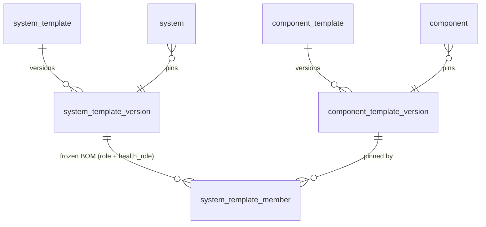

Templates let an operator define a device or system class once and stamp it onto many instances, with each instance pinned to a frozen version so its keys and roles never shift underneath it. Templates are the **immutable, versioned shapes**
that instances pin. A [component](/architecture/core-entities/) pins a `component_template_version`;
a [system](/architecture/core-entities/) pins a `system_template_version`. Editing a template mints a
**new version**; an instance pins one frozen version (or tracks `latest`) and re-pointing is explicit,
so the keys and roles never change under an instance.

## The component_template: the device shape

A **`component_template` is the direct mirror to a Zabbix template**: it bundles, as one versioned
unit, everything needed to monitor and control a class of device. Where a Zabbix template ships items,
triggers, macros, and tags, ours ships:

- **collection** authored as [functions](/architecture/collection/) (inputs, interfaces, functions),
  below;
- **commands** (command-triggered functions the device supports, e.g. `reboot`, `set-input`), detail
  in [collection](/architecture/collection/);
- **`datapoint_type`s** (kind / unit / validation live on the registry, see
  [datapoints](/architecture/datapoints/#the-datapoint_type-registry); a template declares its keys at
  **template** scope, or references an **org** / **official** key, see [Template-scoped keys](#template-scoped-keys-and-optional-alignment));
- required **[config](/architecture/variables/)** and defaults, and the **credential shapes** it needs
  (see [config and credentials](/architecture/variables/));
- default **tags**;
- default **alarms / health** (the trigger mirror; the [alarm spoke](/architecture/alarms-actions/)
  owns the detail).

A template is authored once and **assigned to an existing component**; the node then executes the
result.

| Family | What it is | Examples |
|---|---|---|
| `component_type` | classification | device, app, cloud-api |
| `component_template` | the **device shape**: everything about a class of device | Polaris DSP 16, Cisco Room Kit Pro, Q-SYS Core |
| `component` | a deployed instance | `dsp-boardroom-3` |

### Collection is functions

A template's collection is authored as [functions](/architecture/collection/): `inputs` (typed
parameters), `interfaces` (connections declared once, possibly persistent), and `functions` (each a
trigger plus a DAG of steps that parse at the edge and emit datapoints). A command is a
command-triggered function in the same model. See [collection](/architecture/collection/) for the full
schema; this page covers the rest of the device shape.

### Template-scoped keys and optional alignment

A template declares its datapoints **and** commands at **template scope** by default: auto-discoverable,
no registry friction, identified by `(template_id, name)` so two templates can both declare an `input`
with no collision ([key scope](/architecture/datapoints/#key-scope-template-org-official)). It may
**optionally align** each datapoint to an org or official canonical key. Alignment is just
**referencing** a canonical `datapoint_type` (plus an optional value transform), which is what buys
cross-fleet comparability, dashboards, and AI; the shipped official set covers the common signals, so
most templates align by referencing one. Commands are already template-scoped (the functions live on
the template); a canonical **command type** (the abstract `reboot` to per-model layer) is the same
promotion ladder, deferred.

### The rest of the shape

- **Config.** The template declares the [config](/architecture/variables/) a component *requires*
  (connection and inventory facts, e.g. `ip-addr`, `serial`) and their defaults. Effective values
  resolve through the cascade ([cascade](/architecture/cascade/)).
- **Credential shapes.** The template declares the *kinds* of credential the device needs
  (`basic_auth`, `snmp_community`, `bearer_token`); these are
  [`variable_type`](/architecture/variables/) shapes, bound to actual secret values at assignment
  (credentials).
- **Tags.** Default org labels seeded onto the component (`category: audio-dsp`).
- **Alarms / health.** Default `event_rule`s the template ships (the Zabbix-trigger mirror: fan
  stalled, sustained high temp), owned in detail by the [alarm spoke](/architecture/alarms-actions/).
- **Function trigger params are cascade bases.** A function's `interval: 30s` is the floor of the
  cascade, overridable by a location, group, or the instance (the `poll_interval` example in
  [cascade](/architecture/cascade/)), not a hard value.

### Deploy: assign a template to an existing component

Assigning a template to a component materializes its collection in one action: it binds the template's
required [`inputs`](/architecture/collection/#inputs-the-templates-typed-parameters) (the `:apply`
gate, a 422 lists any unmet required fields), writes the supplied inputs as the component's
[config](/architecture/variables/) (declared, audited), resolves the interfaces, and compiles the
functions to the per-node runtime unit at the server-chosen node. Re-applying converges. The 80% case
is one action, as cheap as "add host".

## The system_template: the composition shape

A **`system_template`** is the parallel shape for a [system](/architecture/core-entities/): it
declares a system's composition, its members and their roles, and the system-level rules and KPIs that
only the system can see. Like a component template it is mutable, and **editing mints a new version**;
a system pins the **immutable** `system_template_version` snapshot.

- **The frozen bill of materials.** A `system_template_version` carries a **`system_template_member`**
  for each role: the `(role, component_template_version, health_role)` tuple that pins which device
  shape fills each role and how it counts in the health rollup. The role validates against the
  system's frozen version so an instance assignment never expires under it.
- **`health_role` rides the frozen version.** Each member declares `required` / `redundant` /
  `informational`, the knob for the built-in role-aware health rollup ([health](/architecture/health/)).
  It lives on the `system_template_member` (not on the component) because the same device can be
  required in one system and redundant in another.
- **System-level rules, flows, and KPIs.** The system template owns the conditions only the system
  cares about: system-scoped `event_rule`s over member data (a display on input 2 is fine for the
  display but wrong for the room), the [flows](/architecture/alarms-actions/) that respond, and the
  system-owned [KPIs](/architecture/health/) (availability, the utilization family). These are stated
  here briefly; the rule and KPI detail live on [alarms and actions](/architecture/alarms-actions/)
  and [health](/architecture/health/).
- **System-level config.** Config declared on a system template (or a role slot) resolves onto
  whichever component fills the role, so `video.input = HDMI1` for the main-display role applies to
  whatever display is assigned ([config and credentials](/architecture/variables/)).

| Table | Key columns | Notes |
|---|---|---|
| `system_template` | name, type, **spec (jsonb)** | the mutable system shape; editing mints a new version |
| `system_template_version` | (template, **version**), frozen **spec** | the **immutable** snapshot a system pins; roles never change under it |
| `system_template_member` | (system_template_version, **role**, component_template_version, **health_role**) | the frozen **bill of materials**: role -> pinned `component_template_version` + health role (required / redundant / informational, [health](/architecture/health/)) |

Locations have no template: the `location_type` is the only shape-definer
([core entities](/architecture/core-entities/)).

## Open items

- The `args` typing vocabulary for commands (scalar types first, structured args later) and how
  command results beyond `success-when` map to the `action` row fields.
- Whether a template may declare default `event_rule`s inline or only reference them (co-design with
  the alarm spoke).
- Whether a `LocationTemplate` (`kind` is reserved in the collection apiVersion) is ever introduced,
  or locations stay template-less.
