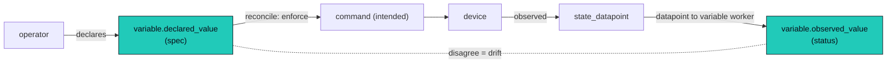

A **variable** is a current-value config cell: a typed, named, owned value an operator
**declares**, resolved through a scope cascade on every poll and every tick. It is the home
for declared intent (a static IP, an SSH credential, a desired firmware, a locked input). It
is **not** a datapoint, and keeping the two apart is the point of this page: datapoints flow
**up** from devices as measurement, variables flow **down** from operators as configuration.

A variable can also carry an **observed** side: it may link a datapoint whose latest value
mirrors reality, so declared intent and measured fact sit on one row and can be compared
(**drift**) or converged (**reconcile**). This is the Kubernetes spec-and-status pattern: the
variable's `declared_value` is the spec, a linked datapoint is the status.

## Variable vs datapoint: opposite registries

The two look alike (a typed, named, owned value) but run in opposite directions. Conflating
them, modeling declared config as a datapoint with a "declared" provenance, would blur that
direction.

| | datapoint | variable |
|---|---|---|
| name | a universal canonical **measurement** (`firmware`, `cpu.utilization`), registry-governed | an operator-defined **config key** (`crestron.ssh`, `dns.primary`), a shared cascade namespace, not curated |
| type | `datapoint_type`: the measurement definition (kind / unit / validation) | `variable_type`: the **shape** (scalar, or structured like `oauth2` / `ssh_credential`) |
| direction | **bottom-up**: observed or derived | **top-down**: declared at a scope, overridden going down |
| resolution | latest value per `(owner, key, instance, provenance)` | **most-specific scope wins** (component over system over location over global) |
| sameness | the same measurement everywhere, the owner gives context | the same name, deliberately **different** values per scope |
| storage | append-heavy timeseries | a sargable point-lookup, resolved fleet-wide every tick |

`firmware` is universal and retrieved; `crestron.ssh` is set once high and overridden low.
Different beasts, different tables.

## `variable_type` is a shape

`variable_type` is not a measurement registry; it is the **structural shape** of a value, the
way credential shapes (`username_password`, `snmp_community`, `header_token`) are, generalized
to all config:

- **scalars:** `string`, `int`, `float`, `bool`, `json`.
- **structured built-ins:** `bearer_token {token}`, `basic_auth {username, password}`,
  `ssh_credential {username, password | private_key}`, `snmp_community {community}`,
  `oauth2 {client_id, client_secret, access_token?, refresh_token?, expires_at?}`.
- **operator-defined** structured shapes (BYO field schemas).
- **secrecy is per field** in the shape (`oauth2.client_secret` is secret, `client_id` is
  not), not a whole-variable flag.
- a shape may carry **behavior**: an `oauth2` type knows how to refresh `access_token` from
  `refresh_token` when it expires (the shape accommodates it; the refresh execution is a
  later slice).

Interfaces consume shapes directly: an interface declares `credentialRef: ${input.ssh}` (an
`ssh_credential` bound to a `$var:` at apply) and the SSH adapter uses `{username,
private_key}`; an HTTP interface's `oauth2` input yields a bearer the adapter attaches.

## Two tables

```text
variable_type     # the SHAPE registry (official | private namespaces)
  namespace, name (the shape, e.g. oauth2), schema (fields + per-field secret),
  refresh (optional behavior), validation, display_name, description

variable          # a named instance bound to exactly one scope (exclusive arc)
  id
  name             -- the config key, e.g. crestron.ssh (the $var: lookup + cascade key)
  type             -> variable_type (the shape)
  scope            -- EXCLUSIVE ARC: exactly one of
                      template_id | component_id | system_id | location_id | global
  declared_value   -- operator intent, conforms to the shape; secret fields encrypted at rest
  linked_state     -> a state_datapoint series (owner + key); nullable; the observed side
  observed_value   -- latest value of linked_state, pushed by the worker (cached, sargable)
  reconcile        -- per-instance policy override; nullable
  updated_at       -- plus an audit trail of declared changes
```

- **`name` is the cascade key.** The same `name` (`dns.primary`, `crestron.ssh`) can exist at
  several scopes; `$var:<name>` resolves the most specific. A binding (an input default, or an
  apply-time binding) references the name; the operator sets a value at whatever scope fits (a
  Crestron admin credential set once at `global`, overridden on the one device that differs).
- **Names are not a curated registry** (unlike universal datapoint names). Variable names are
  org-specific config keys, with no canonical authority and no pre-registration. Sprawl is
  controlled instead by a **creation role-gate** (not every user may mint a variable, see
  [identity and access](/architecture/identity-access/)) and by the fact that every variable
  is **surfaced in the tree** as it is added.
- **Scope is an exclusive arc** (the same pattern datapoints use): exactly one owner FK set.
  The cascade is the standard one ([cascade](/architecture/cascade/)): local wins (component
  over system over location over global), with a `template`-scoped value as the shipped
  default for instances of that template.
- **Linking a datapoint is for scalar shapes.** A scalar variable (an IP, a serial) links a
  `state_datapoint`; the two value types must agree so drift compares like with like.
  Structured secrets (an `oauth2` block) are rarely observed, so they usually carry only
  `declared_value`.

## Declared and observed, simultaneously

A variable can hold either or both:

- **`declared_value`** is the operator's intent (the configured community, the static IP, the
  desired firmware). Set via `inputs` at apply (component scope) or by an admin (a shared
  scope).
- **`linked_state` / `observed_value`** is reality: the latest value of a linked datapoint,
  pushed in by a worker. A discovered serial or a DHCP-assigned IP has no intent, only an
  observation.

`$var:<name>` resolves through the scope cascade (component to system to location to global,
with the template default as the base, nearest wins) and returns **`declared_value` when
present, else `observed_value`**. So a configured value uses intent; a discovered value uses
observation. This is a native indexed lookup, resolved on every poll and tick.

## Drift and reconcile

When a variable carries **both** a declared and an observed value, the gap between them is
**drift**. An `event_rule` can alert on it (`declared != observed`), the same
[`disagree`](/architecture/taxonomy/#disagree-and-divergence) comparison used elsewhere, with
the declared side sourced from the variable. The `reconcile` policy turns drift into action:

- **`alert`** (default): surface the drift, change nothing.
- **`enforce`**: declared wins, push the intended value back to the device. This issues a
  command, which writes an [`intended`](/architecture/taxonomy/#intended-the-declared-effect-of-a-command)
  datapoint and reconciles against the next observation. Desired-state convergence, the
  controller half of spec-and-status.
- **`accept`**: observed wins, write the observation into `declared` (reality becomes the new
  intent).

`enforce` and `accept` are deferred; the column reserves the seam. This is where the old
"declared wins" precedence lives now: it is a per-variable reconcile policy, not a per-key
attribute on a datapoint.

## The datapoint to variable worker

A background worker (the one-worker-plus-stages model) maintains `observed_value`. On a new
`state_datapoint` value whose `(owner, key)` is referenced by some `variable.linked_state`, it
upserts that variable's `observed_value`. It is **event-driven** (it runs as datapoints land,
not on a timer) and reverse-indexed by `linked_state`, so "is this datapoint linked by a
variable?" is a sargable lookup, not a scan. This is the one controlled, one-directional
crossing from the timeseries back into current-value config.



## Secrets and credentials

A credential lives in this model as a variable of a secret-bearing shape (`oauth2`,
`ssh_credential`, `snmp_community`, `tls_cert`), not a separate vault primitive. The shape marks
**which fields are secret** (`oauth2.client_secret` yes, `client_id` no).

**Encryption at rest, through a pluggable `SecretProvider`.** Secret fields of `declared_value`
are encrypt-at-write, decrypt-on-use, with the encryption key supplied by a pluggable
**`SecretProvider`**: an envvar key by default, with **KMS, Vault, or an external store** behind
the same interface and no model change (envelope encryption, a per-value DEK wrapped by the
provider's KEK, is the shape when those land). Secrets are **masked at interpolation time** (a
community, a bearer token, an SSH key rendered into a request must never surface in a log line, an
error string, or a datapoint label), and **every decrypt is audited** ([audit](/architecture/audit/)).

**Shared versus per-device is just scope.** A credential reused across a fleet (a building's
SNMPv3 user, a service SSH key) is a variable set high in the cascade; a unique-per-device secret
is the same shape set at component scope. There is no shared-versus-per-device split to model: it
is the `$var:` cascade, like any other variable.

**Lazy refresh, not cron.** A shape with a `refresh` behavior (`oauth2`) refreshes its
machine-acquired token **on demand**, when the cached token is within a skew window of expiry,
coordinated across replicas by a row lock on the variable (the SKIP-LOCKED family). Idle
credentials never refresh; there is no scheduler. The machine-written token is a separate
encrypted cache on the variable, not an operator-owned secret, so it avoids audit-on-read noise on
every use.

**Credential health is a datapoint.** Two flavors, both surfacing through the normal
datapoint-to-alarm pipeline: **intrinsic expiry** (an `oauth2` token, a `tls_cert` `notAfter`)
warns proactively before it dies; **observed-use failure** flips a credential unhealthy after N
consecutive auth failures consumers report.

## How this changes provenance

Modeling declared config as a variable removes **declared** as a datapoint provenance.
Datapoints carry three provenances ([observed, calculated,
intended](/architecture/taxonomy/#provenance-how-we-know-a-value)); declared intent lives on
the variable instead. The `state` datapoint **kind** is unchanged: an observed state (a
device reporting `power.state = on`) is still a `state_datapoint`, and a variable can link it.
What moved is the *declared* value: from a datapoint row to `variable.declared_value`.

There is no separate prop or config store: config is one table plus the cascade, and the
spec-and-status loop gets a real home instead of overloading datapoint provenance to carry
operator intent.
