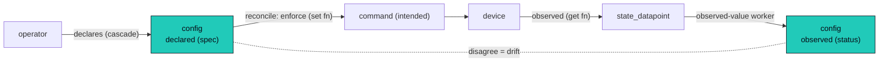

Everything an operator **sets** resolves the same way: a typed value, owned at a scope, resolved
most-specific-wins down the [cascade](/architecture/cascade/) on every poll and every tick. Three
kinds share that resolution but differ in what they are keyed to and what lifecycle they carry:

- **config**: a device setting you declare. Keyed by a **canonical signal** (a `datapoint_type`),
  so it has an observed side and can be reconciled.
- **credential**: an access secret. Its own keyspace, a pluggable storage provider, and a
  lifecycle (refresh, rotation, expiry).
- **variable**: a free interpolated value (a macro). Not bound to a signal, just resolved and
  spliced into functions and interfaces.

| | **config** | **credential** | **variable** (macro) |
|---|---|---|---|
| what it is | a declared device setting | an access secret | a free interpolated value |
| keyed by | a canonical signal (`datapoint_type`) | its own template/interface-local name | an org config key (cascade namespace) |
| has an observed side? | yes, a datapoint via a get function | its **validity**, not the secret value | no |
| lifecycle | drift → reconcile (a set function) | provider + refresh + rotation + expiry | none; resolved and interpolated |
| example | `video.input = HDMI1` | an `ssh_credential`, an `oauth2` token | `poll_interval = 30s`, a base URL, a label |

The common thread is the cascade and an exclusive-arc scope (exactly one of
`global | template | location | system | component`): the same exclusive-arc ownership as
datapoints, plus a `template`-scoped default the datapoint arc lacks (and unlike datapoints,
config is not `node`-owned). The three are not three subsystems; they are three uses of one
"set a value, resolve it down a scope" idea.

## config: declared device state, keyed to a signal

A **config** item is the **declared side of a canonical signal**. `video.input` is one key with two
sides: the **observed** value the device reports (a `state_datapoint`, provenance=observed) and the
**declared** value you set. They share the **key** but not the **storage**: the declared value lives
in the config table, resolved down the cascade, and is **never a datapoint row**. Same name, opposite
direction, the observed side flowing *up* from the device and the declared side flowing *down* from
the operator. This is not a "declared provenance" (there are no declared rows in the datapoint
tables); it is one signal with two homes, and their gap is **drift**.

Keying config to the signal registry instead of a private name is what removes the import problem: a
component template **brings no keys, it references registered ones**, exactly as it does for the
datapoints it reads. Two display templates that both touch `video.input` are two references to one
governed key, not a collision. Config reuses the `datapoint_type`'s value domain, so a declared value
is validated against the same `{values: […]}` the observed side uses.

**The template is the source of truth for configurability.** A signal becomes settable on a device
class when that class's [component template](/architecture/templates/) binds a **get** function (an
ordinary collection function that emits the observed datapoint) and a **set** function (a
command-triggered function that writes it). The registry may carry a soft `settable` hint, but the
binding is authoritative: no set function, not enforceable here.

Each piece of a config item has one home, joined by the canonical key:

| Piece | What it holds | Lives in |
|---|---|---|
| signal definition | key, kind, value domain, unit | `datapoint_type` (the registry) |
| get / set binding | how this device class reads and writes the signal | the **component_template** version |
| declared value | the intent (`HDMI1`), plus the per-item `reconcile` policy | the **config table** (cascaded) |
| observed value | what the device reports (`HDMI2`) | `state_datapoint` rows (observed) |
| drift | declared ≠ observed | **computed on read**, not stored |

### Drift and reconcile

When a config item has both a declared and an observed value, their gap is **drift**: the same
[`disagree(declared, observed)`](/architecture/datapoints/#disagree-and-divergence) comparison used
everywhere, with the declared side sourced from config. A per-item `reconcile` policy turns drift
into action:

- **`alert`** (default): surface the drift, change nothing.
- **`enforce`**: declared wins. Call the template's **set** function to push the value back; that
  issues a command, writes an [`intended`](/architecture/datapoints/#intended-the-declared-effect-of-a-command)
  datapoint, and reconciles against the next observation. Desired-state convergence, the controller
  half of spec-and-status.
- **`accept`**: observed wins, write the observation into the declared value (reality becomes intent).

The power here is that **remediation needs no rule**. You do not author an `event_rule` or a flow to
fix a setting; you declare the value, set the policy to `enforce`, and the cascade plus drift plus
the set function close the loop. Reconcile runs **per item**, so one reconciled setting is better than
none; the capability of any item is simply which of its get/set functions the template has bound (get
only gives alert-on-drift; a set too makes it enforceable). The data-mediated loop (set → device →
observe → drift clears) is the one guarded at action dispatch
([alarms and actions](/architecture/alarms-actions/)), with a per-item backoff so a device that
refuses a write does not hammer.

### Declaring at the system level

Because config rides the standard cascade, you rarely declare on the device. Declare
`video.input = HDMI1` for the **main-display role** on the system template, and the cascade resolves it
onto whichever display fills that role; the display's own template declared nothing. Drift and
reconcile then *just happen*, no per-device authoring. (Resolving a value scoped to a role slot, the
`system_template_member` where `health_role` already lives, may need a new cascade level between
system and component; that is an open refinement.)

## credential: a secret with a lifecycle

A **credential** is an access secret. Sensitivity alone (mask + encrypt) is just a flag any value can
carry; a credential is its own primitive because it has a **lifecycle** a plain config never does:
a storage provider, refresh, rotation, and expiry. That lifecycle is surfaced on the **component
template**, because that is where the interface and its auth logic live.

**Shape.** A credential has a structured `variable_type` **shape**: `bearer_token`, `basic_auth`,
`ssh_credential {username, password | private_key}`, `snmp_community`, `oauth2 {client_id,
client_secret, access_token?, refresh_token?, expires_at?}`, `tls_cert`, with **secrecy per field**
(`oauth2.client_secret` is secret, `client_id` is not). An interface consumes a shape directly:
`credentialRef: ${input.ssh}` binds an `ssh_credential`, and the SSH adapter uses `{username,
private_key}`.

**Pluggable storage provider.** Secret fields are encrypt-at-write, decrypt-on-use, with the key
supplied by a pluggable **`SecretProvider`**: an env-var key by default, with **KMS, Vault, or an
external secrets manager** behind the same seam and no model change (the off-platform-storage case is
just an external provider). It is the same seam pattern as the
[expression engine](/architecture/expressions/): one interface, swappable implementation.

**Read is permissioned and audited.** Sometimes a secret must be read in plaintext; that is a
privileged, audited action. `secret:read` is an [IAM](/architecture/identity-access/) permission you
grant to roles, and **every decrypt writes an [audit](/architecture/audit/) row**. The
machine-acquired token cache (below) is exempt to avoid audit-on-read noise on every request.

**Lifecycle, built from the primitives we already have.** None of this is a new subsystem; each
behavior is a template-declared use of functions, time, and flows:

- **refresh** (an `oauth2` access token) is **lazy**: refreshed on use when within a skew window of
  expiry, coordinated across replicas by a row lock (the SKIP-LOCKED family). Idle credentials never
  refresh; the refreshed token is a separate encrypted cache, not an operator secret.
- **rotation** (a password on a schedule) is a **flow**: generate → set on the device (a set function)
  → update the store → verify → invalidate the old, driven by the [time](/architecture/time/) primitive.
- **expiry and reminders** are an expiry timestamp plus a **watchdog** that fires an event and an
  **alarm** before the credential lapses.

**Credential health is its validity, not its value.** A credential's observable is whether it still
works: **intrinsic expiry** (an `oauth2` token, a `tls_cert` `notAfter`) warns proactively, and
**observed-use failure** flips it unhealthy after N consecutive auth failures consumers report. Both
surface through the ordinary datapoint-to-alarm pipeline, so a credential gets a health story without
being a device signal.

**Shared versus per-device is just scope.** A fleet-wide SNMPv3 user is a credential set high in the
cascade; a unique-per-device secret is the same shape set at component scope. No shared-versus-unique
split to model; it is the cascade, like everything else.

## variable: free interpolated values (macros)

A **variable** is the leftover, and the most familiar: a value you splice into behavior that is **not**
a device signal and carries no lifecycle, like a poll interval, a base URL, an environment label, or a
tuning constant. These are Zabbix-style **macros**, resolved `global → template → instance` down the
same cascade and interpolated as `$var:<name>` into functions, interface definitions, and rule
scopes.

- **Names are org-specific config keys, not canonical signals** (the one place the
  "operator-defined, not curated" namespace genuinely applies). There is no registry authority and no
  pre-registration; sprawl is controlled by a creation **role-gate** ([IAM](/architecture/identity-access/))
  and by every variable being **surfaced in the tree** as it is added.
- **Global and template-local are the same primitive at different scopes.** A global macro
  (a company-wide NTP server) and a template-local one (a device class's default poll interval) differ
  only by where on the cascade they sit.
- A variable has **no observed side and no reconcile**; nothing on a device mirrors a poll interval.
  That absence is exactly what separates it from config.

Scalar shapes (`string`, `int`, `float`, `bool`, `json`) cover the common case; a variable may be
flagged secret (a free secret like a webhook signing token) without being a full credential, since it
has no lifecycle.

## What's shared

- **The cascade.** All three resolve most-specific-wins down `global → … → component`, with a
  template-scoped value as a shipped default. One resolver ([cascade](/architecture/cascade/)).
- **The exclusive-arc scope.** Each value is owned at exactly one scope: the same exclusive-arc
  ownership as datapoints, plus a `template`-scoped default the datapoint arc lacks (and config is
  not `node`-owned).
- **`variable_type` shapes** back credentials (structured secrets) and variables (scalars); config
  instead borrows the `datapoint_type`'s domain, because its key *is* a signal.
- **`$var:` interpolation** renders variables and credential fields into requests; config is read by
  key like a datapoint. Secrets are **masked at interpolation time** and never surface in a log line,
  error string, or datapoint label.

The observed side of config is maintained by one **event-driven worker** (the one-worker-plus-stages
model): when a `state_datapoint` lands whose `(owner, key)` a config item is keyed to, it refreshes
that item's cached observed value, reverse-indexed so "is this datapoint a config's observed side?" is
a sargable lookup, not a scan. It is the one controlled, one-directional crossing from the timeseries
back into current-value config.

## How this changes provenance

Modeling declared state as **config** (and secrets as **credentials**) keeps **declared** out of the
datapoint provenances. Datapoints carry three ([observed, calculated,
intended](/architecture/datapoints/#provenance-how-we-know-a-value)); declared intent lives in config,
keyed to the same signal but stored down the cascade rather than as a row. The `state` **kind** is
unchanged: an observed `power.state = on` is still a `state_datapoint`, and a config item is keyed to
it. What moved is the *declared* value, out of the datapoint tables and into config resolved by the
cascade. There is no separate property or vault store; config, credentials, and variables are one
resolution model, and the spec-and-status loop gets a real home instead of overloading datapoint
provenance with operator intent.

## Storage

The shape registry, the config / variable cell, and the operator-label tables; the physical layout (the owner arc, the cascade key) lives on [storage](/architecture/storage/). Whether config, credentials, and variables share one table or split is open.

| Table | Key columns | Notes |
|---|---|---|
| `variable_type` | (namespace, name), schema (fields + **per-field secret**), refresh, validation | the **shape** registry (a scalar, or structured like `oauth2` / `ssh_credential` / `snmp_community`); official namespace null, private shadow |
| `variable` | (name, **owner arc**), type, **declared_value** (secret fields encrypted), **linked_state** (-> state_datapoint, nullable), **observed_value**, reconcile | the config cell and the `$var:` cascade key; scope is the exclusive arc (template/component/system/location/global). Holds declared intent, optionally mirrors an observed datapoint for drift |
| `tag` | name, applies_to, propagates | operator-label registry (no `_type`, no namespace) |
| `tag_binding` | (scope_kind, scope_id, tag), value | union + override combinator ([cascade](/architecture/cascade/)) |

## Open items

- **The role-slot cascade scope** (declaring config on a `system_template_member`, resolved onto the
  component filling the role), and the per-item get/set binding shape on the template.
- Whether config, credentials, and variables are **one table with a discriminator or three**; they
  share the cascade and scope either way.
- `reconcile: enforce` / `accept` execution (the set-function push and observed-becomes-intent); the
  policy reserves the seam, the controller is a later slice.
- The external `SecretProvider` implementations (KMS / Vault / secrets managers) behind the existing
  seam.
