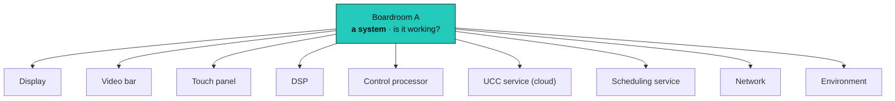
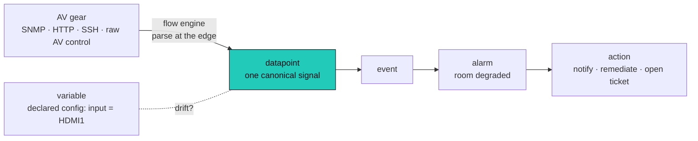
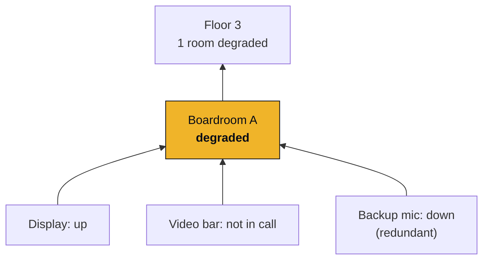

It is 9:58 on a Tuesday. A board meeting starts in two minutes. The executive walks in to a
black display, a video bar with no touch panel, and a call that will not connect. Somewhere,
the AV professional responsible for that room is about to find out the hard way, when the
phone rings.

That is the problem Omniglass exists to solve. Not "collect some metrics." **Make an AV system
as observable and operable as any cloud service**, so the answer to "is the room working?"
arrives before the meeting, not after the complaint.

## Start with the question

Every monitoring tool answers a question, and the question gives away what it was built for.

Zabbix and Prometheus answer **"is the host up?"** They model a fleet of servers: a *host*, and
the *metrics* it emits. That is exactly the right shape for a data center, and they are very
good at it.

Omniglass answers a different question: **"is the room working?"** A room is not a host.

A room is a **system**: a display, a video bar, a touch panel, a DSP, a control processor, a
cloud UCC service, a scheduling service, the network it rides on, the environment around it.
Together they have exactly one job, let people meet. The display being "up" tells you almost
nothing. The *room* working is a fact about all of them, at once.

This is the line the discipline draws: **observable devices are not the same as observable
systems.** You can have a perfectly instrumented display and still have no idea whether the
room is usable.

## Why the tools we were handed do not fit

Give an AV pro a host-and-metric tool and ask them to monitor two hundred meeting rooms, and
watch what happens. They bend it. They bolt a flow-glue tool onto the side to reach the gear
the platform cannot speak to. They script a fake "room." They bolt on a separate service-tree
module to pretend there is an SLA. They keep inventory in a spreadsheet. It is duct tape, and
duct tape does not survive contact with two hundred rooms.

The IT tools are not bad. They simply have **no model for the things AV operators actually care
about**:

- a **room** and a **system**, not just a host;
- a **redundant** microphone whose failure should *degrade* the room, not down it;
- an **AV control protocol** that speaks a strange wire over a raw socket: same socket, weirder
  wire;
- a **UCC call state**, a **codec input**, a **DSP channel**, as first-class signals, not
  scraped strings;
- a **desired configuration** that should be enforced when the world drifts from it.

None of that is a metric. So none of it fits.

## How Omniglass is built differently

Omniglass starts from the discipline, not from a metrics database. Every part of the
architecture follows from one question, "is the room working?"

### The estate is the model

A component, a system, a location: a real tree, the way an AV estate actually nests. The room
*is* a system. The building *is* a location. Health, alarms, and config attach to any level,
not only to a device. The host-and-tag world cannot say "this room," so it cannot reason about
one. [The taxonomy](/architecture/taxonomy/) is built so it can.

### One canonical signal

Every vendor's reading normalizes into one owned **[datapoint](/architecture/taxonomy/)**:
`power.state`, `audio.level`, `network.icmp.rtt`. A Sony display and a Samsung display answer
the same question the same way, because the *measurement* is named, not the device. That single
canonical path is what makes a cross-fleet dashboard, a real SLA, and useful AI possible at all.
A pile of vendor-specific strings makes all three impossible.

### Collection that speaks AV's weird wire

Reaching AV gear is the hard part, and it is where the IT tools tap out. Omniglass collects
through a **[flow engine](/architecture/collection/)**: SNMP, HTTP, SSH, and the raw-socket AV
control planes, parsed **at the edge** and normalized into the canonical signal as it is
collected. No middleware glue, no scripts in a second tool. The thing that talks to a Crestron
processor and the thing that talks to a switch are the same engine.

### Config is a first-class thing, with drift

What a device *should* be is an operator decision: this codec should be on HDMI1, this DSP at
this gain. Omniglass holds that as a **[variable](/architecture/variables/)**, a declared value
that can be compared against the observed reality. When they disagree, that is **drift**, and
drift is a signal you can alarm on or a fix you can push. The IT tools have nowhere to put
"what it should be," so they cannot tell you when the world walked away from it.

### Health is the headline

Signals are not the point; **health** is. Omniglass turns the canonical signals into the one
answer that matters, and it rolls up the tree.

[Health](/architecture/health/) is just a computed datapoint, owned by the system, reduced from
its members, and it is **role-aware**: a *required* member down takes the room down; a
*redundant* one only degrades it; an *informational* one does not touch it. That is the
difference between "a thing is red" and "the room is in trouble." And it is what makes an uptime
SLA possible at all, because an uptime SLA is impossible without a health model.

A room's health is a fact you can read at a glance:

| Component | Problem | Effect on the room |
|---|---|---|
| Display | Powered off while in use | down |
| Video bar | Not connected to UCC | down |
| Video bar | Call failed | degraded |
| Backup mic (redundant) | Unreachable | degraded |
| Touch panel | Poor network | degraded |
| Scheduling service | Resource account misconfigured | degraded |

### And then it acts

Seeing is half of it. Omniglass also **acts**: notify the right person, run
remediate-verify-escalate (send the command, wait, re-check the real datapoint, escalate if it
did not take), push a declared config back onto a device that drifted, open and close the ticket
as the alarm opens and clears. [Alarms and actions](/architecture/alarms-actions/) are one
model, composed, not a separate workflow engine bolted on.

## What Omniglass is

Omniglass is an **open observability and control plane for AV and IT estates**. A single Go
binary over standard PostgreSQL: point it at your fleet and operate. It is licensed AGPLv3 and
public from the first commit.

It is also a **learning tool**. The same binary serves an interactive docs and concept site, so
the tool that runs your estate also teaches the discipline it implements, against real or
simulated data. The Measure and Instrument layers are concrete, explorable artifacts, not
blueprints in a PDF.

## The difference, in one line

We did not build Omniglass because the world needed another monitoring tool. We built it because
the people who keep rooms working deserve to *see* them, as systems and not as a pile of hosts,
and to act before the call comes in.

Zabbix and Prometheus answer "is the host up?" Omniglass answers "is the room working?" That
difference is the whole architecture.

Ready for the deep end? Start with the [architecture overview](/architecture/), then the
[taxonomy](/architecture/taxonomy/).
