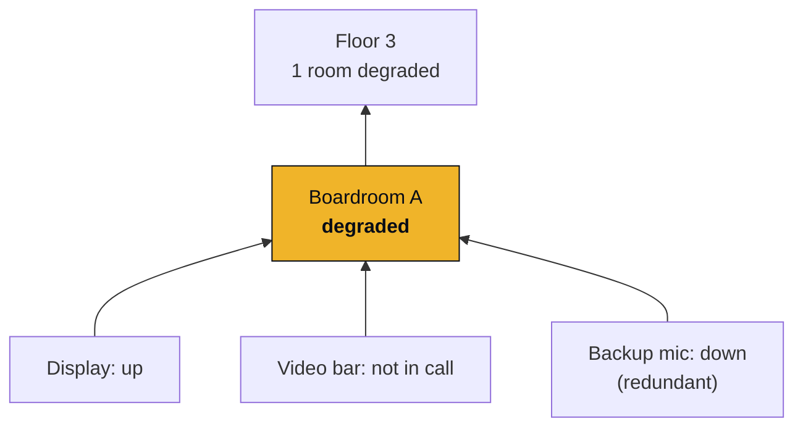
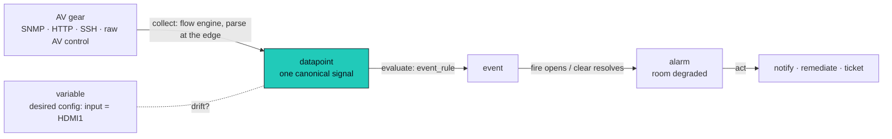

Run AV at scale and you know the feeling. You find out a room is broken when someone walks out
of it. The operation runs on tribal knowledge, escalations, and last-known-good guesses. Every
high-profile meeting is a potential resume-generating event, and when one goes wrong you are in
the postmortem with no data to back you up. It is the difference between a good night's sleep and
a 3am call.

Here is the part nobody says out loud: **that is not a reflection of you or your team.** AV is
genuinely, structurally hard to see, and the industry never shipped a right way to do it. Omniglass
exists to ship one.

## AV is not built to be observed

Most AV gear is built to be **controlled, not monitored**. You can tell a device what to do. Asking
it what it is *doing* is a different problem entirely, and the device was not designed to answer it.
So you cannot reliably say what is up, what is down, and what is about to fail. At a handful of rooms
you can brute-force that with grit. At a thousand rooms, it collapses.

It is hard for reasons that are real, and none of them are your fault:

- **It is agentless.** AV gear is firmware appliances. You cannot install an agent and be done; you
  have to ask the device from the outside and take whatever it is willing, or able, to give you.
- **There is no standard, and the APIs are uneven.** Control interfaces are usually decent;
  *management* data is an afterthought, when it exists at all. Different port, protocol, and format
  for every vendor, every product, sometimes every firmware revision. Every integration is bespoke.
- **The system is the hard part.** A room is not a device. It is a signal chain (a display, a video
  bar, the microphones, a DSP, a control processor, the UCC service in the cloud, the network) and
  "healthy" is a fact about the whole chain. Two of those mics might be redundant; the control
  processor speaks its own command dialect over a TCP port. Every unique combination of gear is its
  own health model, and there is no standard to lean on.
- **It is fragmented by design.** Each manufacturer portal sees only its own devices. Stack them up
  and you have a dozen panes of glass and still no single view of the room.

Put plainly: AV was never required to be observable, so it isn't. That is an industry problem, not
an operator one.

## Why an IT monitoring tool does not finish the job

The IT monitoring world (Zabbix, Prometheus, and the rest) is genuinely excellent at what it was
built for: a fleet of servers, an agent on each one, clean and standardized metrics. The host-and-
metric model is the right shape for a data center, and these tools are the best in the world at it.

That model quietly assumes the three things AV does not have: **an agent to install, a standard API
to read, and a host that is the thing you actually care about.** Point it at a room and the gaps
show. There is no agent. There is no standard to read. And it has no idea what a "room" is, no
language for an AV control protocol, no concept of a redundant mic. It can tell you a host is up. It
cannot tell you the room is usable.

You *can* bend these tools to AV. Skilled people do it every day, scraping web interfaces,
automating CLI sessions, gluing middleware on the side to reach the gear the platform cannot. That
work is real and it is impressive. But you are doing the platform's job for it, by hand, forever,
and it still has no model of the room at the end.

## It is an architecture problem, not a tooling problem

The fix is not a better dashboard. It is a method: figure out **why** you monitor, then **what**
(model what "healthy" means), then **how** (go get the data, however the device will give it). That
is the [AV Observability Framework](https://hyperscaleav.com/framework), and its keystone is the
**health model**, the thing that answers one deceptively simple question:

> Is this room usable right now?

The health model always runs. The only question is whether it runs *as a system* against real
signal, or in the operator's head at 3am against half of it. Omniglass is the tool that runs it as a
system.

## What Omniglass is

Omniglass is an **open, self-hosted observability and control plane for AV (and IT) estates**, built
for the real world rather than the demo. It does three things an IT tool cannot, because they were
designed in from the start, not bolted on.

**It meets the devices where they are.** Agentless and protocol-diverse, it goes and gets the data
however the device will give it (SNMP, HTTP, SSH, a control processor's raw command dialect) and
normalizes every vendor's reading into one canonical signal, so a Sony display and a Samsung display
answer the same question the same way.

**It models your estate the way it actually nests.** Components, systems, rooms, buildings. The
room is a first-class system, not a tag, so health, alarms, and config attach at the level you
actually operate.

**It runs the health model.** Signals roll up the tree into "is the room working," and the rollup is
role-aware: a *required* display down takes the room down, a *redundant* mic only degrades it, an
*informational* sensor does not touch it. That is what turns a wall of red dots into one honest
answer, and it is what makes a real uptime SLA possible at all.

And then it acts: notify the right person, run remediate-verify-escalate (send the command, wait,
re-check the real signal, escalate if it did not take), open and close the ticket as the alarm opens
and clears.

It is flexible enough to handle the mess, and clear enough that you can actually run it across a
thousand rooms. Open source, self-hosted, vendor-agnostic, one server over a database you already
know how to run. And it is free.

## The architecture, as one journey

Every monitoring system is the same shape: **collect, evaluate, raise an event, hold it as an alarm,
act, and see it the whole time.** Omniglass is that shape, built AV-native, and the architecture
follows it end to end.

Read it as a journey, and each stop is a page:

1. **[Collection](/architecture/collection/)** goes and gets the data from gear that never wanted to
   give it, and parses it at the edge.
2. **[Taxonomy](/architecture/taxonomy/)** types every reading into one owned, canonical signal, the
   same measurement across every vendor.
3. **[Variables](/architecture/variables/)** hold what a device *should* be, so config drift becomes
   a signal you can see and a fix you can push.
4. **[Health](/architecture/health/)** rolls the signals up the system tree into the one answer that
   matters.
5. **[Alarms and actions](/architecture/alarms-actions/)** detect a condition, hold it until it
   resolves, and respond.

That journey is the whole architecture. The [overview](/architecture/) is the map of it.

## The point

We did not build Omniglass to add another monitoring tool to a crowded shelf. We built it so the
people who keep rooms working can finally **know their systems**: see them as systems, not as a pile
of hosts, and act before the 3am call.

An IT tool answers "is the host up?" Omniglass answers "is the room working?" The industry never
shipped a right way to see AV. So we did.
