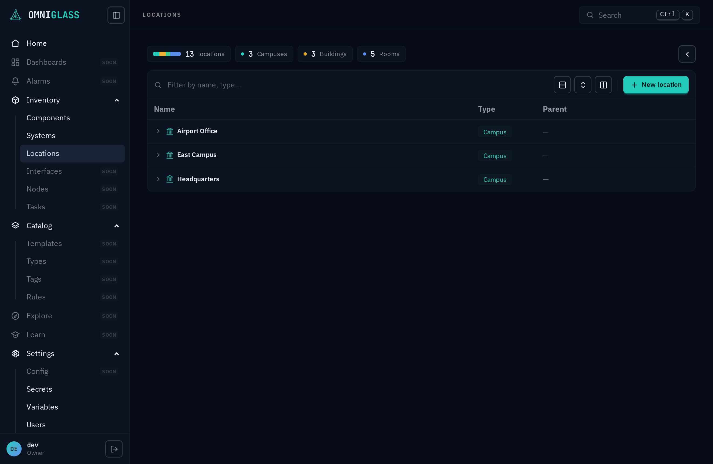

Systems, Components, and Locations are the live inventory pages. They share one shape, so
once you know one you know all three. This page is how you **find** something in that
inventory; [working with an entity](/guides/operator/entities/) is what you do once you have
opened it.

## Filter

The bar at the top of the table is a **chip filter**. Type a field name, then an operator,
then a value; each commit becomes a chip:

- Within one chip, multiple values are **OR** (match any). Across chips, the filters are
  **AND** (match all).
- Click a chip's operator to cycle it; click its value to re-edit; the **x** removes it.
  Clicking an active summary facet (below) toggles the same chip.
- A summary widget or a count card is just a one-click shortcut to a filter chip.

This is a page-local filter, distinct from the global **⌘K** jump that moves you between
sections ([getting around](/guides/operator/#getting-around)).

## Tree, list, columns

- Tree entities (Locations, and Systems/Components where they nest) show as a **tree**; use
  the expand/collapse controls, or switch to **list** view. Filtering also flattens to a
  list, with each row's place in the tree shown above its name.
- The default list order is the **tree compressed to a flat list** (nesting preserved); click
  a column header to sort by it instead.
- The **columns** menu shows or hides columns and lets you **drag to reorder** them. The
  layout is remembered per browser.
- On Locations, each row wears its **type's icon** as a leading glyph (a campus, building,
  floor, and room each read differently at a glance), tinted the same hue as the type badge.
- On Locations, a **summary board** at the top breaks the estate down by place type (a donut
  plus count cards); click any segment or card to filter to it.
- A **Tags** column shows each row's **effective [tags](/architecture/tags/)**: the `key = value`
  labels that resolve onto it down the cascade, not only the ones set directly on it (so a component
  wears the tags of its location and system too). Each key gets its own consistent color, so the same
  tag reads the same everywhere. The column is on by default; hide it from the columns menu.

Everything on these pages is already filtered to [your scope](/guides/operator/#what-you-see-is-your-scope):
you are searching within the subtree your grants reach, not the whole estate.
