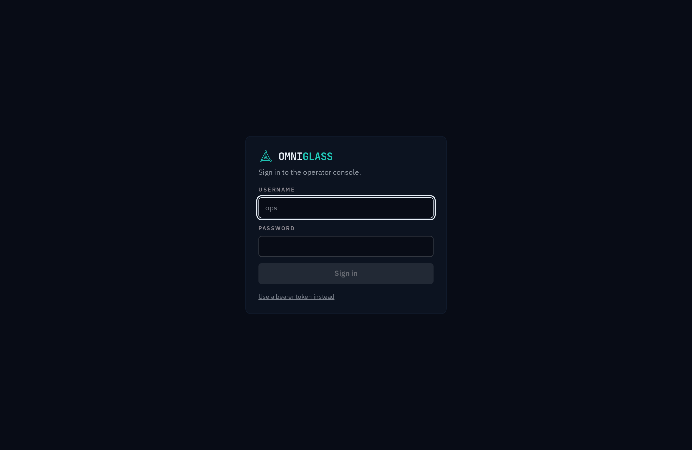

## Signing in

Sign in with your username and password. On success the server sets an httpOnly session
cookie (the browser never exposes a token to scripts), and the cookie rides on every request
for the rest of the session. Sign out from the menu in the sidebar footer, which revokes the
session and clears the cookie.

The login screen also has a **"Use a bearer token instead"** toggle: paste a token (for a
service account, or an operator who works from the CLI) and the console authenticates with the
`Authorization` header rather than a password. Either path lands you in the same console.

The first owner is created on the server with
`omniglass bootstrap <username> --password <password>` (see [the CLI guide](/guides/cli/)).

## Your profile

Click your name in the sidebar footer to open **Your profile**. It is self-service: you edit
only your own account, whatever your role.

- **Profile.** Change your display name; it drives how you appear in the console (the sidebar
  label and the initials avatar). Your username and email are set by an administrator, not you,
  and are shown read-only.
- **Profile picture.** The avatar at the top of the panel shows your picture when you have one and
  your initials when you do not. **Upload** picks an image file (JPEG, PNG, or WebP); the server crops
  and re-encodes it to a small square, so it reads the same everywhere you appear (the sidebar and the
  Users directory). **Remove** clears it and falls back to initials. Like the rest of the page it is
  self-service: you manage only your own picture.
- **Change password.** Enter your current password and a new one. The new password must meet the
  **policy** (at least 12 characters, not a common password, and not containing your username); the
  field validates as you type, and **Generate** fills a strong random one you can **Copy**. A wrong
  current password is refused. Changing it **signs out your other sessions and tokens** (the one you
  are using stays), so the change takes effect everywhere at once.
- **Access.** A read-only view of the identity model you operate under: your principal, the
  roles granted to you, and the flattened permissions those roles carry. The server enforces
  these on every request; the console only mirrors them.

From the CLI the same actions are `omniglass auth update-profile`, `omniglass auth change-password`,
and `omniglass me setAvatar` / `omniglass me removeAvatar` for the picture (see
[the CLI guide](/guides/cli/)).

## After an administrator resets your password

If an administrator resets your password, you sign in with the password they gave you and the
console immediately gates you to a **Set a new password** screen: your account is on hold and every
other page is refused (by the server, not just the console) until you choose a new password. Enter
the temporary password as the current one and set a new policy-compliant password; once it is saved
the hold clears and you land in the console. Signing out is the only other way off the screen.
